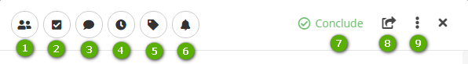

Title: Simple Agile Management

# Simple Agile Management

CITSmart Simple is a functionality of the CITSmart that allows the easy and agile
management of activities. It was created to manage projects in the simplest way,
with resources to organize, monitor and delegate the activities among the members
of your team or individually.

Simple is based on the Kanban methodology, it's visually organized in a framework
with cards that indicate the flow progress.

In the Simple workspace, activities are inserted and grouped by projects
(in Simple called Workspace), task pane (in Simple called Sprint) and finally
tasks, which can be in groups of cards.
    
!!! warning "ATTENTION"

    The language in the columns that appear on the **My notifications (bell icon)** screen 
    will follow what was set in parameter 66 (Default language of the system).

Procedure
------------

### Creating Workspace

1.  Access the main menu Inegrated Management \>
    Simple – Agile Management;

2.  Click on “Workspace” and give a name to create the new Workspace;

     

    Figure 1 - Workspace Screen

    -   **1**: searches for any information that is in any other Workspace, Sprint, 
        List or Task. It is possible the search that selects the activities by the estimated 
        date of its development (the period of beginning and conclusion). To use this search 
        feature, follow the instructions bellow:
   
        -   For the correct operation of this field, it is necessary that the Workspace, 
            Sprint and activity have an estimated date of beginning and end; 
       
        -   Make the search. The system will then return a list of Workspaces, Sprints and 
            Lists that are between the date referenced in the search.

     -   **2**: create new Sprint

     -   **3**: abbreviation of added member names. By clicking on it, it's possible to
         delete and define if the member will be manager or not

     -   **4**: add member that will participate in the Sprint

     -   **5**: actions for configuring the Workspace and access to *Profiles and permissions*:
   
         -   The Permissions in Workspace and Sprint, when the **Administrator** is logged, will 
             be selected by default and cannot be changed. Only when the user is of type **Normal** 
             will the permissions be editable. The Workspace Administrator can change the project 
             manager (Administrator permission) on each Sprint. If the user is not the Workspace 
             Administrator, you cannot give the administrator permission to another user.
           
         -   With the profile of type **Normal** within the Workspace or Sprint, if the user ticks 
             the checkbox **Change the permissions of Workspace/Sprint members**, the permission of 
             the other members of the project to which they belong will be released, or whether a user 
             who **does not** have the Administrator profile, can change the permission status of each 
             member, even if he/she is not the Administrator.     

3.  Each Workspace will have in its home screen a summary of Sprints and
    its deadlines:

    -   Expired: it presents the number of **Sprints** with the "delivery date"
    smaller than the current date/time;

    -   To be expired: it presents the numer of **Sprints** with the "delivery date"
    that will expire in 24hs from the current date/time;

    -   On time: it presents the number of **Sprints** with the "delivery date"
    bigger than 24hs from the current date/time;

    -   Total: sum of the **Sprints** inside the Workspace.

!!! warning "ATTENTION"    

    To move a **workspace** by changing its ordering, click and drag it to the desired 
    priority position.
   

### Creating Sprint

1.  Click on the Workspace created before;

2.  Click on “Sprint”, give it a title and "Save”;

3.  Each Sprint has in its home screen a counter of **tasks**, hours spent
    and planned, total of tasks by deadline established and its percentage of
    achievement:

    -   Expired: it presents the number of **tasks** with the "delivery date" smaller
        than the current date/time;

    -   To be expired: it presents the number of **tasks** with the "Delivery date"
        that will expire in 24hs from the current date/time;

    -   On time: it presents the number of **tasks** with the "delivery date" bigger
        than 24hs from the current date/time;

    -   Total: it presents the total number of **tasks** of the Sprint;

    -   The progress bar has the following calculation:

        -   1st It's made the sum of the tasks estimate of all completed **tasks**;

        -   2nd The sum of the total estimates of all **tasks** is summed;

        -   3rd Progress is the percentage calculated with the total estimates of 
            completed **tasks** on the total estimates of all tasks.

!!! info "INFORMATION"

    The calculation of progress depends entirely on the estimates reported in the tasks.
    
!!! warning "ATTENTION"

    To move a **sprint** by changing its ordering, click and drag it to the desired 
    priority position.

### Creating lists

1.  In each Sprint it will be available a default list of the system:: “To
    do, In progress and Finished”;

2.  To create a new list, click on "+List”, name it and "Save”.

    
    
    Figure 2 - List screen

    -   **1**: search tasks with filters of member, tags and status of the list
    (completed and not completed)

    -   **2**: create new list

    -   **3**: refresh the screen

    -   **4**: abbreviation for the member name added. When clicking on it, it's possible to
    delete and define if the member will be manager or not

    -   **6**: set the date, hour and hours estimated to deliver

    -   **7**: view the history of actions

    -   **8**: archive tasks list

### Creating tasks

   
    
   Figure 3 - Task screen

   -   **1**: create new task

   -   **2**: define in which stage the task is.

   -   **3**: physically move the list inside the framework

!!! warning "ATTENTION"

    To move a **task** from a list to another, click and drag it to a list.

### Complete Simple card

The Simple card has fields and buttons to describe a task/action with planning
and control of dates, time, checklist and several others device of control
and management.

1.  Each card has devices of control and information:

     
    
      Figure 4 - Card screen

    -   **1**: add or remove members in the task

    -   **2**: add list of actions that will be viewed in the Checklist tab

    -   **3**: add comments

    -   **4**: each member can post hours referring to their time used in the task, besides 
        detailing the action taken

    -   **5**: add tags to visually identify the task card

    -   **6**: click to be notified of any changes in this task. This notification will be
        done through the notification button of the CITSmart

    -   **7**: indicate the completion of the task

    -   **8**: move the task to another Sprint:

        -   Sprint of the *same* Workspace: tags are retained, but members are removed from the task

        -   Sprint of *other* Workspace: the tags and members will be removed from the task

    -   **9**: archive the card – once archived, in this version, the card cannot be reused.

1.  Describe the taks in the field "Description”;

2.  Define the date and time of delivery in the field "Delivery date”;

3.  Estimate the number of hours that will be used in the task;

4.  In the field "Hours released", the system will automatically count the total;

5.  The tabs available present:

    -   **Checklist**: adding a checklist will create an item on this tab. To name it,
    place the mouse on "Add item...", click on add "+" to add new item. To indicate
    the completion of an item inside the checklist, select the checkbox;

    -   **Comments**: list of comments made:
    
           -  Edit Comment;
           
           -  Delete comment. If you opt for the deletion, the comment will not be saved in the "History" tab.

    -   **Attachments**: make availabe the field to add attachmetns;

    -   **Hours released**: relate hours released of each member participating in the task;

    -   **History**: it presents all actions made in the card, with date and time.

<i class='fa fa-youtube-play  fa-2x' style='color:#97ce17;vertical-align: middle;'> </i> [Video Library](https://www.youtube.com/watch?v=yHi8-heMMxM)

!!! tip "About"

    <b>Product/Version:</b> CITSmart | 8.00 &nbsp;&nbsp;
    <b>Updated:</b>02/13/2019 – Anna Martins

