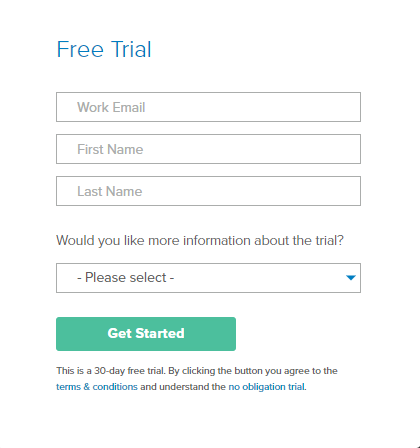

title: Configure Okta in CITSmart
Description: Okta connects any user to any application in any device. This document explains the ideal way to connect this solution to CITSmart.
# Configure Okta in CITSmart

This authentication method allows you to use the Okta features to authenticate users of your organization in a CITSmart instance. This document explains the steps in configuring this method. To learn more about Okta, visit [okta.com][1].

Before getting started
--------------------

The configuration of this solution is a multi-phase process. The first step is the creation of an Okta account.

Procedure
----------------

*1st Step: Create an Okta account:*

1. Access the site:  https://www.okta.com;

2. Click on "Try Okta" and then on "Sign up today";

3. Enter the essential data (e-mail, name and last name);

    

4. Click on "Get Started" to complete the operation. Then check the registered e-mail (which will send an access link), access the account with the temporary password sent and change it for greater data security;

*2nd Step: Created CITSmart application within Okta:*

1. After completing the previous step, connect to Okta with your newly created account;

2. Click on the "Applications" tab and then on "Add Application";

    

3. Click on "Create New App";

    

4. Select the option "SAML 2.0" and then click on "Create";

    

5. In the field "App name", add the name of the application and soon after, it is necessary to click on "Next";

    

6. Configure the application path and then click on Next

    

    !!!Abstract "ATTENTION"
   
        In the "Single sign on URL" and "Audience URI (SP Entity ID)" field, the URL addresses on which the CITSmart Application           will be executed should be included.
     
7. Select the options "I'm an Okta customer adding an internal app" and "This is an internal app that we have created". Then, click on "Finish".

      

*3rd Step: Assign users to Okta's CITSmart application:*

1. After completing the previous step, you need to click on the "Applications > Applications" tab and then on "Assign Applications" and choose the filter called "People";

    

2. Then you can choose the user who will be allowed to access the application that is being created. Click on "Assign" and then, to finish, click on "Done";

    

*4th Step: Include required information in the CITSmart configured on Okta:*

1. You will need to configure some data in the WildFly directory. Access the directory, open the "/standalone/configuration" folder and change the file "citsmart.cfg".

    

2. Accessed the file, you need to include this information in the file "citsmart.cfg":
       
   a) In the line *SAML2_HOST* and *SAML2_PORT* include the address and port of the CITSmart application;
       
   b) In the line *SAML2_METADATA* include the SAML metadata of the Okta. This data can be obtained by following the instructions below:
 
      - Access the CITSmart application in Okta, click the "Applications > Applications" tab and then on "Sign On". When you click on the "Identity Provider metadata" option, a new tab will be available to the metadata, copy the URL of the browser and insert in the property *SAML2_METADATA*;
        
    

   c) In the line *OKTA_URL*, include the main URL in the Okta account.
   
   d) In the line *OKTA_TOKEN*, include the token to access through API. To get this token, follow these steps:
   
3. Access the CITSmart application in Okta, select the "Security > API" menu and then click on "Create Token". Name the token and click on "Create Token". It will be presented the token value to be copied on the line quoted above.
   
    

   e) In the line *OKTA_DOMAIN_ALIAS*, include the domain of users coming from Okta.
  
*5th Step: Synchronize Okta user on CITSmart:*

1. Within CITSmart, access the "Okta Config" menu and register a new configuration by clicking on "New";

    

2. Complete the fields with the necessary information:

    

    * **Description**: introduce a definition of this new setting Okta;
     
    * **Alias**: include the user domain that will be saved to the database. Example: okta\administrador@citsmart.com;
     
    * **URL domain**: should include the same value (URL) that was entered in the line *OKTA_URL* in the "citsmart.cfg" file; 
     
    * **Token API**: include the same value of the token inserted in the line *OKTA_TOKEN* in the file "citsmart.cfg";
     
    * **Group**: insert the ID of the group in which the synchronized and registered user will belong in CITSmart;
     
    * **Access Profile**: insert the profile ID in which the synchronized and registered user will belong in CITSmart;
     
    * **Application ID**: include the application ID. This information can be retrieved from the Okta URL, as shown below:
     
    

3. Click on "Save" and then on "Synchronize users" to perform the operation.

*6th Step: Configure the Logout:*

1. Since Okta does not have a logout screen, in parameter 377 of CITSmart, we can insert some page address to redirect the user to the end of the session;

2. Set up the logout link also at the address **(Admin > Settings > Customization > Sign-Out-Page)**, then check the option "Use the custom sign-out page". Therefore, enter the URL (https://localhost:8443/citsmart/saml/logout) with the appropriate adaptations (host and port), according to the image below:

!!!Abstract "NOTE"
   
    When *logout* in CITSmart, do not *logout* from the Okta, since users may have other applications in the Okta session. In       contrast, if you do Okta *logout*, the user session in CITSmart will be removed.

What to do next
----------------------

Once the Okta integration with CITSmart is complete, some CITSmart parameters can be configured to better customize this integration. They are:

 
 - The parameter 445 (Name of the Administrator group in Okta) allows you to choose the administrator group in the Okta solution. If the user belongs to this chosen group, he/she will have the access profile defined as administrator. If this is not the case, your access profile will be the default profile defined by the parameter 39.
 
!!! tip "About"

    <b>Product/Version:</b> CITSmart | 8.00 &nbsp;&nbsp;
    <b>Updated:</b>05/30/2019 – Larissa Lourenço

[1]: https://www.okta.com/
