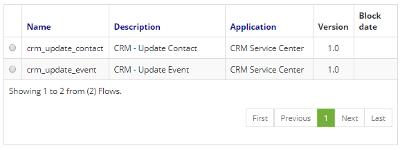
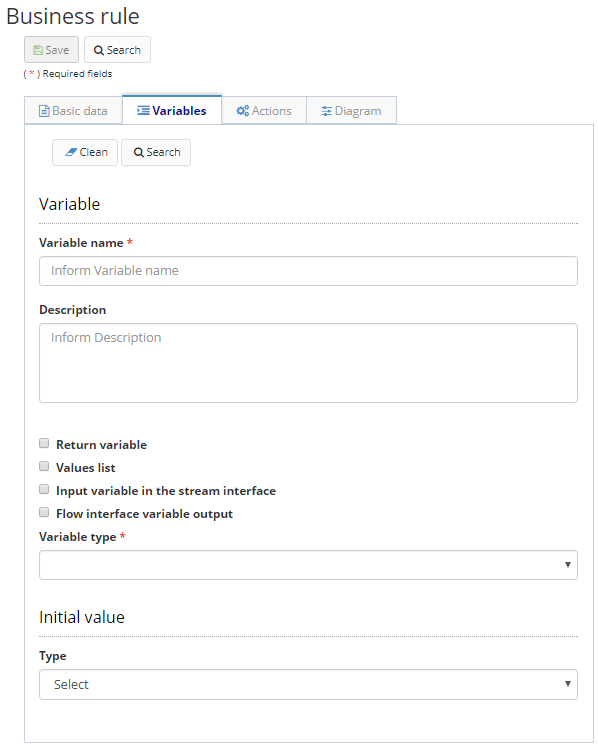
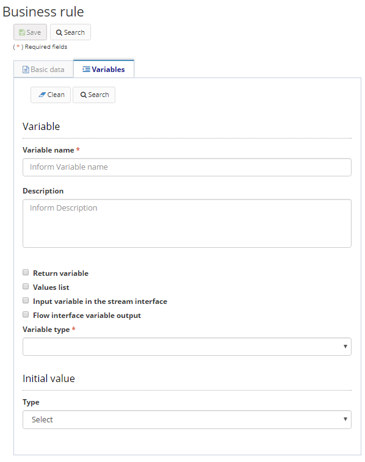

title: Business rules  
Description: Business rules define how your business works, and can cover a variety of issues such as your policies, interests, objectives, ethical and social commitments, contractual obligations, strategic decisions, laws and regulations, among others  

# Business rules

Business rules define how your business works, and can cover a variety of issues such as your policies, interests, objectives, ethical and social commitments, contractual obligations, strategic decisions, laws and regulations, among others.  
In Neuro, business rules can be built through the Drools language, by drawing a flow, or through a Script.    

##How to access 

1.	Access the functionality through navigation in the main menu Neuro > Management > Business Rule.    

##Preconditions

1.	No applicable.  

##Filters

1.	The following filter enables the user to restrict the participation of items in the standard feature listing, making it easier to find the desired items:  

    +   Keyword or enter.  

 

Figure 1 - Business rules search screen  

##Items list

The following cadastral fields are available to the user to facilitate the identification of the desired items in the standard feature listing: Name, Description, Application, Version and Block date.  

Figure 2 - Business rules listing screen

##Filling in the registration fields 

1. To edit a created item, select the item you want, click "Edit", make changes, and click "Save".  
2. To create a new business rule, click the "New button";  
3. To remove a created item, select the item you want, click  on the Edit → Remove and confirm the deletion.  
4. The business rules you enter by default are created locked. This means that the rule will not be used unless you unlock it. To unlock    the rule, select the desired item, and click the "Unlock" option on the top menu. A Business Rule can be used in a form, within a          business object, in a business process or in a flow;  
5. Further information regarding the use of a business rule can be found in the Developing Applicantions.  

##Create business rules using Drools type

1. Drools is a set of tools that allow us to separate and reason about the logic and data found within business processes. The two       important keywords we have to realize are Logic and Data. Go to https://www.drools.org/ for more information;  
2. To create a business rule using Drools, you must first create the DSL and DSLR through the Neuro > Configuration > Domain;  
3. After these registrations have been made, access the menu Neuro > Management > Business rule, Click on the New button. Fill in the   fields by entering the  Name, Description, Type (fill in with Drools), and the respective Application that has been registered (Neuro   ® Management ®  Application), finally inform Drools DSLR that was registered in the previous step;  
4. In addition, variables that complement business rules may be inserted.  

    
    
    Figure 3 - Drools business rule registration / editing screen - Basic data tab  

5. In the Variables tab click Add and fill in the following fields as shown below:

     
    
    Figure 4 - Drools business rule registration / editing screen - Basic data tab (continued)  

##Create business rules using Flow type

1. To create a business rule using Flow, a diagram should be drawn using the components provided in the tool. To learn more about the components, visit the documentation for the components provided by Neuro;  
2. In the Basic Data tab, fill in all the fields (as shown in the figure below), when selecting the Flow Type, two new tabs will appear (Actions and Diagram);  

    
    
    Figure 5 - Business rule registration / editing screen - Flow Type  

3. In the Variables tab click "Add" and fill in the following fields as shown below:  

    
    
    Figure 6 - Business rule registration / editing screen - Flow Type (continued)  

4. On the Actions tab click "Add" and fill in the following fields as shown below:  

     
    
    Figure 7 - Business rule registration / editing screen - Flow type (continued)  

5.  On the Diagram tab, draw the flow and click "Save", as shown below:  

    
    
    Figure 8 - Business rule registration / editing screen - Flow Type (continued)  

##Create business rules using Script type  

1. To create a business rule using Script, go to the New option, enter the Name, Description, Type (complete with Script), and the respective Application that has been registered:  

    
    
    Figure 9 - Business rule registration / editing screen - Script type  

2. Code your business rule script in the Script field, and add variables in the variables tab, if necessary. Scripts are accepted in the Rhino language.  

     
    
    Figure 10 - Business rule registration / editing screen - Script type (continued)  

3. Click "Save" to run the changes.  

!!! tip "About"

    <b>Product/Version:</b> CITSmart | 8.00 &nbsp;&nbsp;
    <b>Updated:</b>01/23/2019 - João Pelles  

