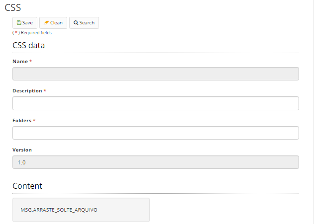

title: CSS
Description: The Neuro allows the maintenance of CSS files within the tool. These files can be used on Forms as a dependency.
# CSS

The Neuro allows the maintenance of CSS files within the tool. These files can be used on Forms as a dependency.  

!!! Abstract "ATTENTION"

    The folder is a physical grouper of the files on the server, for organization purposes. The configured folder does not interfere         with system operation.

##How to access  

1.  Access the feature by navigating the menu Neuro > Resources > CSS.  

##Preconditions  

1.  Not applicable

##Filters  

1.  The following filter enables the user to restrict the participation of items
    in the standard feature listing, making it easier to find the desired items:  

     * Keyword   

  

Figure 1 - CSS Search Screen  

##Items list

1. The following cadastral fields are available to the user to make it easier to identify the desired items in the standard feature listing: Resource, Name, Description and Version.    

 

Figure 2 - CSS listing screen  

##Filling in the registration fields

1. To register a new CSS file, click "New" as shown in the figure below:  

     
    
    Figure 3 - CSS home screen  

2. On this screen the user is also allowed other actions. They are:  
 
     - To edit a created item, select the desired item, click Edit (the current version or the previous version), make the changes, and      click "Save".  
     - To view an item, select the item and click "View".  
     - To remove a created item, select the item you want, click "Remove", and confirm the deletion.  

3. When you click Next, the following screen will appear:  
 
    
    
    Figure 4 - CSS registration screen  

4. Enter a description, the path of the CSS folder and upload the file. The fields name and version are auto-incremented by the system.  
5. Click "Save" to store the image. Click Search to return to the previous screen.  

!!! tip "About"

    <b>Product/Version:</b> CITSmart | 8.00 &nbsp;&nbsp;
    <b>Updated:</b>01/23/2019 - João Pelles  

