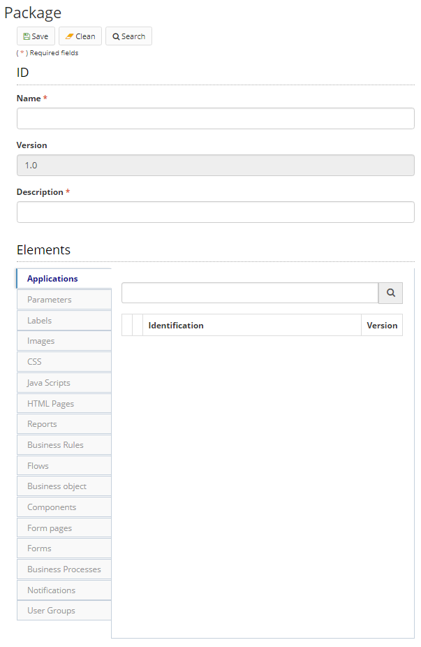

Title: Package
Description: When you produce a set of application items through the Builder, it is possible that this set is clustered in a package that can be imported / exported between Builder environments.  
# Package  

When you produce a set of application items through the Builder, it is possible that this set is clustered in a package that can be imported / exported between Builder environments.  

## How to access

1. Access the functionality through navigation in the main menu Builder > Management > Package.  

## Preconditions 

1. No applicable.  

## Filters 

1. The following filter enables the user to restrict the participation of items in the standard feature listing, making it easier to find the desired items:  
     * Keyword or enter.  

Figure 1 - Package search screen  

## Items list 

1. The following cadastral fields are available to the user to facilitate the identification of the desired items in the standard feature listing: Name, Description and Version.  

Figure 2 - Package listing screen  

## Filling in the registration fields

1. To change a package already registered, click "Edit", make the modifications and then click "Save";  
2. To create a package, click "New". Enter the Package Name and Description. Then select the elements that will be part of the package. All these elements must have been previously registered in Builder;  

     
    
    Figure 3 - Package registration / edit screen  

3. You can select **Applications, Parameters, Labels, Images, CSS, Java Scripts, HTML Pages,  Reports, Business rules, Flows, Business object, Components, Form pages, Forms, Business Processes, Notifications** and **User Groups** to compose the package;  
4. Click "Save" to create the package. Click "Search" to go back to the previous screen;  
5. To export a saved package, select it and then click "Export". Packages are exported in .json format;  
6. To import a package into a Builder, click Import, select whether this version of the package should override elements that have the same identifier, whether the DDL should be run, and select the .json import file;  

    !!! Abstract "ATTENTION"  

        To ensure compatibility, it is strongly recommended that the Builder version that created exported package be the same as                 the Builder that will import it.  

7. To view an item, select the item and click "View".  

!!! tip "About"

    <b>Product/Version:</b> 4biz | Helium &nbsp;&nbsp;
    <b>Updated:</b>01/23/2019 - João Pelles  
