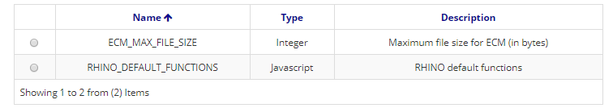

Title: Parameters  
Description: In this screen the parameters to be used in applications created through Neuro are configured.  

# Parameters  

In this screen the parameters to be used in applications created through Neuro are configured. 

## How to access

1. Access the functionality by navigating the menu Neuro > Configuration > Parameters. 

## Preconditions

1. Not applicable  

## Filters

1. The following filter enables the user to restrict the participation of items in the standard feature listing, making it easier to find the desired items:  
       * Keyword  

 

Figure 1 - Parameter search screen  

## Items list 

1. The following cadastral fields are available to the user to make it easier to identify the desired items in the standard feature listing: Name, Type and Description.  

Figure 2 - Parameter listing screen  

## Filling in the registration fields

1. To register a new parameter, click "New", as shown in the figure bellow:  

    
    
    Figure 3 - Parameter home screen  

2. On this screen the user is also allowed other actions. They are:

       + Edit: Changes an existing parameter. To edit, select an item in the table and click "Edit".  
       + View: Displays a registered parameter. No editing allowed. To view, select an item in the table and click "View".

3. When you click "Next", the following screen will appear:  

    
    
    Figure 4 - Parameter register screen  

4. To register a parameter, enter the name, type, and description. The system will display a "Value" field according to the selected type. 

5. Click "Save" to save your changes.  

!!! tip "About"

    <b>Product/Version:</b> CITSmart | 8.00 &nbsp;&nbsp;
    <b>Updated:</b>01/23/2019 - João Pelles  
