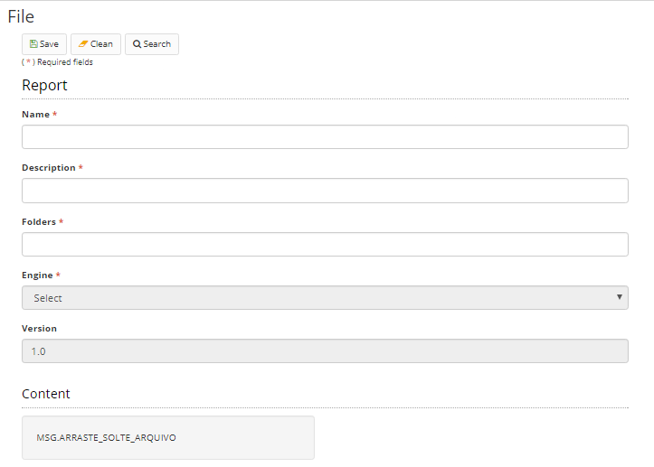

Title: Report file  
Description:At this point, it is not possible to create a report in the Neuro itself. This functionality only refers to uploading a report file.  
# Report file  

At this point, it is not possible to create a report in the Neuro itself. This functionality only refers to uploading a report file.  

## How to access

Access the feature by navigating the menu Neuro > Resources >  Report upload.  

## Preconditions 

No applicable  

## Filters

1. The following filter enables the user to restrict the participation of items in the standard feature listing, making it easier to find the desired items:  

    * Keyword or enter  

Figure 1 - Report file search screen  

## Items list  

1. The following cadastral fields are available to the user to make it easier to identify the desired items in the standard feature listing: Resource, Name, Description, and Version.  

Figure 2 - Report file listing screen  

## Filling in the registration fields  

!!! Abstract "ATTENTION"
    
    You can not create a report itself in Neuro. This functionality only refers to uploading a report file.
	
1. The version field is auto-incremented by the system.Enter the name of the report, a description, and the project folder on the server. The engine field is filled automatically according to the file format. Currently, Jasper's jrxml format is only accepted.

2. Finally, upload the report file.

3. When you include a report file, the system automatically generates a record in the report configuration screen.

4. Click "Save" to store the image. Click "Search" to return to the previous screen.  

    
    
    Figure 3- Report file master screen  

5. To edit a created item, select the desired item, click "Edit" (the current version or the previous version), make the changes, and click "Save".   
6. To view an item, select the item and click "View".  
7. To remove a created item, select the item you want, click "Remove", and confirm the deletion.  

!!! tip "About"

    <b>Product/Version:</b> CITSmart | 8.00 &nbsp;&nbsp;
    <b>Updated:</b>01/23/2019 - João Pelles  
