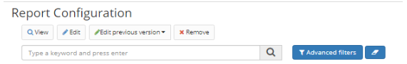
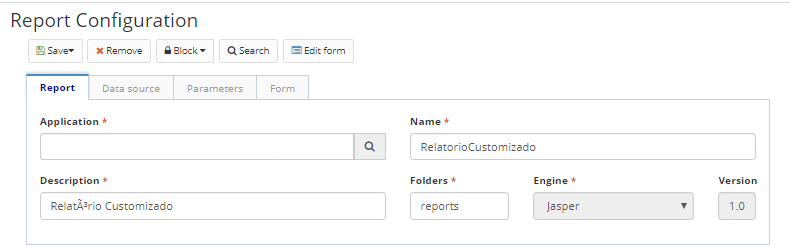
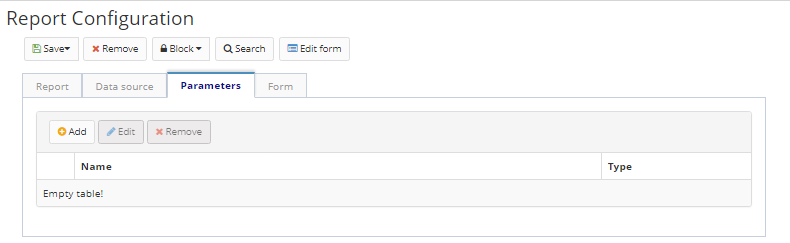

Title: Report setup  
Description:The information is automatically populated from the report file. The name, description, and grouper folder on the server can be edited.  
# Report setup  

The information is automatically populated from the report file. The **name, description**, and grouper **folder** on the server can be edited.  

## How to access 

Access the functionality through the menu Neuro > Management > Report. 

## Preconditions 

The form must be previously registered in the Form.  

## Filters 

1. The following filter enables the user to restrict the participation of items in the standard feature listing, making it easier to find the desired items:  

     * Keyword or enter.  

 

Figure 1 - Report configuration search screen   

## Items list 

1. The following cadastral fields are available to the user to facilitate the identification of the desired items in the standard feature listing: **Application, Resource, Name, Description** and **Version.**  

Figure 2 - Report configuration lisitng screen  

## Filling in the registration fields  

### Report data

1. This information is automatically populated from the report file. The **name, description**, and **project** folder on the server can be edited, however the engine and version fields can not be changed.  

Figure 3 - Register/edit report configuration, Report tab  

## Data source

1. Refers to the data source of the report. Enter the **type** of the data source, which can be:  

    - **None**: if the file does not search the database.  
    - **Data connection**: if the information source is a database connection, also inform the respective database connection (register in the Database connection menu).  
    - **Data object**: if the information source is a database object registered in the application. Enter the **data object** that will be the data source (registerable in the Business Object menu).  
    - **ESI flow**: if the source of information is an ESI flow registered in the application. Enter the **flow** that will be the data source (registered in the Workflow/ESI Design menu).  
    - **Script**: if the data source is a script, code the script using the Rhino language.  

Figure 4 - Register/edit report configuration, Data source tab  

## Parameters 

1. This tab refers to the registration of fixed parameters for the report. You can enter an image as a parameter to define the report logo, for example.  

- Click "Add" to add a new parameter.  
- Enter the parameter **name, type**, and parameter **object**.  
- Click "Save" to add the parameter to the list.  
- To edit a parameter in the list, click "Edit".  
- To remove a parameter from the list, click "Remove".  

 

Figure 5 - Register/edit Report configuration, Parameters tab  

## Form

This tab represents the form to be displayed when the user generates the report.  

1. Enter the **name** of the registered form, state whether tabs should be displayed, the **title** of the form, and the **menu** associated with to it.  
2. In the selected form, by default, options will be added to generate the report in PDF, Excel and HTML.  
3. To change the default, edit the source code displayed on the screen.  
4. Click "Save" to run the changes. Click "Search" to return to the previous screen.  
5. To edit a created item, select the desired item, click "Edit" (the current version or the previous version), make the changes, and click "Save".  
6. To view an item, select the item and click "View".  
7. To remove a created item, select the item you want, click "Remove", and confirm the deletion.  

Figure 6 - Register/edit report configuration, Form tab  

!!! tip "About"

    <b>Product/Version:</b> CITSmart | 8.00 &nbsp;&nbsp;
    <b>Updated:</b>01/23/2019 - João Pelles  

