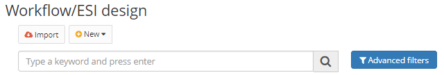

Title: Variables
Description: In this tab are configured the variables that will be used in the drawn flow. Variables are objects that can hold and represent a value or expression. Variables are associated with "names", called identifiers, during the runtime of the flow.  
# Variables  

In this tab are configured the variables that will be used in the drawn flow. Variables are objects that can hold and represent a value or expression. Variables are associated with "names", called identifiers, during the runtime of the flow.  

## How to access  

1. Access the functionality through the menu Neuro > Management > Integration Flow.  

## Preconditions  

1. Not applicable  

## Filters  

1. The following filter enables the user to restrict the participation of items in the standard feature listing, making it easier to find the desired items:  

    * Keyword  

Figure 1 - Search screen

## Items list  

1. The following cadastral fields are available to the user to make it easier to identify the desired items in the standard feature listing: **Name, Description, Flow Application, Version**, and **Block date**.

 

Figure 2 - Listing screen  

## Filling in the registration fields - variables  

1. To add a new variables, choose the tab for the same and then click "Add".  
2. The following screen will be displayed:  

    
    
    Figure 3 - Workflow registration / editing screen, Variables tab  

3. Fill in the fields:  

    - Name of the variable;  
    - Description;  
    - Whether it will be stored in the database;  
	    - This option will store the value of the variable internally within the **Neuro** data model, so it will retain the value     during the execution of the tasks  
    - Whether it is a return variable;  
	    - This option will cause **Neuro** to return the variable at the end of the flow run.  
    - Whether it is a list of values;  
    - If it is an input variable in the flow interface;  
	    - This option allows the variable to be "injected" into the business process linked to this flow.  
    - If it is an output variable in the flow interface;  
	    - This option causes the variable to have the value filled when the business process bound to the flow is executed.  
    - The type of the variable;  
	    - If it is a Java object, enter the corresponding Java class;  
	    - If it is a business object, what its respective application is and what the registered name of the business object;  
    - The initial value of the variable, whether constant or script.  
	    - If the value is a constant, it will never be changed during the execution of the flow, regardless of the operations    performed by the user.  

4. To edit a variable, select the desired variable, click "Edit", make the necessary changes, and click "Update" to complete the edit.  

    !!! Abstract "ATTENTION"  

        To save your changes effectively, click "Save" on the top bar. 

5. To remove a variable flow, select the desired variable, click "Remove", and confirm the deletion.
	

!!! tip "About"

    <b>Product/Version:</b> CITSmart | 8.00 &nbsp;&nbsp;
    <b>Updated:</b>01/23/2019 - João Pelles  

