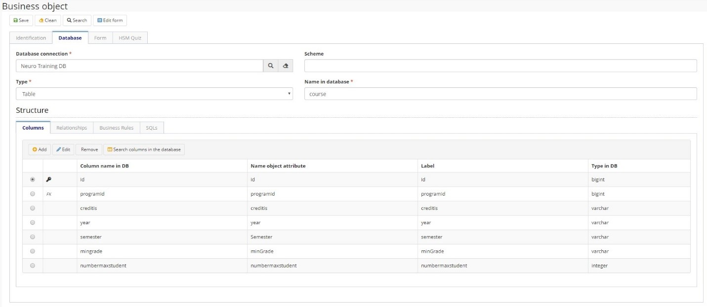
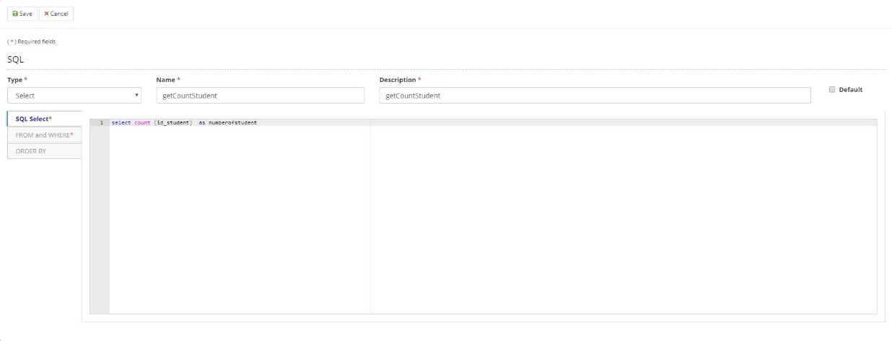

title: Business Object
Description: Business object
# Business Object

Business Object are the link between Neuro and a Data Entity of the
applications. In this way the Business Object will represent the data model and
may reach one or more forms.

Each business object created represents a table in the database.

Before getting started
----------------------

Must have a DB Connection and Neuro Application created.

## General data

1.  Access the functionality through navigation in the menu Neuro \> Management \> Business Object;

2.  Click on "New";

3.  Complete the fields available for “Identification” Tab;

4.  Select the **Application** for which the business object is created, give
    the Business Object a Name and a Description, also inform the purpose of the
    Business Object;

Figure 1 - Identification

## Database Information

1.	Complete the fields available for “Database” Tab, this tab refers to the database structure of the application. Since each business object represents a database table, this tab defines the database columns as well as their relationships, business rules, and SQL commands (if necessary).

2.	Fill the information with:

    1.	The Database Connection created;

    2.	The Database Scheme name;

    3.	Type, whether view or table;

    4.	The Name in Database of the business object.

Figure 2 - Database

## Columns

1.  Add the columns of the table, indicating

    1.  Inform the **Column name in DB**;

    2.  Select the **Type** of the Column, the system will make the correlation
        automatically to the **Type in DB**;

    3.  Give the **Name object attribute**, if you don´t change it will take the
        same name as the column name;

    4.  Set the **Label** for the form and grid;

    5.  Select **Primary key** if the column is the Primary key for the table;

    6.  Select **Required** if the column is mandatory;

    7.  Click on "Save”.

!!! Abstract "NOTE"

    After the “Save”, you´ll be able to inform Domain key and type and assign the
    Relationship if it´s needed.

Figure 3 - Columns list

Figure 4 - Adding new columns

!!! Abstract "ATTENTION"

    On each change of database or by the time of the creation of the business
    object you must run the correspondent DDL to run the creation/change in the
    Database.

## Relationship

1.  If necessary, you can add Relationships at this tab;

2.  Define:

    1.  **Type** (1 x N, N x 1);

    2.  Inform the **Relationship name** and the **Label** (to the form);

    3.  The **Referenced object** that will be linked;

    4.  The **Column for auto-complete**;

    5.  Set If it is **Required** field;

    6.  **Delegation** use when you want to use Generalization/Specialization
        concepts for the Relationship;

    7.  Set with Business object Colum will be part of the relationship.
    

Figure 5 - Relationship 

## Business Rules

1.	Select the Business Rule assigned for insert, change or delete action on the Business Object;

Figure 6 - Business rules
    
## SQLs 

1.	You can create SQL´s related to the business object to be used in the flow, for example: 

a)	In a task for request of enrollment in courses you can create a SQL (it will be considered as a function)  to get the number of student enrolled in a course;

b)	The SQL will run under an ESI Flow and will be call by the SM Flow (using the component for integration with ESI Flow).  
    

Figure 7 - SQL

## Form (CRUD & Custom)

1.	You can change the attribute labels through the Labels tab, and you can edit the grid fields using the Grid tab.

    

    Figure 8 - Labels

    

    Figure 9 - Grid

2.	Clicking the Edit Form button in the screen header will generate a form for this business object. If there is no form for this business object, the Fields sidebar will be displayed. If there is already a previously registered form linked to this form, the Screen Drawing tab for this form will be opened.

!!! tip "About"

    <b>Product/Version:</b> CITSmart | 8.00 &nbsp;&nbsp;
    <b>Updated:</b>03/12/2019 - Anna Martins  
