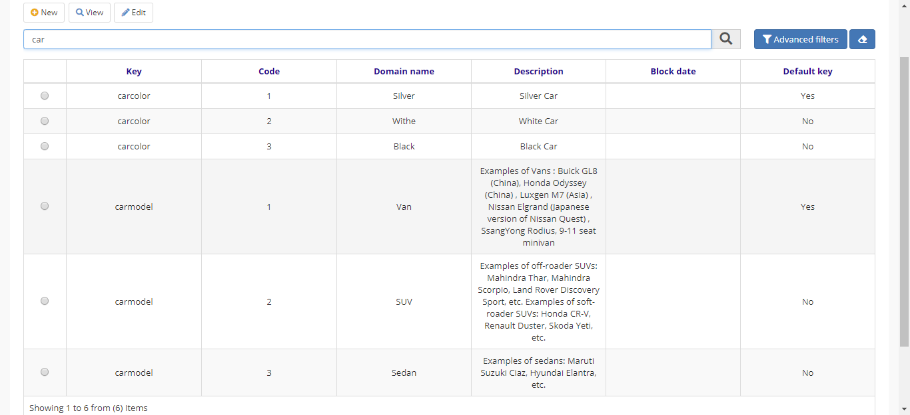

title: Domain
Description: Domain
# Domain

Builder allows to define domains that will be used by all application of the
institution. The identifier (Key) groups the Domain items.

Procedure
---------

1.  Access the functionality through navigation in the menu Builder \> Configuration \> Domain;

2.  Click on "New";

3.  Complete the fields available for “Register Domains”;

    !!! Abstract "NOTE"

        Create the **Key** (domain name) to group the items, the **Code** (to
        uniquely identify the domain item) the **name** of the domain item and the
        **description** of it (you can save one key as default.).

1.  Click on "Save”.

Figure 1 - Search domain

Figure 2 - Register domain

!!! tip "About"

    <b>Product/Version:</b> 4biz | Helium &nbsp;&nbsp;
    <b>Updated:</b>03/12/2019 – Anna Martins
