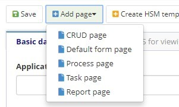
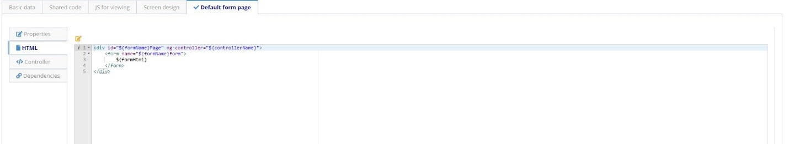
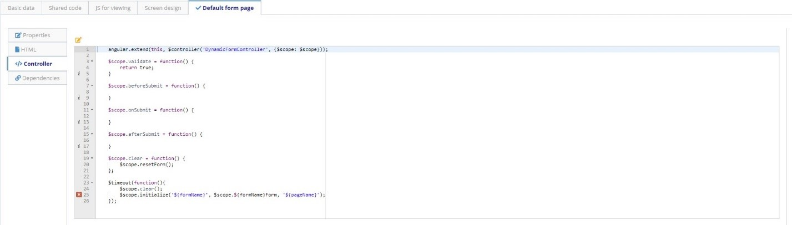

title: Form
Description: Form
# Form

Allows the construction of user interfaces through the combination of previously
defined Drag and Drop components and the use of CSS, Angular JS and JavaScript
resources.

## Characteristics

   * Each form may contain one or more pages and each page has an HTML, an
      Angular Controller JS, and a collection of dependencies (Screen layout is
      common to all pages)

   * The screen drawing contains a collection of lines and each line of the
      screen design may have one or more components (with one or more properties)

   * Pages previously configured in the system:

   -  **Default page**

       * Page used to start SM service, search the data inside database and register
          directly on it.

   -  **CRUD page**

       * Page automatically created by the business Object, with the basic functions

   -  **Process page**

       * Page for SM system processes associated with business processes, used to
         Start a Neuro Business Process.

   -  **Task page**

       * Run through a created Workflow/ESI Design, rendering a neuro form on the
         ticket screen.

   -  **Report page**

       * Report Page for reports generated by the application, includes specific
        dependencies for executing a JASPER report.

Before getting started
----------------------

Must have the Neuro Application created.

Procedure
---------

1.  Access the functionality through navigation in the menu Neuro \> Management \> Form;

2.  Click on "New";

3.  Complete the fields available for “Basic Data”, In this tab the user should
    inform the basic data of the forms, such as the **Application** to which the
    form belongs, the **Name**, **Description**, **Business Rules** (for
    Validation and for SM, if any) and the **Folder**, which is a physical form
    grouper on the server, for the purposes of organization and mark if the Form
    is to be **Show as a SM widget**;

    

    Figure 1 - Form

    !!! Abstract "ATTENTION"

        Version is incremented automatically by the system whenever a new version of the
        form is created.

4. Add page

    

    Figure 2 - Add page
    

5. The generated tabs will have the following structure:

    * Properties: General data

    

    Figure 3 - General data
    

    * HTML: page HTML structure

    

    Figure 4 - HTML
    

    * Controller: controller code referring to the form

    

    Figure 5 - Controller
    

    •	Dependencies: the dependencies of the application are reported. The name of the dependency and the path in which it is located must be entered. The user must also inform whether it will be injected into the controller.

    

    Figure 6 - Dependencies

6.	Design the screen, to create the screen designing, click Edit Screen or navigate to the system tab Screen Designing that opens automatically:

    *	Drag the components located on the left side palette to the center of the screen according to the shape you want to build the form. The components are arranged in rows and columns, and the rows have a width of 12 columns. This means that in each line you can insert up to 2 components with width 6, or up to 3 components with width 4, for example. It is not mandatory to fill the entire row;

    *	You can also create tabs on the forms. To do this, go to the tabs menu, and choose tabs horizontally or vertically. The tabs will be added on the screen, and you can design the screen with the components on each tab.

    

    Figure 7 - Design

7.	Click "Save" to run the changes. You can save it in the original version (current version), or in a new version.

!!! Abstract "JS for visualization"

    This tab has the ability to add variables in the JavaScript scope on the screen that opens when you click the "View Screen" button.     More information can be found in the Developing Applications.

!!! tip "About"

    <b>Product/Version:</b> CITSmart | 8.00 &nbsp;&nbsp;
    <b>Updated:</b>03/12/2019 - Anna Martins  
