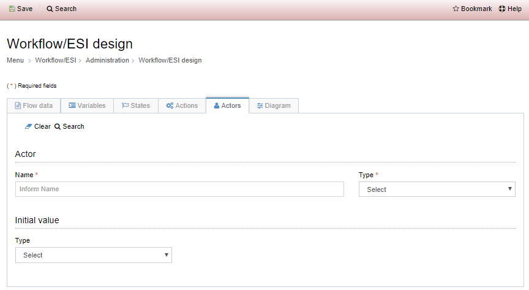

Title: Process Integration Flow  
Description:The process integration flows are workflows that have tasks performed by users and may also have automatic tasks performed by the system.

# Process Integration Flow  

The process integration flows are workflows that have tasks performed by users and may also have automatic tasks performed by the system.  

## How to access

1. Access the functionality through the menu Neuro > Management > Integration Flow.  

## Preconditions

1. Not applicable  

## Filters 

1. The following filter enables the user to restrict the participation of items in the standard feature listing, making it easier to find the desired items:  

      * Keyword  

Figure 1 - Workflow / ESI design search screen  

## Items list 

1. The following cadastral fields are available to the user to make it easier to identify the desired items in the standard feature listing: Name, Description, Flow application, Version and Block date.  

 

Figure 2 - Workflow / ESI design listing screen  

## Filling in the registration fields

Through this tab, basic information about the flow to be design is defined.  

1. Click on New > Process integration flow, as shown in the figure below:  

    
    
    Figure 3 - Service integration flow register screen  

2. The Design Workflow / ESI registration screen will be displayed, precisely on the Flow Data tab, as shown in the figure below:   

    
    
    Figure 4 – Register/edit workflow, Flow data tab.  

3. Fill in the fields: 
 
-  Enter a name for the flow, a description, the flow application, what form
    will start to flow (if applicable)

-  The field version is incremented automatically by the system whenever a new
    version of the workflow is created.

-  Time management can take place in the following ways:

	-   No management: when the time is not managed in the registered flow.

	-   Defined in the flow: the time recorded in the flow will be used, but only if
    there is no execution time registered in the business process.

	-   Defined in execution: the time registered in the business process will be
    used.

## Variables  

See knowledge Variables.   

## States

Flow states represent the situations in which a flow can found, according to its life cycle.  

1. To add a state to the workflow, select the States tab and click "Add",  
2. The following status register screen will be displayed, as shown in the figure below:  

     
    
    Figure 5 - Register/edit workflow, states tab  

3. Fill in the fields, informing:  

    - An identifier for the state;  
    - The literal name of the state;  
    - A background color that will be displayed when the flow in this state;  
    - The color of text that is displayed when the flow in this state;  
    - Whether it is the initial state of the flow;  
    - The state of the flow instance, i.e. whether the workflow is open, closed, suspended, or canceled in this state.  

4. To edit a state, select the state you want, click "Edit", make the necessary changes, and click "Update" to complete the edit.  
5. To remove a state, select the desired state, click "Remove", and confirm the deletion.  

!!! Abstract "ATTENTION"  

    To save your changes effectively, click "Save" on the top bar.
	
## Actions

Through this menu, it is possible to register the actions that will be executed in the workflow.  

1. To include an action, select the Actions tab and click  the "Add" option,  
2. The action register screen will be displayed, as shown in the figure below:  

     
    
    Figure 6 - Register/edit workflow, actions tab  

3. Fill in the fields, informing:  

    - An identifier for the action;  
    - The literal name for the action; 
    - The final state that will be established after executing the action (previously registered in the States tab);  
    - Whether or not the action requires a reason.  

4. In addition, a script can be defined to be executed when the action is triggered.  
5. To edit an action, select the action you want, click "Edit", make the necessary changes, and click "Update" to complete the edit.  
6. To remove an action, select the action, click "Remove", and confirm the deletion.  

!!! Abstract "ATTENTION"  

    To save your changes effectively, click "Save" on the top bar. 
	
## Actors  

Flow actors are the users or groups of users who participate in the task (s) of the workflow designed.  

Example: Suppose you want to order a pizza from your house. In your pizza delivery order flow, you'll probably have actors like the customer, the attendant, the pizzaiolo, and the delivery man. All these roles are considered actors in the flow, as they all participate in the process of delivering pizzas.  

1. To include an actor in the flow, select the Actors tab and click the "Add" option.  
2. The action register screen will be displayed, as shown in the figure below:  
	
    
    
    Figure 7 - Workflow registration / editing screen, Actors tab  
	
3. Fill in the fields, informing:  

    - A name for the actor,  
    - The type of actor,  
    - Whether group or user,  
    - The starting value of the actor, if applicable.  

4. The initial values of the actors can be of the type:  

    - Constant;  
    - Script;  
    - Flow variable.  

5. Regardless of the initial value type, the defined value must be a text, where:  

    - If the type of actor is "User", the "login" of the user registered in the GRP must be informed.  
    - If the type of actor is "Group", the "acronym" of the group registered in the GRP must be informed.  

6. To edit an action, select the action you want, click "Edit", make the necessary changes, and click "Update" to complete the edit.  

    !!! Abstract "ATTENTION"  

        To save your changes effectively, click Save on the top bar. 
	
7. To remove an action, select the action, click "Remove", and confirm the deletion.  
	
## Diagram  

The workflow drawing is done in the Diagram tab. The entire business process can be drawn here by using BPMN notation.  

1. The elements that can be added to the workflow are in the palette in the left corner of the screen. These elements are subdivided into:  

    - Events: "They trigger, interrupt, change or terminate the process. These events are classified as start, intermediate or end events, depending on when they occur in the process."  
    - Tasks: "It's the smallest part of a process. It is an action, not a function, nor the state of a product or service. It is "what" to do, so it must be written with the verb in the infinitive."  
    - Gateways: "They direct the process, dividing or converging activities in the flow, usually representing a point of control in the process."  

     
    
    Figure 8 - Register/edit workflow, Diagram tab  

2. To include an element in the flow, select it and drag it to the drawing page. A modal with element properties will be displayed on the screen (according to the chosen element). The information displayed for modal fill depends on the selected element, which can be:  

    **- For events:**  

    - Name;  
    - Description;  
    - CRON expression (for timer events);  
    - Target (for signal sending events);  
    - Target identifier (for signal sending events).  

    **- For tasks:**  

    - Identification tab  
	    - Name;  
	    - Description;  
	    - Identification;  
	    - Instance type.  

3. Variables  
    - In this tab the selected variables that are part of this task must be selected. Several variables can be selected, which can be for input and / or output. The list presented here is the same as in the "**Variables**" tab of the workflow register.  

4. User Actions  
    - The user actions tab represents the actions that the user can trigger when executing a task and, depending on the **action** selected, the flow may follow an alternate flow, it all depends on modeling. The actions that are presented in this list are the same ones that were registered in the "Actions" tab of the workflow register.  

5. Interface

    - This tab defines how the graphical user interface will be shown when performing this task, that is, how it will be the screen that      the user it will operate. You can choose two ways:  

      - Construct the HTML screen inside this tab; or  
      - Search for a pre-registered form in the project repository (Builder > Application management > Form).  

6. To use a form already created in the repository, check the **Repository Form** option as **Yes**, and enter the **Form Name**.  
7. When choosing to use a repository form, the user will have the option to add HTML with additional information for that particular task, which is very useful for generic form reuse, adding task-specific information.  
	
    
    
    Figure 9 - Button to edit a component property  
	
    
    
    Figure 10 - Modal with element properties on edition screen  	
	
	
	
!!! tip "About"

    <b>Product/Version:</b> CITSmart | 8.00 &nbsp;&nbsp;
    <b>Updated:</b>01/23/2019 - João Pelles  
	
	
	
