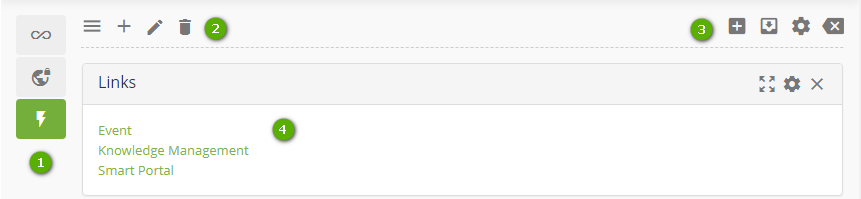

Title: Navigation and user interface
# Navigation and user interface

The user interface is the easiest way for the user to interact with
applications and information in a CITSmart instance.

Figure 1 – CITSmart homepage Screen

-   **1 - Banner frame**: in the internal area of the system, the taskbar contains navigation items and tools. As the main menu, with all the CITSmart functionalities, buttons with VoIP integration, the virtual assistant Anuva and information about the user login, environment version and also their language change;

-   **2 - Navigation in applications**: access to CITSmart's 13 certified processes,
    basic registration functionalities, creation and emission of reports, parameters,
    access to CITSmart Neuro (application engine), in addition to functionalities 
    of the platform management;

-   **3 - User panel**: determines the layout of the user panel presentation (Smart
    Decision) available on the CITSmart home page. It allows to put
    quick accesses such as links, reports and widgets.

## User Interface Tour
 

### Banner Frame

Figure 2 - Banner frame

The taskbar, located at the top, contains navigation items and tools:

-   **1**: main navigation menu, contains all the processes and functionalities of CITSmart;

-   **2**: when browsing the system and want to return to the home screen, click on "Home";

-   **3**: system notifications to the user, which is evidenced by the quantity existing;

-   **4**: VOIP call service;

-   **5**: attendance chat (visible to attendance group users);

-   **6**: shortcut to the main system applications;

-   **7**: user information, as well as providing system language change, manage
    chat status, CITSmart support media, and installed version environment
    data.

### Navigation in Applications

Figure 3 – Main menu screen

Clicking on the main navigation menu, it'll present all the features that 
CITSmart offers.

-   **1**: search bar of the functionality, accessible via menu;

-   **2**: access to settings for maintaining flows;

-   **3**: it has all 13 Certified Processes of the CITSmart;

-   **4**: the integrated management has functionalities that help in the management
    of the processes;

-   **5**: it presents basic registers to start CITSmart, such as users, location, besides 
    being able to register and edit menus within the system;

-   **6**: it has data to manage the Experience Center, which is portal customizable 
    for the user;

-   **7**: provides several types of reports that the system can generate with the
    data of the main functionalities, therefore, making possible the information
    to be better analyzed, besides allowing the creation of customized reports;

-   **8**: configuration of access and permission in the system;

-   **9**: configuration of the application and system parameters;

-   **10**: functionalities to manage the CISTmar;

-   **11**: access to CITSmart Neuro (engine of applications).

### User Panel (Smart Decision)

Figure 4 – Smart Decision Screen

Customization of the User Panel (Smart Decision) displayed on the system
homepage, where you can place quick accesses such as links, reports and widgets.

-   **1**: vertical bar containing the registered panels. Bar items can be shifted to fit the user's need;

-   **2**: items to edit a dashboard;

-   **3**: items to edit widgets in a dashboard;

-   **4**: example of widget of type "link", that can be internal or external.

Related
----------

[Customize management panel(Smart Decision)](/en-us/citsmart-platform-8/additional-features/reports/create/dashboard-customize-management-panel-smart-decision.html)

!!! tip "About"

    <b>Product/Version:</b> CITSmart | 8.00 &nbsp;&nbsp;
    <b>Updated:</b>02/19/2019 – Anna Martins

