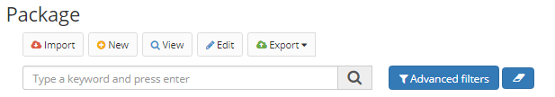

Title: Pacote
Description: Cuando se produce un conjunto de elementos de aplicación a través de Neuro, es posible que ese conjunto sea aglomerado en un paquete que puede ser importado/exportado entre ambientes de Neuro.    
# Paquete  

Cuando se produce un conjunto de elementos de aplicación a través de Neuro, es posible que ese conjunto sea aglomerado en un paquete que puede ser importado/exportado entre ambientes de Neuro.    

## Cómo acceder 

1- Acceda a la funcionalidad a través de la navegación en el menú Neuro > Gestión > Paquete.    

## Condiciones previas 

1- No se aplica.    

## Filtros 

1- El siguiente filtro permite al usuario restringir la participación de elementos en el listado estándar de funcionalidad, facilitando la localización de los elementos deseados:    
 - Palabra clave o enter.      

  
Figura 1 - Pantalla de búsqueda de paquetes    

## Lista de elementos 

1- Los siguientes campos catastrales están disponibles para el usuario para facilitar la identificación de los elementos deseados en el listado estándar de la funcionalidad: Nombre, Descripción y Versión.    

  
Figura 2 - Pantalla de lista de paquetes   

## Completar los campos catastrales

1- Para cambiar un paquete ya registrado, haga clic en "Editar", haga las modificaciones y luego haga clic en "Guardar";   
2- Para crear un paquete, haga clic en Registrar. Introduzca el Nombre y la Descripción del paquete. A continuación, seleccione los elementos que forman parte del paquete. Todos estos elementos fueron registrados previamente en Neuro;    

  
Figura 3 - Pantalla de registro/edición de paquetes   

3- Se pueden seleccionar Aplicaciones, Parámetros, Labels, Imágenes, CSS, Java Scripts, Páginas HTML, Informes, Reglas de negocio, Flujos, Objetos de negocio, Componentes, Páginas de formulario, Formularios, Procesos de negocio, Notificaciones y Grupos de usuarios para componer el paquete;    
4- Haga clic en "Guardar" para crear el paquete. Haga clic en "Buscar" para volver a la pantalla anterior;   
5- Para exportar un paquete guardado, seleccione el paquete y haga clic en "Exportar". Los paquetes se exportan en formato .json;    
6- Para importar un paquete a un Neuro, haga clic en "Importar", seleccione si esta versión del paquete debe reemplazar los elementos que tienen el mismo identificador, si la DDL debe ejecutarse y seleccione el archivo de importación .json.    

!!! Abstract "ATENCIÓN"  

    Para garantizar la compatibilidad, es altamente recomendable que la versión de Neuro que realizó la exportación de un paquete sea 
    la misma de Neuro que realizará la importación del mismo paquete.    

7- Para ver un elemento, seleccionélo y haga clic en "Ver".    

!!! tip "About"
    <b>Updated:</b>17/01/2019 - João Pelles Junior
