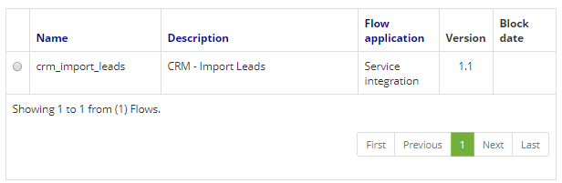
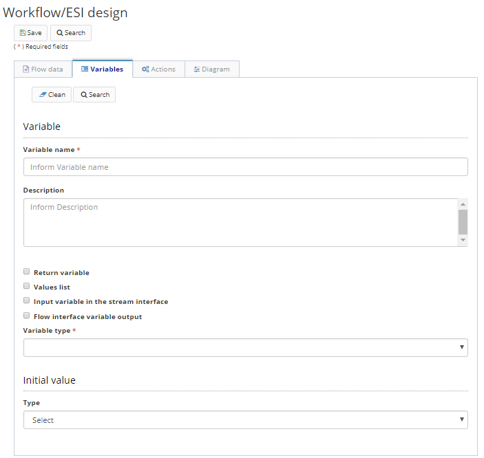

Title: Variables
Description: En esta pestaña se configuran las variables que se utilizarán en el flujo diseñado. Las variables son objetos capaces de retener y representar un valor o una expresión. Las variables se asocian a "nombres", llamados identificadores, durante el tiempo de ejecución del flujo.   

# Variables 

En esta pestaña se configuran las variables que se utilizarán en el flujo diseñado. Las variables son objetos capaces de retener y representar un valor o una expresión. Las variables se asocian a "nombres", llamados identificadores, durante el tiempo de ejecución del flujo.  

## Cómo acceder

1- Acceda a la funcionalidad a través de la navegación en el menú Neuro > Administración > Flujo de integración.  

## Condiciones previas

1- No se aplica. 

## Filtros

1- El siguiente filtro permite al usuario restringir la participación de elementos en el listado estándar de funcionalidad, facilitando la localización de los elementos deseados:    

- Palabra clave    

 

Figura 1 - Pantalla de búsqueda

## Lista de elementos 

1- Los siguientes campos catastrales están disponibles para el usuario para facilitar la identificación de los elementos deseados en el listado estándar de la funcionalidad: Nombre, Descripción, Aplicación del flujo, Versión y Fecha de bloqueo.  

 

Figura 2 - Pantalla de lista   

## Completar campos catastrales   

1- Para agregar una variable, seleccione la pestaña correspondiente y haga clic en "Agregar".    
2- Se presentará la siguiente pantalla:    

Figura 3- Pantalla de registro/edición del workflow, pestaña de Variables  

3- Completar los campos:    

- Nombre de la variable;  
- Descripción;  
- Se almacenará en la base de datos;  
	- Esta opción almacenará el valor de la variable internamente dentro del modelo de datos de Neuro, por lo que conservará el valor durante la ejecución de las tareas   
- Si es una variable de retorno;   
	- Esta opción hará que Neuro devuelve la variable al final de la ejecución del flujo.    
- Si es una lista de valores;  
- Si es una variable de entrada en la interfaz del flujo;  
	- Esta opción permite que la variable sea "inyectada" en el proceso de negocio vinculado a este flujo.    
- Si es una variable de salida en la interfaz del flujo;   
	- Esta opción hace que la variable tenga el valor completado cuando se ejecuta el proceso de negocio vinculado al flujo.   
- El tipo de la variable;  
	- Si es un objeto Java, introduzca la clase correspondiente de Java;   
	- Si es un objeto de negocio, cuál es su aplicación respectiva y cuál es el nombre registrado del objeto de negocio;   
- El valor inicial de la variable, si constante o script.    
	- Si el valor es una constante, éste nunca cambiará durante la ejecución del flujo, independientemente de las operaciones realizadas por el usuario.   

4- Para editar una variable, seleccione la variable deseada, haga clic en "Editar", realice los cambios necesarios y haga clic en "Actualizar" para completar la edición.   

!!! Abstract "ATENCIÓN"  

    Para guardar los cambios efectivamente, haga clic en "Guardar" en la barra superior. 

5- Para eliminar una variable de flujo, seleccione la variable deseada, haga clic en "Eliminar" y confirme la eliminación.  
	

!!! tip "About"
    <b>Updated:</b>17/01/2019 - João Pelles Junior
