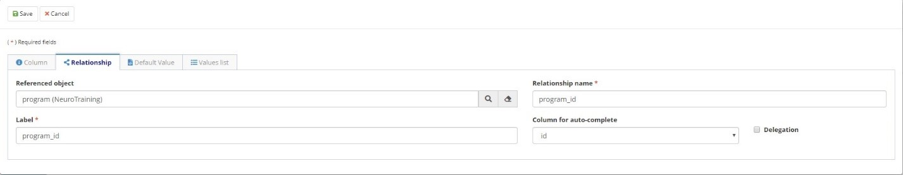
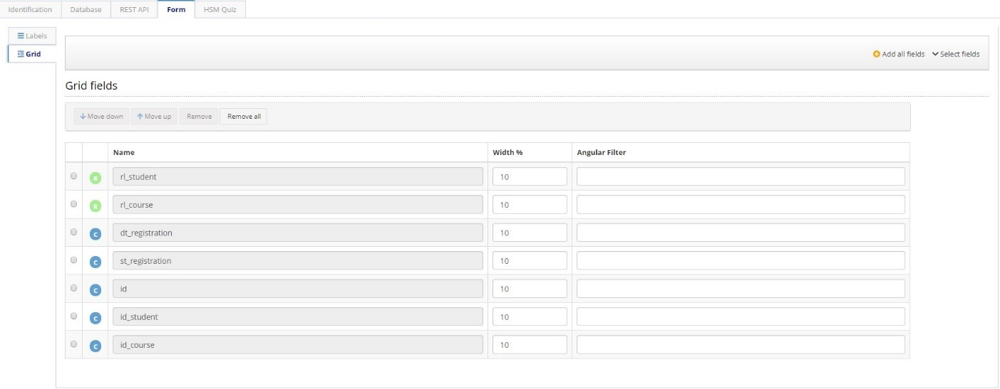

title: Objeto de Negocio
Description:Objeto de Negocio
# Objeto de Negocio

Los Objetos de Negocio son los vínculos entre el Neuro y una Entidad de Datos de
las aplicaciones. De esta forma, el Objeto de Negocio representará el modelo de
datos y podrá alcanzar uno o más formularios.

Cada objeto de negocio creado representa una tabla en la base de datos.

Antes de empezar
----------------

Es necesario tener creado la Conexión BD y la Aplicación Neuro.

## Dados generales

1.  Acceder al menú de navegación Neuro > Administración > Objeto de Negocio;

2.  Hacer clic en “Registro";

3.  Completar los campos disponibles en “Identificación”;

4.  Seleccione la **Aplicación** para la que se crea el objeto de negocio, asigne al Objeto de Negocio un Nombre y una Descripción, también informe el propósito del Objeto de Negocio.
    
    

    Figura 1 - Identificación

## Información de la Base de Datos

1.  Completar los campos disponibles para la pestaña "Base de datos". Esta guía
    hace referencia a la estructura de la base de datos de la aplicación. Como
    cada objeto de negocio representa una tabla de base de datos, esta guía
    define las columnas de la base, así como sus relaciones, reglas de negocio y
    comandos SQL (si es necesario).

2.  Completar las informaciones con:

    1.  La Conexión de Base creada

    2.  Nombre del Esquema de la base de datos

    3.  El Tipo, si es tabla o view 

    4.  Nombre en la Base de Datos del objeto de negocio
    

Figura 2 - Base de datos

## Columnas

1.  Agregar las columnas de la tabla, indicando:

    1.  Informar el **nombre de la columna en la BD**;

    2.  Seleccionar el Tipo de la Columna. El sistema hará la correlación automáticamente para el Tipo en BD;

    3.  Da el Nombre de atributo de objeto, si no cambia, tendrá el mismo nombre que el nombre de la columna;

    4.  Configurar la Label para el formulario y la grid;

    5.  Seleccionar la Clave principal si la columna es la Clave principal para la tabla;

    6.  Seleccione Obligatorio si la columna es obligatoria;

    7.  Hacer clic en “Guardar”.
    
!!! Abstract "NOTA"

    Después de guardar, puede indicar la clave del Dominio, adémas de escribir y asignar la relación, si es necesario.
    

Figura 3 - Lista de columnas

Figura 4 - Agregar nuevas columnas

!!! Abstract "ATENCIÓN"

    En cada cambio de base de datos, o en el momento de la creación del objeto de negocio, debe ejecutar el DDL correspondiente para         ejecutar la creación/cambio en la Base de Datos.
    
## Relación

1.  Si es necesario, puede agregar Relaciones en esta guía;

2.  Definir:

    1.  **Tipo** (1 x N, N x 1);

    2.  Informar el **nombre de la Relación** y del **Label** (para el formulario);

    3.  El **objeto referenciado** que será vinculado;

    4.  La **columna de relleno automático**;

    5.  Configurar si es un campo **Obligatorio**;

    6.  Uso de Delegación cuando desee utilizar conceptos de Generalización/Especialización para la Relación;

    7.  Configurar se a Coluna de objeto de negócio fará parte do relacionamento;
    
    

Figura 5 - Relación 

## Reglas de Negocio

1.	Seleccionar la Regla de Negocio asignada para insertar, cambiar o eliminar la acción en el Objeto de Negocio  

Figura 6 - Reglas de negocio
    
## SQLs 

1.  Usted puede crear SQL's relacionados con el objeto de negocio que se utilizará en el flujo, por ejemplo:

    1.  En una tarea para solicitud de inscripción en cursos, puede crear un SQL (será considerado como una función) para obtener el             número de alumnos matriculados en un curso;

    2.  El SQL será ejecutado por un flujo ESI y será llamado por el Flujo SM (usando el componente para integración con el flujo ESI.
  
    

Figura 7 - SQL

## Formulario (CRUD & Personalizable)

1.	Puede cambiar las labels de atributos a través de la guía de Labels y editar los campos de grid mediante la guía Grid.

    

    Figura 8 - Labels

    

    Figura 9 - Grid

2.	Al hacer clic en "Editar" formulario, en el encabezado de la pantalla, generará un formulario para ese objeto de negocio. Si no hay un formulario para este objeto de negocio, aparecerá la barra lateral Campos. Si ya hay un formulario registrado anteriormente vinculado a este formulario, la guía Dibujar Pantalla para este formulario se abrirá.

!!! tip "About"

    <b>Product/Version:</b> CITSmart | 8.00 &nbsp;&nbsp;
    <b>Updated:</b>03/20/2019 - Anna Martins  

