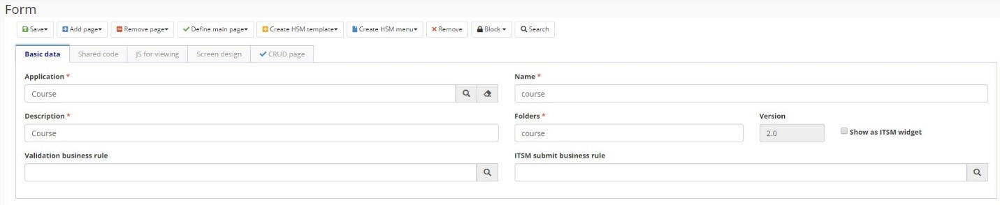

title: Formulario
Description: Formulario
# Formulario

Permite la construcción de interfaces de usuario a través de la combinación de componentes de Arrastrar y Soltar previamente definidos y el uso de recursos CSS, Angular JS y JavaScript.

## Características

   * Cada formulario puede contener una o más páginas y cada página tiene un HTML, un JS de controlador angular y una colección de dependencias (el diseño de la pantalla es común a todas las páginas);

   * El diseño de la pantalla contiene una colección de líneas y cada línea del diseño de la pantalla puede tener uno o más componentes (con una o más propiedades);

   * Páginas previamente configuradas en el sistema:

   -  **Página estándar**

       *   Página utilizada para iniciar el servicio SM, buscar los datos dentro de la base de datos y registrarse directamente en él

   -  **Página CRUD**

       *   Página creada automáticamente por el Objeto de negocio, con las funciones básicas.

   -  **Página de proceso**

       *   Página para procesos del sistema SM asociados a procesos de negocio, utilizados para iniciar un Proceso de Negocio Neuro

   -  **Página de tarea**

       *   Ejecución de un proyecto de flujo de trabajo/Diseño ESI, renderizando un formulario Neuro en la pantalla del ticket.

   -  **Página de informe**

       *   La página de informes para informes generados por la aplicación, incluye dependencias específicas para la ejecución de un informe JASPER.

## Antes de empezar

Es necesario tener creado la Aplicación Neuro.

## Procedimiento

1. Acceder al menú de navegación	Neuro > Administración > Formulario;

2. Hacer clic en “Registro;

3. Completar los campos disponibles en "Datos Básicos". En esta pestaña, el usuario debe informar los datos básicos de los formularios, como la **Aplicación** a la que pertenece el formulario, el **Nombre**, **Descripción** y **Reglas de Negocio** (para Validación y para SM, si hay) y la **Carpeta**, que es una agrupación de formularios en el servidor con fines de organización, y marca si el **Formulario se Muestra como un widget de SM**;
    
    

    Figura 1 - Formulario

    !!! Abstract "ATENCIÓN"

        La versión se incrementa automáticamente por el sistema cada vez que se crea una nueva versión del formulario.

4. Agregar página

    

    Figura 2 - Agregar página
    

5. Las pestañas generadas tendrán la siguiente estructura:

    * Propriedades: datos gerais

    

    Figura 3 - Datos generales
    

    * HTML: estructura de la página HTML

    

    Figura 4 - HTML
    

    * Controlador: código do controlador para el formulario

    

    Figura 5 - Controlador
    

    •	Dependencias: las dependencias de la aplicación se reportan. El nombre de la dependencia y la ruta en la que se encuentra se deben insertar. El usuario también debe informar si se inyecta en el controlador.

    

    Figura 6 - Dependencias

1.  Diseñar la tabla. Para crear el diseño de la pantalla, haga clic en "Editar" o navegue hasta la guía del sistema Diseñar Pantalla, que se abre automáticamente.

    *   Arrastre los componentes ubicados en la paleta izquierda al centro de la pantalla, de acuerdo con la forma en que desea crear el     formulario. Los componentes se organizan en líneas y columnas, y las líneas tienen un ancho de 12 columnas. Esto significa que en       cada línea usted puede insertar hasta 2 componentes con ancho 6, o hasta 3 componentes con anchura 4, por ejemplo. No es obligatorio     completar la fila entera;

    *   También puede crear guías en los formularios. Para ello, vaya al menú de guías y elija las guías horizontalmente o                   verticalmente. Las guías se añadirán a la pantalla y puede crear la pantalla con los componentes de cada guía.

    

     Figura 7 - Design

7.	Haga clic en "Guardar" para hacer los cambios. Puede guardarlo en la versión original (versión actual) o en una nueva versión.

!!! Abstract "JS para la visualización"

    Esta guía tiene la capacidad de agregar variables en el ámbito de JavaScript, en la pantalla que se abre al hacer clic en "Ver           Pantalla". Más información se puede encontrar en Desarrollar Aplicaciones.

!!! tip "About"

    <b>Product/Version:</b> CITSmart | 8.00 &nbsp;&nbsp;
    <b>Updated:</b>03/20/2019 - Anna Martins  

