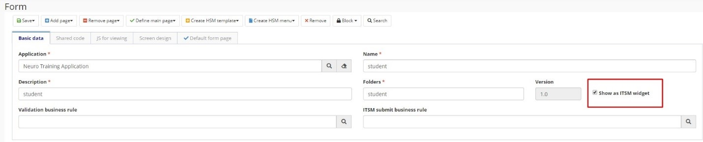

title: Utilizar aplicaciones Neuro en el Centro de Experiencia
Description: Utilizar aplicaciones Neuro en el Centro de Experiencia
# Utilizar aplicaciones Neuro en el Centro de Experiencia

Centro de Experiencia

1.  Crear un formulario para el objeto de negocio;

2.  Marcar su formulario para **Mostrar Como Widget SM**;

    

    Figura 1 - Datos básicos

3.  Vincular el formulario a un Centro de Experiencia;

4.  Selección de un formulario;

    

    Figura 2 - Formulario

    

    Figura 3 - Formulario (continuación)

5.  Uso del Centro de Experiencia para Insertar Datos:

Figura 4 - Centro de Experiencia

Figura 5 - Centro de Experiencia (continuación)

!!! tip "About"

    <b>Product/Version:</b> CITSmart | 8.00 &nbsp;&nbsp;
    <b>Updated:</b>03/20/2019 – Anna Martins
