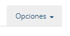
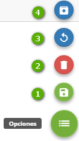
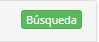

title: Crear conocimiento
Description: Es posible crear, editar y buscar conocimientos que van desde la aclaración de una funcionalidad, incluso orientaciones más técnicas.
# Crear conocimiento
Es posible crear, editar y buscar conocimientos que van desde la aclaración de una funcionalidad, incluso orientaciones más técnicas.
Un conocimiento permite la anexión de imágenes, vídeos, archivos adjuntos, enlaces, entre otros recursos audio-visuales, haciendo así el intercambio de información más interactivo.

Antes de empezar
----------------

Antes de crear un conocimiento, es necesario crear carpetas para su inserción y
mejor organización. Así es más fácil su ubicación al hacer una búsqueda.

Procedimiento
-------------

1.  Acceder al menú principal Procesos \> Gestión del Conocimiento \>
    Conocimiento de Conocimiento;

2.  Hacer clic en "Opciones", ubicado en la esquina inferior derecha, y después
    en "Añadir nuevos conocimientos";

### Registro, Relación y Notificación

Figura 1 - Crear conocimiento

-   **1**: Registro - registrar documento;

-   **2**: Documento Relacionado - permite vincular un conocimiento ya existente al
       documento que se está creando;
       
-   **3**: Elemento de Configuración - permite vincular un elemento de configuración;

-   **4**: Categoría de Ocurrencia - permite vincular una categoría de ocurrencia;

-   **5**: Partes Interesadas - seleccionar las partes (usuarios o grupos) que terán
    acceso al conocimiento, siendo posible notificarlos;
    
-   **6**: Notificaciones - configura notificaciones de publicación, por correo
    electrónico y en la pantalla;
    
-   **7**: Versión - presenta todas las versiones del documento.

!!! Abstract "ATENCIÓN"

    Para que la pestaña Elemento de Configuración sea disponible, el documento
    deberá estar guardado.
    
### Conformidad   

Figura 2 - Guía Opciones

*Opciones*:

-   **Gestión de Disponibilidad**: el conocimiento referente o no a la Gestión de Disponibilidad;
    
-   **Derechos de Autor**: el conocimiento es referente o no a un derecho de autor;

-   **Legislación**: el conocimiento es referente o no a una legislación.

### Datos de Registro

En la pestaña Registro, se presentan vários campos para completar, entre ellos:

-   **Título**: informar el título del conocimiento;

-   **Situación**: informar la situación del documento que se va registrar;

-   **Privacidad**: definir la privacidad del conocimiento;

-   **Confidecial**: sólo el autor del conocimiento y el administrador de la carpeta tendrán acceso al conocimiento;
    
-   **Público**: todas las personas tendrán acceso al conocimiento, incluso las personas sin permiso en la carpeta;
    
-   **Interno**: sólo las personas con permiso en la carpeta tendrán acceso al conocimiento

-   **Fecha de expiración**: informe la fecha de expiración que el conocimiento obedezca.
    Cuando alcanza la fecha definida, el documento se archivará automáticamente.
    
-   **Contenido**: describir el texto del conocimiento:

    -   Para añadir un enlace (hiperlink) al contenido del conocimiento para  acceder a un vínculo externo, seleccione una palabra o frase y haga clic en "Insertar/Editar enlace", completar los campos y hacer clic en "OK".
        
    -   Para añadir una imagen al contenido del conocimiento, haga clic en "Imagen" (dibujo e paisaje) o copiar y pegar la imagen guardada en un archivo en el ordenador;    

    -   Para añadir un vídeo, haga clic en "Insertar un vídeo":
    
        -   En la pestaña Vídeo del servidor: permite insertar un vídeo que está en el
            servidor de vídeos o en el ordenador;
            
        -   En la pestaña Embedded: permite insertar vídeos del Youtube. Al acceder al
            vídeo, hacer clic con el botón derecho y seleccionar "Copiar código de 
            incorporación".
            
!!! Abstract "ATENCIÓN"   

       Se debe tener mucho cuidado al utilizar la privacidad "Público", pues
       se corre el riesgo de ofrecer documentos de forma inadecuada. En este 
       escenario se detiene la configuración de perfil de acceso y libera el 
       acceso del documento a todos los usuarios.
       
       
### Opciones de publicación

Figura 3 - Botón Opciones

   Al tener un conocimiento ya registrado, el botón "Opciones" presenta otras
   acciones:
   
-   **1**: guardar el conocimiento;

-   **2**: borrar el conocimiento;

-   **3**: limpiar el documento abierto;

-   **4**: archivar el documento abierto, convertiéndolos en no visibles en el
    Portal de Conocimientos.
    
    
!!! Abstract "Workflow de Aprobación"

    El usuario final puede proponer nuevos Documentos/Conocimientos en el botón flotante del Portal de Conocimiento, el documento se guarda en la carpeta indicada por el Parámetro del sistema 313.
    El Gestor de conocimiento busca los documentos no publicados o en la carpeta indicada y, según el progreso de la aprobación, el Documento ganará otro status:
    
    - En diseño
    
    - En revisión
    
    - Revisado
    
    - En evaluación y
    
    - Evaluado
    
    

### Otras opciones
            

Figura 4 - Botón Búsqueda

Botón Búsqueda - devuelve la pantalla principal de búsqueda de conocimientos.

!!! Abstract "Versión"

    En la creación del conocimiento, CITSmart establecerá siempre la versión "1.0" y, cuando del cambio de un documento, podrá ser indicado por el operador, si la modificación debe ser Versionada o no y, también si las versiones anteriores deben archivarse.

!!! Abstract "ATENCIÓN" 

    **PRIVACIDAD** Se debe tener mucho cuidado al utilizar la privacidad "Público", pues se corre el riesgo de ofrecer documentos de forma inadecuada. En este escenario se detiene la configuración de perfil de acceso y libera el acceso del documento a todos los usuarios.
    
    **SITUACIÓN**, la Situación indica el Flujo/Proceso de la creación (diseño) y aprobación/evaluación del Conocimiento hasta su           publicación. 

Relacionado
--------------------

[Crear carpeta](/es-es/citsmart-platform-8/processes/knowledge/configuration/create-folder.html)

[Configurar acceso externo al Portal del Conocimiento](/es-es/citsmart-platform-8/processes/knowledge/configuration/configure-external-access-knowledge-portal.html)

<i class='fa fa-youtube-play  fa-2x' style='color:#97ce17;vertical-align: middle;'> </i> [Video Library](https://www.youtube.com/playlist?list=PLB5qK2uzf2RPgNa5jacymoUrgZpi7MgdD)'

!!! tip "About"

    <b>Product/Version:</b> CITSmart | 8.00 &nbsp;&nbsp;
    <b>Updated:</b>01/25/2019 – Larissa Lourenço
