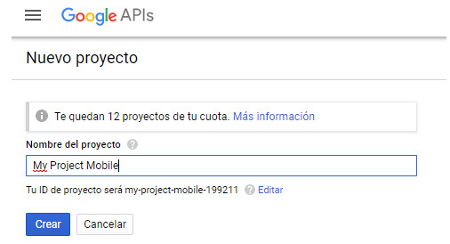
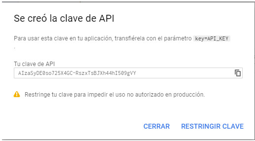

title: Configurar instancia CITSmart para acceso vía móvil
Description: Proporcionar orientaciones necesarias para configurar el servidor para el uso adecuado de CITSmart ITSM Experience en la plataforma iOS y Android.
# Configurar instancia CITSmart para acceso vía móvil

Este documento tiene el propósito de proporcionar orientaciones necesarias para
configurar el servidor para el uso adecuado de CITSmart Experience en la
plataforma iOS y Android.

Antes de empezar
-----------

Es necesario Instalar la versión 7.2.2.0 (o superior) de CITSmart 
Experience, Configurar los parámetros 257 e 272

-   Valores: "S" o "N" Default: "N";

-   Si el valor del parámetro es "S", sólo se mostrará las notificaciones de
    solicitudes sin responsable actual.

-   Si el valor del parámetro es "N", se pueden mostrar las notificaciones de
    todas las solicitudes;

Los parámetros 254 (parametrización del sistema), 255, 256, 258, 267, 284, 285,
286, 350 también deben configurarse.

Configuración de los web services
---------------

La configuración de los web services es fundamental para el acceso a todas las
características de la aplicación. Siga los pasos para configurarlo:

1.  En el CITSmart Experience (Web), acceda a la funcionalidad de los web
    services para el móvil (Sistema > Configuración > Web Service Citsmart
    Mobile);

2.  Haga clic en la pestaña "Vincular grupos" y vincule el grupo ejecutor de
    actividades a los web services de CITSmart Experience Mobile.

!!! Abstract "REGLA"

    En el momento en que se selecciona el grupo, se vinculará a todos los web
    services de CITSmart Experience de forma automatizada.

Instalación del certificado intermediario Globalsign
--------------------------------------------------

Para reconocer el certificado intermedio de GlobalSign (Emisor del Certificado Digital) es necesario la instalación del mismo. Sigue los siguientes procedimientos:

1.  Acceso a la dirección: <https://support.globalsign.com/customer/portal/articles/1464460-domainssl-intermediate-certificates>;

2.  Realice la descarga del primer certificado, como se indica en la figura siguiente:

    

    Figura 1 - Certificado intermedio de GlobalSign

    *  En el móvil: informe el nombre genérico (sugerencia: GlobalSign) y haga clic
       en "Siguiente".

    *  En el escritorio: haga clic con el botón derecho en el certificado
       descargado (como figura abajo), haga clic en instalar certificado y avanzar
       hasta que finalice.

    

    Figura 2 - Instalación del certificado en Windows

3.  Después de instalar, simplemente cambie la dirección de la aplicación a sus
    necesidades (por
    ejemplo:“[https://citsmart.empresa.com.br/citsmart](https://citsmart.centralit.com.br/citsmart)”).

### Instalación del App Android y iOS

1.  Accede a store (Play Store o App Store) para bajar la aplicación CITSmart
    Experience mobile;

2.  Busque CITSmart Experience y después de la búsqueda, seleccione la
    aplicación;

3.  Presione el botón *Instalar* para descargar la aplicación.

### Creando clave para uso y consumo de las API Google

Para que sea posible el uso y el consumo de las API de Google es necesario que
se crea una API de claves. Para ello, se deben seguir los siguientes pasos:

!!! Abstract "ATENCIÓN"

    Para realizer estos procedimientos, debe inciar session con una cuenta de
    Google.

1.  Accede a la consola del desarrollador
    Google [https://console.developers.google.com](https://console.developers.google.com/);

2.  Haga clic en Crear un proyecto, como se indica en la figura siguiente:

    

    Figura 3 - Consola del desarrollador de Google

3.  Se mostrará una ventana, como se muestra en la figura siguiente, para
    informar los datos del nuevo proyecto;

    

    Figura 4 - Pantalla de creación de proyectos

4.  Introduzca el nombre del proyecto y haga clic en el botón *Crear* para crear
    el proyecto.

5.  Después de crear el proyecto, haga clic en API y servicios. Para crear la
    API de claves, haga clic en API y servicios > Credenciales > Crear
    credenciales > Clave de API, como se indica en la figura siguiente:

    

    Figura 5 - Pantalla de creación de API Key

6.  Hecho esto, se mostrará la clave de API:

    

    Figura 6 - Pantalla de opciones de API de la clave para la creación

7.  Elija la opción que mejor le atienda. Para más información sobre qué clave
    le atender, acceda
    a <https://developers.google.com/console/help/new/#generatingdevkeys>.

8.  Después de las claves creadas, las API ya se pueden consumir.

### APIs a utilizar en las soluciones

Las siguientes son las API de Google que se deben considerar en las soluciones:

Figura 7 - APIs

-   **Direcciones API**: la API de direcciones de Google se consume mediante
    solicitudes HTTP. Tal API calcula direcciones entre dos puntos informados,
    el origen y el destino, poseyendo otras diversas opciones. Para más
    información sobre el uso de esta API, acceda
    a: <https://developers.google.com/maps/documentation/directions>.

-   **Distance Matrix API**: la API Google Distance Matrix permite la
    recuperación de matrices de distancias entre dos puntos, es decir, devuelve
    también un resultado aproximado. La diferencia para la API de Google API es
    que Distance Matrix no devuelve información tan detallada como los pasos a
    realizar. Para más información sobre el uso de esta API, acceda
    a: <https://developers.google.com/maps/documentation/distancematrix>.

-   **Geocoding API**: Google Geocoding API es una API que ayuda a recuperar
    posiciones geográficas enviando como argumento una dirección por extenso. El
    consume de la API es hecho por HTTP y los resultados se pueden obtener en
    XML o JSON. Para más información sobre el uso de esta API, acceda
    a:<https://developers.google.com/maps/documentation/geocoding>.

-   **Statics Maps API**: la API para mapas estáticos de Google se utilizará en
    casos que no será necesaria la interacción como mapa, sólo visualización. Es
    interesante su uso ya que es más ligero, ya que no es necesario descargar
    recursos JS e imágenes que no serán utilizadas. Para más información sobre
    el uso de esta API, acceda
    a: <https://developers.google.com/maps/documentation/staticmaps>.

-   **Google Maps JavaScript API**: el uso de la API se realiza a través de una
    API JS. Para su uso, basta con enlazar el JS en la página que utilizará los
    mapas. Para más información sobre el uso de esta API, acceda
    a:<https://developers.google.com/maps/documentation/javascript>.

Activando una API
-----------------

Para activar una API para su uso, siga estos pasos:

1.  Después de realizar los pasos descritos en la sección "Creación de claves
    para el uso y el consumo de las API de Google";

2.  Haga clic en API y servicios > Activar API y servicios, como se muestra en
    la siguiente figura:

    

    Figura 8 - APIs Google

3.  Se mostrará la biblioteca de API. Seleccione la API que desea activar (la
    siguiente figura representa un ejemplo de API) y haga clic en el
    botón "Habilitar" API como se indica en la figura siguiente:

    

    Figura 9 - Activación de API de Google

4.  Hecho esto, la API estará habilitada para su uso.

Relacionado
-----------

[Configurar parametrización - móvil](/es-es/citsmart-platform-8/platform-administration/parameters-list/configuration-parametrization-mobile.html)

[Configurar parametrización - sistema](/es-es/citsmart-platform-8/platform-administration/parameters-list/configure-parametrization-system.html)

[Manual de uso de la aplicación móvil CITSmart Experience](/es-es/citsmart-platform-8/additional-features/mobile-and-field-service/apps/citsmart-app.html)

[Configurar las opciones del mobile](/es-es/citsmart-platform-8/additional-features/mobile-and-field-service/configuration/configure-mobile-options.html)

!!! tip "About"

    <b>Product/Version:</b> CITSmart | 8.00 &nbsp;&nbsp;
    <b>Updated:</b>01/28/2019 - Anna Martins

