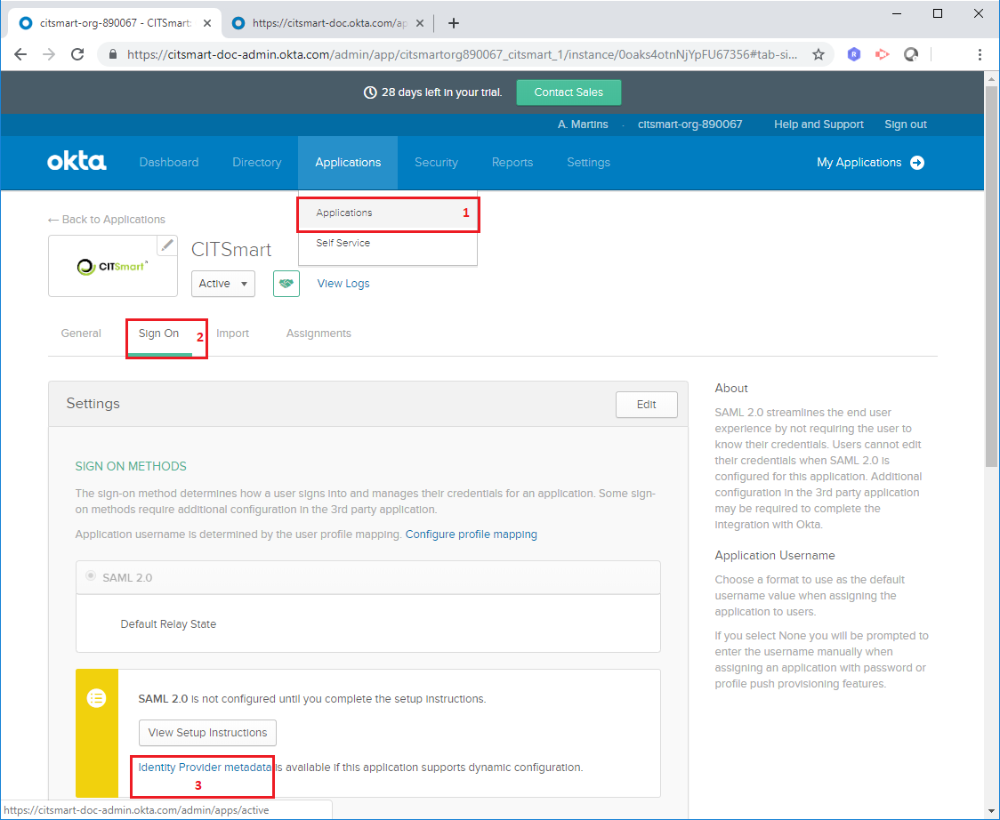

title: Configurar Okta en CITSmart
Description: Okta conecta cualquier usuario con cualquier aplicación en cualquier dispositivo. Este documento explica la forma ideal de conectar esta solución al CITSmart.

# Configurar Okta en CITSmart

Este método de autenticación le permite utilizar los recursos de Okta para autenticar a los usuarios de su organización en una instancia CITSmart. Este documento explica los pasos para configurar este método. Para saber más sobre el Okta accede [okta.com][1].

Antes de empezar
--------------------

La configuración de esta solución es un proceso de varias fases. La primera fase es la creación de una cuenta de Okta.

Procedimiento
----------------

*1º Paso: Crear una cuenta Okta:*

1. Acceder al sítio:  https://www.okta.com;

2. Hacer clic en "Try Okta" y después en "Sign up today";

3. Informar los datos esenciale (correo electrónico, nombre y apellido);

    

4. Haga clic en "Get Started" para completar la operación. Después, compruebe el correo electrónico registrado (que enviará un enlace de acceso), acceda a la cuenta con la contraseña temporal enviada y la cambie para mayor seguridad de los datos;

*2º Paso: Crear la aplicación CITSmart dentro del Okta:*

1. Después de completar el paso anterior, conectarse al Okta con su cuenta recién creada;

2. Haga clic en la pestaña "Applications" y luego en "Add Application";

    

3. Haga clic en "Create New App";

    

4. Marcar la opción "SAML 2.0" y después hacer clic en "Create";

    

5. En el campo "App name", añadir el nombre de la aplicación y después, haga clic en "Next";

    

6. Configurar la ruta de la aplicación y, a continuación, haga clic en Next;

    

    !!!Abstract "ATENCIÓN"
        
        En el campo "Single sign on URL" y "Audience URI (SP Entity ID)", se deben incluir las direcciones de URL en las que se
        ejecutará la apilación CITSmart.
     
7. Marcar las opciones "I'm an Okta customer adding an internal app" y "This is an internal app that we have created". Después, haga clic en "Finish".

*3º Paso: Asignar usuarios a la aplicación CITSmart del Okta:*

1. Concluido el paso anterior, es necesario hacer clic en la pestaña "Applications > Applications" y después en "Assign Applications" y optar por el filtro "People";

    

2. Después, se puede elegir el usuario que tendrá el permiso para acceder a la aplicación que se está creando. Haga clic en "Assign" y luego para finalizar, haga clic en "Done";

*4º Paso: Incluir la información necesaria en el CITSmart configurado en el Okta:*

1. Es necesario configurar algunos datos en el directorio del WildFly. Acceder al directorio, abrir la carpeta "/standalone/configuration" y cambiar el archivo "citsmart.cfg".

     

2. Para acceder al archivo, se debe incluir estas informaciones en el archivo "citsmart.cfg":
       
     a) En la línea *SAML2_HOST* y *SAML2_PORT* incluir la dirección y el puerto de la aplicación CITSmart;
       
     b) En la línea *SAML2_METADATA* incluir los metadatos SAML del Okta. Este dato puede obtenerse siguiendo las siguientes 
       instrucciones:
 
      - Acceder a la aplicación CITSmart en Okta, hacer clic en la pestaña "Applications > Applications" y después en la opción "Sign On". Al presionar la opción "Identity Provider metadata", se pondrá a disposición una nueva pestaña de los metadatos, copiar la URL del navegador e insertar en la propiedad *SAML2_METADATA*;
        

   c) En la línea *OKTA_URL*, incluir la URL principal de la cuenta Okta.
   
   d) En la línea *OKTA_TOKEN*, incluir el token para acceder vía API. Para obtener este token, atienda estos pasos:
   
3. Acceder a la aplicación CITSmart en el Okta, seleccionar en el menú la opción "Security > API" y después hacer clic en "Create Token". Nombre del token y hacer clic en "Create Token". Se mostrará el valor del token que deberá ser copiado en la línea citada arriba.
   

   e) En la línea *OKTA_DOMAIN_ALIAS*, incluir el dominio de los usuarios provinciales del Okta.
  
*5º Paso: Sincronizar usuario del Okta en CITSmart:*

1. Dentro del CITSmart, acceder al menú "Okta Config" y registrar una nueva configuración al hacer clic en "Nuevo";

    

2. Completar los campos con las informaciones necesarias:

    

    * **Descripción:** introducir una definición de esta nueva configuración Okta;
     
    * **Alias:** incluir el dominio del usuario que se guardará en la base. Ejemplo: okta\administrador@citsmart.com;
     
    * **URL del dominio:** debe incluir el mismo valor (URL) que se insertó en la línea *OKTA_URL* en el archivo "citsmart.cfg"; 
     
    * **Token API:** incluir el mismo valor del token insertado en la línea *OKTA_TOKEN* en el archivo "citsmart.cfg";
     
    * **Grupo:** insertar el ID del grupo en el que el usuario sincronizado y grabado pertenecerá al CITSmart;
     
    * **Perfil de Acceso:** insertar el ID del perfil en el que el usuario sincronizado y grabado pertenecerá al CITSmart;
     
    * **ID de la aplicación:** incluir el ID de la aplicación. Esta información puede ser recuperada en la URL del Okta, conforme la figura abajo:
     
    

3. Haga clic en "Guardar" y después en "Sicronizar usuarios" para efectuar la operación.

*6º Paso: Configurar el Logout:*

1. Como el Okta no tiene pantalla de logout, en el parámetro 377 del CITSmart, podemos insertar alguna dirección de página para 
redirigir al usuario al final de la sesión;

2. Configurar el enlace para el logout también en la dirección **(Admin > Settings > Customization > Sign-Out-Page)**, a continuación, marque la opción "Usar custom sign-out page". Entonces, se debe insertar la URL (https://localhost:8443/citsmart/saml/logout) con las debidas adaptaciones (host y puerto), conforme la imagen abajo:

 
 
!!!Abstract "NOTA"
   
    Al hacer *logout* del CITSmart, no se debe realizar el *logout* del Okta, pues el usuario puede tener otras aplicaciones en la sesión del Okta. En cambio, si realiza el *logout* del Okta, la sesión del usuario en el CITSmart será removida.

Lo que hacer después
----------------------

Concluido la integración del Okta con el CITSmart, algunos parámetros del CITSmart pueden ser configurados para mejor personalizar esta integración:

 
 - El parámetro 445 (nombre del grupo Administrador en Okta) permite elegir el grupo administrador en la solución Okta. Si el usuario pertenece a este grupo elegido, tendrá el perfil de acceso definido como administrador. Si no es así, su perfil de acceso será el perfil predeterminado definido por el parámetro 39.
 
!!! tip "About"

    <b>Product/Version:</b> CITSmart | 8.00 &nbsp;&nbsp;
    <b>Updated:</b>05/30/2019 – Larissa Lourenço

[1]: https://www.okta.com/
