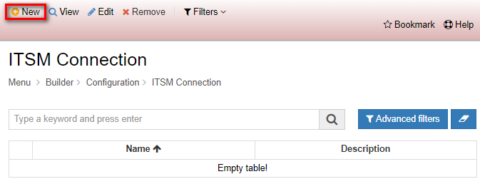

Title: Conexión ITSM  
Description: Esta funcionalidad tiene como objetivo configurar la conexión para realizar integración con el CITSmart.    
# Conexión ITSM    

Esta funcionalidad tiene como objetivo configurar la conexión para realizar integración con CITSmart.    

## Cómo acceder 

1- Acceda a la funcionalidad a través de la navegación en el menú Builder > Configuración > Conexión ITSM.   

## Condiciones previas 

1- No se aplica.   

## Filtros  

1- El siguiente filtro permite al usuario restringir la participación de elementos en el listado estándar 
   de funcionalidad, facilitando la localización de los elementos deseados:  
  - Palabra clave.  

   
Figura 1 - Pantalla de búsqueda     

## Lista de elementos

1- Los siguientes campos catastrales están disponibles para el usuario para facilitar la identificación de 
   los elementos deseados en el listado estándar de la funcionalidad: Nombre y Descripción.   
  
  
Figura 2 - Pantalla de lista     

## Completar campos catastrales

1- Para registrar una conexión ITSM, haga clic en Registrar, como se muestra en la figura siguiente:    

  
Figura 3 - Pantalla inicial de conexión ITSM   

2- En esta pantalla también se permite al usuario otras acciones. Son ellas:     
- Para editar un elemento creado, seleccione el elemento deseado, haga clic en Editar, realice los cambios y active Guardar.    
- Para ver un elemento, seleccionélo y haga clic en Ver.   
- Para eliminar un elemento creado, seleccione el elemento que desee, haga clic en Eliminar y confirme la eliminación.  

3- Al hacer clic en Registrar, aparecerá la siguiente pantalla:   

  
Figura 4 - Pantalla de registro    

4- Introduzca el nombre, la descripción, la dirección URL, el usuario y la contraseña para guardar la conexión.    
5- Haga clic en Guardar para crear la conexión ITSM. Haga clic en Buscar para volver a la pantalla anterior.  
6- La conexión puede estar vinculada a un proceso de negocio registrado.    

!!! tip "About"
    <b>Updated:</b>17/01/2019 - João Pelles Junior
