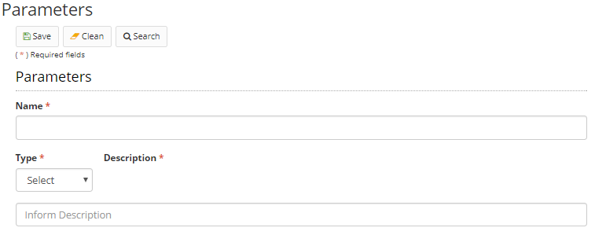

Title: Parámetros   
Description: En esta pantalla, se configuran los parámetros a utilizar en las aplicaciones creadas a través de Neuro.    

# Parámetros  

En esta pantalla, se configuran los parámetros a utilizar en las aplicaciones creadas a través de Neuro.   

## Cómo acceder

1- Acceda a la funcionalidad a través de la navegación en el menú Neuro > Configuración > Parámetros.   

## Condiciones previas 

1- No se aplica.    

## Filtros 

1- El siguiente filtro permite al usuario restringir la participación de elementos en el listado estándar de funcionalidad, facilitando la localización de los elementos deseados:    
 - Palabra clave    

    
Figura 1 - Pantalla de búsqueda de parámetros    

## Lista de elementos

1- Los siguientes campos catastrales están disponibles para el usuario para facilitar la identificación de los elementos deseados en el listado estándar de la funcionalidad: Nombre, Tipo y Descripción.    

   
Figura 2 - Pantalla de lista de parámetros    

## Completar campos catastrales

1- Para registrar un nuevo parámetro, haga clic en "Registrar", como se muestra en la figura siguiente:  

  
Figura 3 - Pantalla inicial de parámetros  

2- En esta pantalla también se permite al usuario otras acciones:

* Editar: cambia un parámetro existente. Para editar, seleccione un elemento de la tabla y haga clic en "Editar";

* Ver: presenta un parámetro registrado. No permite la edición. Para ver, seleccione un elemento de la tabla y haga clic en Ver..  

3- Al hacer clic en Registrar, aparecerá la siguiente pantalla:   

   
Figura 4 - Pantalla de registro de parámetro    

4- Para registrar un parámetro, introduzca el nombre, tipo y descripción. El sistema presentará un campo "Valor" según el tipo seleccionado. 

5- Haga clic en "Guardar" para guardar los cambios.    

!!! tip "About"
    <b>Updated:</b>17/01/2019 - João Pelles Junior
