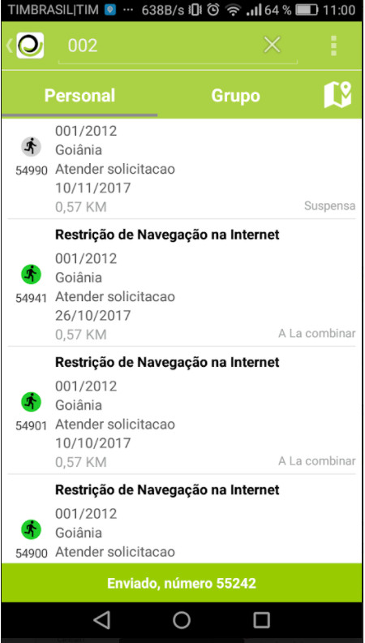
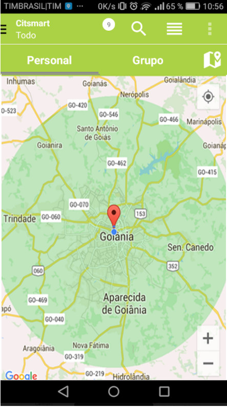
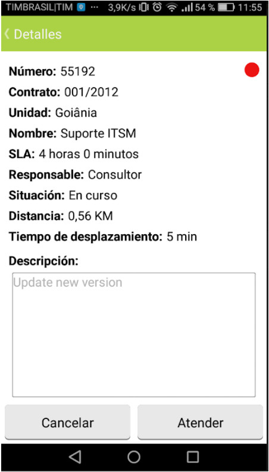
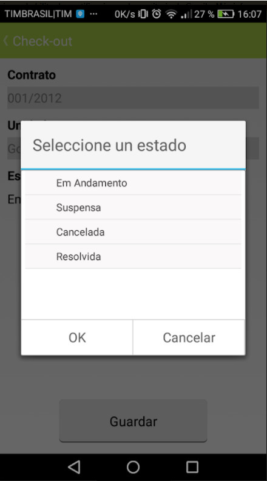
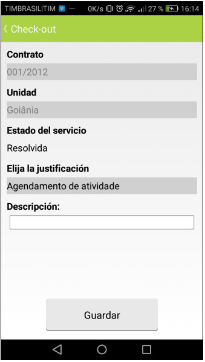

title: Manual de uso de la aplicación móvil CITSmart Experience (Android)
Description: Proporcionar orientaciones necesarias para instalar, configurar y utilizar la aplicación CITSmart Experience Mobile.
# Manual de uso de la aplicación móvil CITSmart Experience (Android)

Este documento tiene el propósito de proporcionar orientaciones necesarias para
instalar, configurar y utilizar la aplicación CITSmart Experience mobile.

El CITSmart Experience mobile ofrece varios recursos:

1.  Facilidad en la atención y tener una dirección de donde la solicitud está
    localizada;

2.  Filtrar solicitudes personales y por grupo de trabajo;

3.  Visualización de los detalles de una solicitud de servicio;

4.  Visualización de solicitudes en el mapa;

5.  Visualización de la mejor ruta para llegar al lugar de atención de la
    solicitud de servicio;

6.  Actualización de la ubicación de la unidad de longitud de latitud desde el
    dispositivo móvil;

7.  Realización de check-out si el usuario tiene permiso de ejecución;

8.  Negación de un check-in sugerido por el sistema;

9.  Recepción de notificaciones.

Este documento se ha estructurado en cuatro grandes secciones:

1.  Instalación y configuración de la aplicación en el teléfono (Smartphone);

2.  Uso del App en el Celular (Smartphone);

3.  Uso Avanzado de la App en el Celular (Smartphone) - con Mapas;

4.  Configuración de la aplicación web (servidor).

Antes de empezar
----------

   Es necesario Implantar la versión 7.2.2.0 (o superior) de CITSmart Experience
   mobile y también configurar el servidor para uso de la
   aplicación móvil CITSmart Experience mobile (ver Relacionado).

Instalación y configuración dell APP en el celular (smartphone)
--------------------------------------------------------------

Para instalar el CITSmart mobile, se debe realizar la búsqueda de la
aplicación en la tienda en línea (Google Play).

1.  Busque CITSmart Experience y después de la búsqueda, seleccione la
    aplicación, como se indica en la figura siguiente:

2.  Presione el botón "Instalar" para descargar la aplicación;

3.  Después de la instalación aparecerá en sus aplicaciones el icono de CITSmart Experience mobile;

4.  Para crear una conexión, pulse el icono con formato de llave, situado en
    la esquina superior derecha de la pantalla, como se indica en la figura
    siguiente:

    

    Figura 1 - Crear conexión

5.  Aparecerá la pantalla de conexiones, pulse el icono "Nueva conexión" , situado en la esquina
    superior derecha de la pantalla, como se indica en la figura siguiente:

    

    Figura 2 - Pantalla de conexiones

6.  Se mostrará la pantalla "Nueva conexión" para el registro de la conexión;

    

    Figura 3 - Registro de conexión

7.  Introduzca los datos:

       -  **Nombre**: introducir el nombre de la conexión que desea conectar;

       -  **URL del servidor**: introducir la dirección del servidor para la
        conexión. Se debe colocar el protocolo (http://) en la URL;

       -  **Usuario**: introducir el nombre de usuario;

       -  **Contraseña**: introducir la contraseña de acceso.

    !!! Abstract "ATENCIÓN"

        Si por si acaso se cambia el dispositivo móvil, esta conexión debe ser borrada.

8.  Después de informar los datos de la conexión deseada, pulse en el
    botón "Añadir";

9.  Una vez agregada la conexión, aparecerá la lista de conexiones creadas. Para
    cambiar una conexión, basta con seleccionar la conexión deseada y hacer el
    cambio;

10.  Para conectarse, basta seleccionar la conexión, en la pantalla inicial de la
    aplicación;

    

    Figura 4 - Login

Utilización del APP en el celular (smartphone)
----------------------------------------------

#### Visualización de solicitudes de servicio

Después de realizar la conexión, aparecerá la pantalla de "Solicitudes de
Servicio" donde podrá visualizar las solicitudes de acuerdo con el filtro
elegido y realizar otras acciones, que serán explicadas a continuación.

1.  Para elegir el tipo de solicitud que desea ver, haga clic en el icono con
    formato de barras situado en la esquina superior izquierda;

    

    Figura 5 - Solicitudes de servicio

2.  Se observa una lista con los tipos y las cantidades de solicitudes de cada
    tipo, como se muestra en la figura siguiente:

    

    Figura 6 - Filtros

3.  Seleccione el tipo de solicitud deseado;

4.  Después de seleccionar el tipo deseado, pulse la opción "Personal" para ver
    las solicitudes personales o de "Grupo" para ver las solicitudes del grupo
    de trabajo según el tipo seleccionado;

5.  Se mostrará la lista de solicitudes de servicio, según el filtro elegido:

    

    Figura 7 - Lista de solicitud personal

    

    Figura 8 - Lista de solicitud del grupo

6.  Para ver solicitudes específicas, haga clic en el icono de búsqueda. Se
    mostrará un campo para informar el dato de la solicitud deseada (número de
    la solicitud, nombre del contrato, nombre de la unidad o nombre del grupo
    ejecutor). Después de la información del dato, presione "Enter". Hecho esto,
    será redirigido a la pantalla de búsqueda, conteniendo una lista de
    solicitudes resultantes de la consulta realizada, como ejemplo ilustrado en
    la figura baja:

    

    Figura 9 - Lista de solicitudes

    !!! Abstract "REGLA"

        Para que la funcionalidad de búsqueda funcione, es necesario configurar el
        web service (notification_buscaNotificación) correspondiente en la pantalla
        de "Registro de Operación Web Service" en el CITSmart Experience Web.

7.  En cada solicitud se presenta un símbolo con el color que representa su
    situación, siendo:

       -  Verde (normal/en curso): indica que la solicitud está en atención,
        dentro del plazo establecido;

       -  Amarillo (a vencer): indica que el plazo límite para atender la
        solicitud está cerca de ser superado;

       -  Gris (suspendida): indica que la solicitud ha sido suspendida;

       -  Rojo (vencida): indica que el plazo límite para la atención de la
        solicitud ha sido superado;

8.  Para ver los detalles de la solicitud de servicio, haga clic en la solicitud
    deseada que mostrará la pantalla de "Detalles" de la solicitud. Para las
    solicitudes que son de seguimiento, sólo es posible visualizar su
    descripción. En estas, no hay botones en el pie de página.

9.  Al realizar el pull down en la pantalla, serán actualizadas las solicitudes
    existentes y exhibidas nuevas solicitudes;

    

    Figura 10 - Actualización de la lista con nuevas solicitudes

10. Al realizar el pull up en la pantalla, serán actualizadas las solicitudes
    existentes y exhibidas las solicitudes antiguas;

    

    Figura 11 - Actualización de la lista con solicitudes antiguas

11. Para ordenar las solicitudes, haga clic en el icono de ordenación. Se
    mostrará una lista de opciones de ordenación (como se muestra en la figura
    siguiente), seleccione una opción deseada y haga clic en "OK";

    

    Figura 12 - Ordenación de solicitudes

       +   **Número de solicitud**: ordena las solicitudes por número, en orden
       decreciente;

       +   **Responsable (sin responsable primero)**: ordena las solicitudes, primero,
       sin el responsable actual. Después sigue el criterio de ordenación por el
       número de la solicitud, en orden decreciente;

       +  **Fecha de creación**: ordena las solicitudes, primero, por la fecha de
        creación, en orden ascendente. Después sigue el criterio de ordenación por
        el número de la solicitud, en orden decreciente;

       +  **Vencimiento**: ordena las solicitudes por solicitudes vencidas, próximas
        al vencimiento, dentro del plazo y suspendidas. Después sigue el criterio de
        ordenación por el número de la solicitud, en orden decreciente.

#### Creación de solicitud de servicio

1.  Para crear una solicitud de servicio, pulse el icono situado en la esquina
    superior derecha de la pantalla y seleccione la opción "Nuevo
    incidente/solicitud", dependiendo de la resolución de la pantalla, aparecerá
    el icono con formato de señal más, basta con presionar el mismo para crear
    la solicitud, como se muestra a continuación:

    

    Figura 13 - Creación de solicitud de servicio

    

    Figura 14 - Icono para crear solicitud de servicio

2.  Se mostrará la pantalla para la creación de la solicitud, como se muestra en
    la figura siguiente:

    

    Figura 15 - Pantalla de creación de nueva solicitud

    !!! Abstract "ATENCIÓN"

        La solicitud registrada por CITSmart mobile utiliza servicios que se
        configuran en CITSmart Web.

3.  Introduzca la descripción de la solicitud de servicio y pulse el
    botón "Enviar" para realizar la operación;

4.  Después de realizar la operación, se mostrará el mensaje de registro de la
    solicitud.

    

    Figura 16 - Solicitud creada

#### Aprobando/rechazando solicitud de servicio

Algunas solicitudes necesitan aprobación, por lo tanto, para atenderlas es
necesario aprobarlas.

1.  Seleccione la solicitud que es aprobada;

2.  Se mostrará la pantalla de "Detalles" mostrando la descripción de la
    solicitud para aprobación/rechazo de la misma;

    

    Figura 17 - Pantalla de aprobación/rechazo de solicitud

3.  Para aprobar la solicitud, basta con presionar el botón "Aprobar";

4.  Para rechazar la solicitud, pulse el botón "Rechazar". Se mostrará una
    pantalla para elegir la justificación de este rechazo, como se muestra en la
    figura siguiente:

    

    Figura 18 - Pantalla justificada de rechazo de la solicitud

       +  Elija la justificación del rechazo de la solicitud y pulse el botón Ok.

Utilización avanzada de la aplicación em el celular (smartphone) - con mapas
----------------------------------------------------------------------------

#### Actualizando las coordenadas de una unidad

Actualice las coordenadas de una unidad para que el sistema pueda identificar la
ubicación de la misma.

1.  Para ver las solicitudes de trabajo a través del mapa, pulse la opción Personal o Grupo y, a continuación, pulse el icono "Obtener coordenadas". Se mostrará el mapa mostrando la ubicación de las solicitudes;

    

    Figura 19 - Solicitud en mapa

2.  Para actualizar las coordenadas, pulse el icono situado en la esquina superior derecha de la pantalla y presione la opción “Obtener     Coordenadas”, dependiendo de la resolución de la pantalla, aparecerá el icono con formato de una bandera, basta con presionar el         mismo para actualizar las coordenadas;

    

    Figura 20 - Obtener coordenadas

    

    Figura 21 - Icono para obtener coordenadas

3.  Se mostrará la pantalla "Obtener Coordenadas":

    

    Figura 22 -Pantalla de obtener coordenadas

      -   Seleccione el contrato y la unidad. Hecho esto, presione el botón "Obtener
      Coordenadas" para efectuar la operación;

      -   Se enviará su latitud y longitud al servidor (CITSmart Web).

#### Atendiendo la solicitud de servicio

!!! Abstract "REGLA"

    Si está en la lista de solicitudes de grupo, y responde a la solicitud, la
    misma pasará a ser personal, que se muestra en la lista de solicitudes
    personales.

1.  Para detener una solicitud de servicio, seleccione la solicitud deseada;

2.  Si está visualizando las solicitudes vía mapa y si sólo tiene una solicitud
    de servicio registrada es posible realizar su llamada a través del mapa,
    basta con presionar el punto de localización de la solicitud y luego
    seleccionar la solicitud. Si tiene más de una solicitud de servicio, al
    presionar el punto de localización de la solicitud, se dirigirá a la lista
    de solicitud personal o del grupo.

    

    Figura 23 - Servicio de solicitud vía mapa

3.  Después de seleccionar la solicitud, aparecerá la pantalla de "Detalles" de
    la misma, según el ejemplo presentado en la figura abajo:

    

    Figura 24 - Contestar solicitud de servicio

4.  Pulse el botón "Atender". Se dirigirá a la pantalla de la solicitud, donde
    será posible realizar el check-in;

    

    Figura 25 - Solicitud de servicio

5.  Para ver la ruta de donde realizará la atención, basta presionar el
    botón "Vea la Ruta";

       +  Se mostrará una pantalla para elegir la aplicación de visualización de la ruta;

    

    Figura 26 - Aplicación para ver la ruta

       +  Seleccione la aplicación que utilizará para ver la ruta;

       +  Se mostrará la pantalla de visualización de la ruta;

       +  La ruta se mostrará desde su ubicación hasta la ubicación de la solicitud.

    !!! Abstract "REGLA"

        Para que sea posible visualizar la ruta, es necesario que la unidad tenga
        las coordenadas configuradas a partir de una longitud y latitud.

6.  Después de verificar la ruta y llegar al lugar para atender la solicitud de servicio, realice el check-in de la solicitud;

7.  Para realizar el check-in, presione el icono situado en la barra superior de la pantalla;

       +  Se mostrará la pantalla de "Check-in", como se muestra en la figura siguiente:

    

    Figura 27 - Pantalla de check-in

       +  Presione el botón Check-in para efectuar la operación;

    !!! Abstract "REGRA"

        Al realizar el check-in, si la solicitud está suspendida, la misma será reactivada y capturada.

8.  Después de realizar el check-in, se mostrará la pantalla para realizar el check-out;

    

    Figura 28 - Pantalla de check-out

       +  Informe el estado del atendimiento de la solicitud;

    

    Figura 29 - Check-out - Estado de la solicitud de servicio

       +   Seleccione el estado y pulse "OK";

       +   Si selecciona el estado "Suspendido", aparecerá una ventana para registrar el motivo de la suspensión, como se muestra en el        ejemplo que se muestra en la figura siguiente:

    

    Figura 30 -  Check-out - Registro del motivo de la suspensión de la solicitud

       +   Si ha seleccionado el estado "Resuelto", aparecerá una ventana para registrar el cierre de la solicitud, como se muestra en          el ejemplo que se muestra en la figura siguiente:

    

    Figura 31 -  Check-out - Registro de Cierre de la Solicitud

#### Notificaciones

La aplicación CITSmart Experience mobile se está ejecutando en segundo plano en
el teléfono móvil, a través de lo que recibirá automáticamente notificaciones
que son pasivas de acción.

1.  Siempre que esté cerca del lugar de respuesta de una solicitud de servicio,
    recibirá una notificación, como se muestra en la figura siguiente:

     

    Figura 32 - Notificación de proximidad del lugar de la atención de la solicitud

       +   Seleccione la notificación, donde aparecerá una pantalla preguntando si desea realizar el Check-in, como ejemplo ilustrado en        la figura abajo:

    

    Figura 33 - Pantalla de justificación de rechazo de la solicitud

       +  Responde si desea realizar el Check-in;

       +  Al presionar el botón "Sí', se dirigirá a la pantalla de Check-in;

       +  Al presionar el botón "No", se dirige a la pantalla de registro de la negación del Check-in, según el ejemplo ilustrado en la        figura siguiente:

    

    Figura 34 - Pantalla de negación del check-in

       +  Introduzca el motivo de la denegación del registro de la solicitud.

2.  Cuando esté cerca del lugar de atención de más de una solicitud de servicio, recibirá una notificación que contenga la cantidad de       solicitudes, según el ejemplo que se muestra en la figura siguiente:

    

    Figura 35 - Notificación de proximidad del lugar de respuesta de varias solicitudes

       +  Al seleccionar la notificación, se muestra una lista de solicitudes cercanas a su ubicación, como se muestra en la figura               siguiente:

    

    Figura 36 -Solicitudes próximas

3.  Cuando un solicitante delegar una solicitud de servicio, recibirá una notificación, según el ejemplo que se muestra en la figura         siguiente:

    

    Figura 37 - Notificación de solicitud recibida

       +  Seleccione la notificación para que se dirija a su lista de solicitud personal.

Relacionado
---------

[Configurar instancia CITSmart para acceso vía móvil](/es-es/citsmart-platform-8/additional-features/mobile-and-field-service/configuration/server-configuration-app-android-ios.html)

[Configurar la opciones del mobile](/es-es/citsmart-platform-8/additional-features/mobile-and-field-service/configuration/configure-mobile-options.html)

!!! tip "About"

    <b>Product/Version:</b> CITSmart | 8.00 &nbsp;&nbsp;
    <b>Updated:</b>01/25/2019 - Anna Martins

