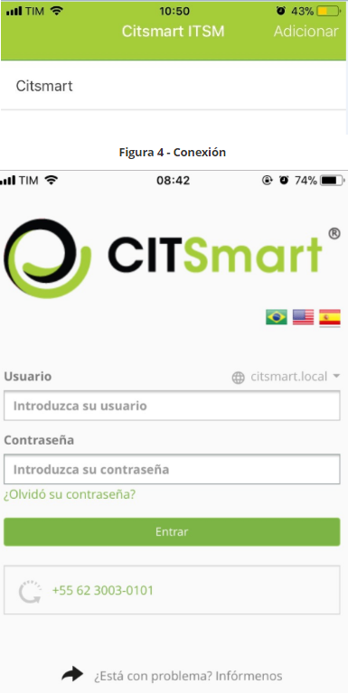
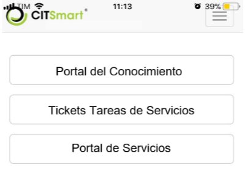
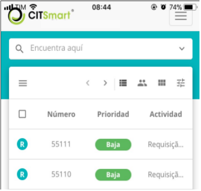
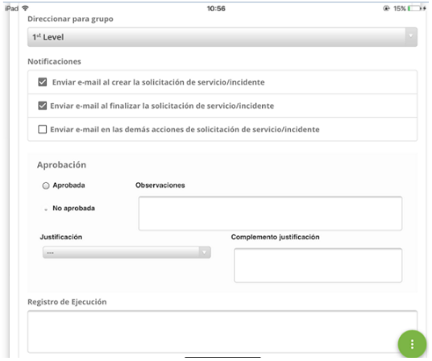

title: Manual de uso de la aplicación móvil CITSmart Experience (iOS)
Description: Este documento tiene el propósito de proporcionar orientaciones necesarias para instalar, configurar y utilizar la aplicación móvil CITSmart ITSM Enterprise en la plataforma iOS.
#Manual de uso de la aplicación móvil CITSmart Experience (iOS)

Este documento tiene el propósito de proporcionar orientaciones necesarias para
instalar, configurar y utilizar la aplicación móvil CITSmart Experience
en la plataforma iOS.

Ofrece varios recursos, tales como:

1.  Facilidad en el atendimiento y tener una dirección de donde la solicitud
    está localizada;

2.  Filtrar solicitudes personales y por grupo de trabajo;

3.  Visualización de los detalles de una solicitud de servicio;

4.  Recepción de notificaciones.

Este documento se ha estructurado en tres grandes secciones:

1.  Antes de empezar;

2.  Instalación y configuración de la aplicación en el móvil;

3.  Uso de la aplicación en el móvil.

Antes de empezar
-----------

Es necesario Implantar la versión 7.2.2.0 (o superior) de CITSmart
Experience y también Configurar el servidor para uso de la aplicación móvil CITSmart
Experience (ver documentos relacionados).

Instalación y configuración del APP en el mobile
--------------------

Para instalar el CITSmart Experience, se debe realizar la búsqueda de la
aplicación en la tienda en línea (App Store).

1.  Puedes buscar CITSmart Experience en la App Store, seleccionar y bajar
    la aplicación ;

2.  Después de la instalación aparecerá en sus aplicaciones el icono de CITSmart
    Experience:;
3.  Para crear una conexión, presione el icono con "Agregar conexión", como se
    indica en la figura siguiente:

    

    Figura 1 - Crear conexión

4.  Se mostrará la pantalla "Nueva conexión" par al registro de la conexión;

    

    Figura 2 - Registro de conexión

5.  Introduzca los datos:

     +  **Nombre de la conexión**: introduzc al nombre de la conexión que desea
     conectar;

     +  **URL del servidor**: introducir la dirección del servidor para la conexión.
     Colocar el protocolo (https) en la URL;

     +  **¿Conexión principal ?**: informe si la URL elegida será la principal;

     +  **Dominio\\Usuario:** a partir de esta versión el usuario tendrá que
     informar el dominio LDAP de uso y su usuario;

        + El formato es citsmart.local\\usuario.consultor (ejemplo), siendo que la
          primera parte es la información del dominio y la segunda parte es el
          usuario;

    +   **Contraseña**: el usuario introducirá la contraseña de acceso al sistema;

    +   **Disponible**:

         +  **Habilitado**: cuando está habilitado, la conexión será la proporcionada en
            el campo URL, y además, para tomar la posición del asistente ese campo debe
            estar habilitado;

         +  **Deshabilitado**: cuando está deshabilitado el sistema no permitirá
            conexión al servidor ni tomará la posición del operador.

    !!! Abstract "ATENCIÓN"

        Si se cambi al aparato, esta conexión debe se borrada.

6.  Después de informar los datos de la conexión deseada, presione el
    botón "Crear";

7.  Una vez agregada la conexión, aparecerá la lista de conexiones creadas. Para
    cambiar una conexión, basta con seleccionar la conexión deseada y hacer el
    cambio;

8.  Para conectarse, basta seleccionar la conexión, en la pantalla inicial de la
    aplicación;

9.  Introduzc al usuario y la contraseña:

    

    Figura 3 - Pantalla de inicio de sesión

Utilización del APP en el mobile
--------------------------------

#### Visualizando solicitudes de servicio

1.  Después de realizar la conexión, aparecerá la pantalla de menú, donde hará
    clic en la opción "Tickets de Servicios":

    

    Figura 4 - Pantalla de menu

2.  Para elegir el tipo de solicitud que desea ver, haga clic en el
    icono de búsqueda situado en la esquina superior izquierda;

    

    Figura 5 - Pantalla de búsqueda de solicitud

3.  Se presentan filtros:

    

    Figura 6 - Filtros

    

    Figura 7 - Filtros (continuación)

4.  Seleccione el filtro deseado y haga clic en el icono de búsqueda, en la esquina
    inferior izquierda;

5.  Se mostrará la lista de solicitudes de servicio, según el filtro elegido:

    

    Figura 8 - Lista de ticket

    !!! Abstract "REGLA"

        Para que la funcionalidad de búsqueda funcione, es necesario configurar el
        web service (notification_buscaNotificación) correspondiente en la pantalla
        de "Registro de Operación Web Service" en el CITSmart Web.

6.  En cada solicitud, cuando se hace clic encima se muestra una lista de
    opciones, siendo:

    

    Figura 9-Lista de ticket

      + icono Abrir - captura la solicitud par al usuario registrado o sólo visualiz al ticket
       sin capturar;

      + icono Ver - visualiz al ticket;

      + icono Descripción - muestr al resumen de la solicitud;

      + icono Mesajes - visualiza mensajes;

      + icono Informes - muestra informes del ticket ;

      + icono Más Opciones  - menú de opciones de acciones para la solicitud (Delegar, Suspender,
                              Cambiar SLA, Reclasificar, Crear sub-solicitudes, Mostrar sub-solicitudes,
                              Programar actividad, Crear solicitud relacionada e Imprimir solicitud).

#### Creación de solicitud de servicio

1.  Para crear una solicitud de servicio, pulse el icono Opciones situado en la esquina
    inferior derecha de la pantalla y seleccione el icono "Nuevo ticket", como
    se muestra a continuación:

    

    Figura 10 – Creación de solicitud de servicio

    !!! Abstract "ATENCIÓN"

        La solicitude registrada por CITSmart Experience utiliza servicios que
        se configuran em CITSmart Web.

2.  Se mostrará la pantalla con campos de registro, según las figuras abajo:

    

    Figura 11 - Pantalla de registro de nueva solicitud

    

    Figura 12 - Pantalla de registro de nueva solicitud (continuación)

    

    Figura 13 - Pantalla de registro de nueva solicitud (continuación)

    

    Figura 14 - Pantalla de registro de nueva solicitud (continuación)

3.  Complete los campos según las instrucciones a continuación:

    +   **Solicitante**: informe el nombre del solicitante, es decir, el nombre de la
    persona que está solicitando la apertura de incidente o solicitud de servicio;

    !!! Abstract "ATENCIÓN"

        Al informar al solicitante se muestra un resumen estadístico de las
        llamadas (por situación), así como otro resumen estadístico de satisfacción
        (por tipo de respuesta) de los servicios ya solicitados por él. Por una
        cuestión de rendimiento y de preservación del layout de la pantalla, estos
        dos resúmenes son paginados, es decir, es posible avanzar / retroceder para
        visualizar toda la información.

    +   **Teléfone**: informe al número de teléfono del solicitante;

    +   **Extensión**: informe el número del interno del solicitante, si lo tiene;

    +   **E-mail**: informe el e-mail del solicitante;

    +   **Origen Contacto**: informe el origen del contacto para registro de la
    solicitud del servicio;

    +   **Unidad**: seleccione la unidad en la que el solicitante está asignado;

    +   **Ubicación Física**: informe la ubicación del solicitante;

    +   **Otras informaciones**: describa las observaciones sobre el solicitante, si
    es necesario.

4.  Registre la información de la solicitud de servicio:

    +   **Catálogo**: seleccione el catálogo de servicios;

    +   **Servicio**: informe al servicio correspondiente al catálogo de servicios
    seleccionado. Si el catálogo de servicios es "Negocio", se pondrán a
    disposición en este campo los servicios de negocio para selección, pero si
    el catálogo de servicios es "Técnico", estarán disponibles en este campo los
    servicios de apoyo/técnico para selección;

    +   **Tipo**: seleccione el tipo de solicitud, si es una apertura de incidente o
    solicitud de servicio:

        -   **Incidente**: si la situación presentada es una interrupción no
        planificada, una reducción en la calidad del servicio o el fallo de
        algún ítem de configuración que aún no haya impactado en un servicio de
        TI. Por ejemplo, el vínculo de red está fuera alcance, la red está
        lenta, el servidor inaccesible, etc;

        -   **Solicitud**: se refiere a las solicitudes de demandas realizadas por
        los usuarios dentro del ambiente de la Tecnología de la Información.
        Pueden ser desde solicitudes de acceso hasta sugerencias de mejora a
        bajo costo. Por ejemplo: solicitud de acceso a la red para un nuevo
        usuario, solicitud de configuración de algún equipo, solicitud para
        agregar algún software en la estación de trabajo, etc.

    +   **Categoría**: informe la categoría de servicio para facilitar la búsqueda
    de la actividad (solicitud/incidente). La categoría identificará la
    naturaleza de la actividad, colocándolo dentro de grupos similares de
    actuación, situándolo en la jerarquía de su categoría;

    +   **Actividad (Solicitud/Incidente)**: informe la actividad que se realizará
    referente al tipo de solicitud. Si la actividad informada tiene un "script
    de orientación" asociado, el mismo aparecerá en la pestaña "Scripts"
    representada por el icono situado en la esquina superior derecha de la
    pantalla;

    +   **Contrato**: después de informar la actividad (solicitud/incidente), se
    exhibirá el contrato par al cual se hará la apertura de incidente o
    solicitud de servicio;

    +   **Urgencia**: después de informar la actividad (solicitud/incidente), se
    mostrará la información de la urgencia que indica la velocidad en la cual el
    servicio necesita ser realizado;

    +   **Impacto**: después de informar la actividad (solicitud/incidente), se
    mostrará la información de impacto del servicio al negocio;

    !!! Abstract "REGLA"

        Después de informar la actividad de solicitud/incidente, se establecerá el
        tiempo previsto para atender la solicitud, conforme configurado en el
        registro del tiempo de atención vinculado a la actividad. El tiempo de
        atención se contabilizará de acuerdo con lo que se definió en el calendario
        vinculado a la unidad, pero si la unidad no tiene un calendario vinculado,
        se contabilizará según el calendario vinculado al servicio. Sin embargo, al
        cerrar el tiempo previsto de atención se contabiliz al retraso en tiempo
        corrido, siendo desconsiderado el calendario.

    +   **Título**: informe el título de la solicitud de servicio;

    +   **Descripción**: introduzca la descripción de la solicitud de servicio. La
    descripción debe ser objetiva, incluyendo toda la información necesaria para
    la atención de la misma;

    +   **Direccionar a grupo**: informe el grupo par al que se dirija la solicitud
    de servicio. Si no informa al grupo, la solicitud se dirigirá al grupo
    definido en el flujo de solicitud/incidente. Si no se define el grupo en el
    flujo, la solicitud se dirigirá al grupo definido en el registro del vínculo
    de la actividad de solicitud/incidente al contrato. Pero si el grupo no está
    definido en el registro del vínculo de actividad al contrato, la solicitud
    se dirigirá al grupo definido en el parámetro **"ID Grupo Nivel 1"**;

    +   **Notificaciones**: marque las opciones de envío de notificación sobre la
    solicitud para ser enviadas al solicitante;  
    Registro de Ejecución: no es necesario el llenado de este campo, pues el
    mismo es indicado par al técnico que atender a la solicitud, describir sobre
    la ejecución de su actividad;

    +   **Situación**: seleccione la opción que se ajusta al estado actual de la
    solicitud: **Registrada En curso**.

#### Aprobando/rechazando solicitud de servicio

Algunas solicitudes necesitan aprobación, por lo tanto, para atenderlas es
necesario aprobarlas.

1.  Seleccione la solicitud que es aprobada;

2.  Se mostrará la pantalla de "Detalles" mostrando la descripción de la
    solicitud para aprobación/rechazo de la misma;

    

    Figura 15 - Pantalla de aprobación/rechazo de solicitudo

3.  Para aprobar la solicitud, basta presionar el botón "Aprobado";

4.  Para rechazar la solicitud, pulse el botón "No aprobado". Se mostrará una
    pantalla para elegir la justificación de este rechazo, como se muestra en la
    figura siguiente:

    

    Figura 16 - Pantalla con justificación del rechazo de la solicitud

    +   Elija la justificación del rechazo/aprobación de la solicitud y pulse el botón "Grabar y avanzar el flujo".

Relacionado
-------

[Configurar instancia CITSmart para acceso vía móvil](/es-es/citsmart-platform-8/additional-features/mobile-and-field-service/configuration/server-configuration-app-android-ios.html)

[Configurar las opciones del mobile](/es-es/citsmart-platform-8/additional-features/mobile-and-field-service/configuration/configure-mobile-options.html)

!!! tip "About"

    <b>Product/Version:</b> CITSmart | 8.00 &nbsp;&nbsp;
    <b>Updated:</b>01/28/2019 - Anna Martins
