Title: ¿Qué hay de nuevo en CITSmart 8.0?
Description: Describe lo que hay de nuevo en CITSmart 8.0

¿Qué hay de nuevo en CITSmart?
=================================

## Versión 8.0.2.0
 
### CENTRO DE EXPERIENCIA

- Mejoras de UI/UX del Centro de Experiencia (CE) con nuevo menú de acceso a los CE y posibilidad de redimensionamiento de encabezados y logotipos, entre otros;

- Implementación de la función de búsqueda en el Centro de Experiencia para el contexto de Conocimiento, Servicios y Noticias;

- Mejoras en UI/UX del Widget de Portafolios y Servicio con acceso rápido al servicio deseado;

### TICKETS

- Nuevo widget "Mis tickets" con una lista de todos los tickets que el usuario ha abierto o para aprobación, incluidas nuevas columnas personalizables; :new:

- Nueva pantalla de vista previa de ticket de usuario final, con comentarios, reapertura, archivos adjuntos, etc; :new:

- Mejora en el rendimiento y UI / UX en el panel de lista de tickets del ticket de los asistentes, con filtros rápidos, nuevo menú lateral e inclusión de una nueva columna de descripción;

- Mejoras de UI/UX en la pantalla de Tickets y opciones integradas para capturar, delegar, reclasificar, suspender, etc;

### WORKFLOW

- Componentes dinámicos en diseño de flujo;

### GENERALES

- Autenticación Oauth2;

- Patch de correctivas;

- Mejoras de rendimiento y funcionalidad del Smart chat que permiten la comunicación entre el asistente y el solicitante, además de la comunicación entre los asistentes;

## Versión 8.0

Uso del Logotipo e Inicio de Sesión
------------------------

El uso de la imagen CITSmart ha sido optimizada para mejorar el uso de datos, así como la aplicación dentro de la solución, haciéndola más simple, ligera y adecuada para los nuevos direccionamientos del producto.

Centro de Experiencia
---------------------

A través del Centro de Experiencia, es posible construir portales de relación con identidad visual propia para clientes, proveedores y colaboradores, promoviendo visibilidad y colaboración.

Cada centro de experiencia tiene páginas dinámicas, con la opción de widgets de:

*   Portafolios
*   Solicitudes
*   Aprobaciones
*   Centro de Conocimiento
*   Aplicaciones Neuro
*   Workspaces
*   Noticias
*   Notificaciones
*   Búsquedas
*   Youtube
*   Imágenes
*   Menú
*   Lista
*   Texto
*   Chat
*   Voip
*   Entre otros

Los Centros de Experiencia se pueden crear de acuerdo con perfiles de acceso y necesidades de las áreas de negocio.

### Widget de Portafolio

Se utiliza en el Centro de Experiencia para listar los Portafolios con sus Servicios y Solicitudes, pudiendo sustituir el uso del portal de servicios.

### Widget Mis Solicitudes

Lista los tickets del usuario conectado **(a.)**, ofrece un historial de atención con línea de tiempo **(b.)**, permite al solicitante añadir notas y comentarios **(c.)**, notificar el asistente por correo electrónico o también utilizar el **chat** con el asistente **(d.)**.

Para más información acceder la documentación del [Centro de Experiencia][1]

### Widget Mis Aprobaciones

Aprobar un ticket por el CITSmart se hizo más simple, basta hacer clic en el icono aprobar **(a.)**, es posible visualizar los detalles del ticket y aprobarlo o no **(b.)**.
 

Menús
----

Internamente, los menús han sufrido reorganización y ahora están dispuestos a la izquierda, con posibilidad de consulta y ocultación, mejorando el espacio de trabajo en la plataforma.

Smart Decisions
---------------

Permite mantener y visualizar áreas de trabajo por usuario con:

* Widgets de dashboards
* Informes nativos y
* Informes construidos en la plataforma. 

**Cada usuario puede configurar su propio área con una o más pestañas.**

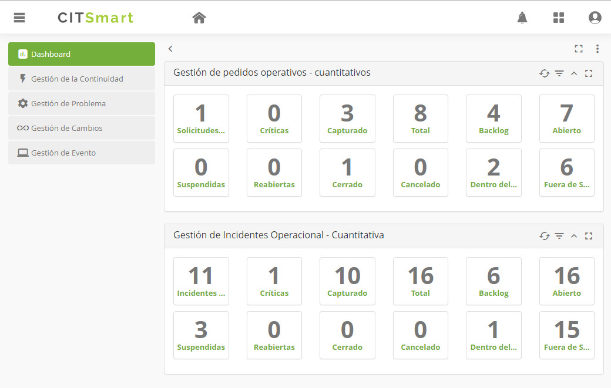

Acceso Rápido
-------------

Nuevos íconos y área de acceso rápido a los procesos y portales fueron puestos a disposición en el área superior de la plataforma para hacer más sencillo y práctico el acceso a las funcionalidades del CITSmart. 

Gestión de Tickets
-----------------

Su nuevo diseño presenta información de forma más estructurada, en un menú lateral, con opción de ocultar; una mejora significativa de rendimiento y experiencia del usuario **(a.)** . En la creación de tickets hay una nueva búsqueda multinivel que permite buscar por portafolios, servicios y actividad de forma visual y rápida (ya no está disponible el filtro por categoría) **(b.)**. Es posible acompañar gráficamente la ejecución del flujo **(c.)**. El asistente puede enviar un mensaje al solicitante y notificarlo por correo electrónico **(d.)**.

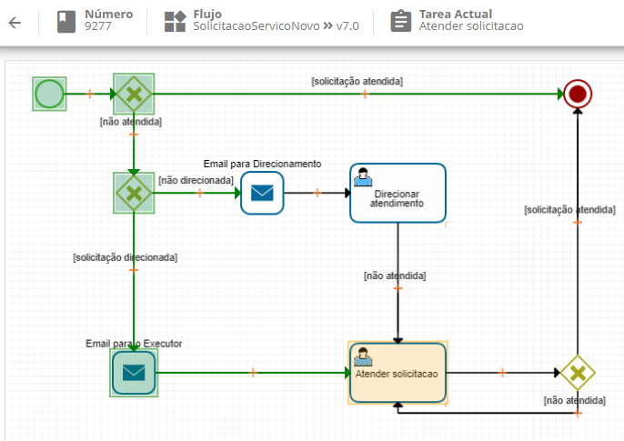

El registro de ocurrencias ha sido sustituido por un registro de notas y comentarios con la posibilidad de notificar al solicitante por correo electrónico, contabilizar horas de atención y controlar la visualización de los registros **(a.)**. Toda la ejecución del flujo y registros de la atención, como la captura, delegación, suspensión, SLA y otros, se muestran en un historial en el formato de línea de tiempo. Los mensajes con el solicitante también se guardan aquí **(b.)**.

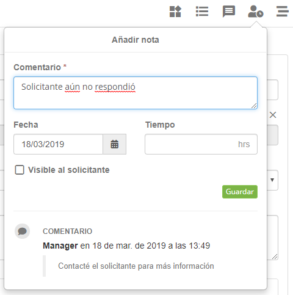

Ahora, una vez que se crea una nueva Solución de Contorno, automáticamente se dispara una notificación al responsable del incidente **(a.)**. Además, puede ver la solución de contorno y copiar el contenido al cierre del incidente, completando la causa y solución de respuesta **(b.) (c.)**.

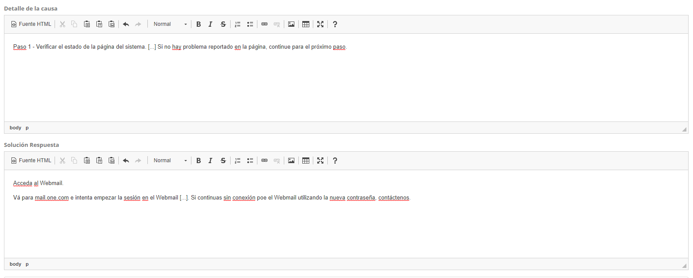

Simple - Gestión Ágil
--------------------

Simple ha traído el poder de la gestión ágil a la plataforma CITSmart, desarrollado para ayudar a los equipos a ser más colaborativos y participativos, aumentando la productividad y dando más autonomía y visibilidad a los miembros de una forma más simple y práctica **(a.)**. Cada equipo puede tener uno o más workspace **(b.)**, además de crear sprints con kanbans y fases, de acuerdo con cada necesidad **(c.)**.

Cada tarea puede tener uno o más miembros. Se puede agregar:

*   Checklists
*   Comentários
*   Estimación
*   Horas trabajadas
*   Tags
*   Archivos
*   Activar notificaciones y otros.

Para más información acceder la documentación del [Simple][2]

Gestión de Problemas
--------------------------

La Gestión de Problemas se ha rediseñado para dar más agilidad, facilidad y practicidad al trabajo de los equipos. Con un nuevo panel de lista y seguimiento, se puede cambiar las columnas de visualización, activar la actualización automática, ver el progreso del flujo, buscar registro de problemas, acceder a la lista de informes dinámicos y otros.

Para facilitar el tratamiento del problema, una secuencia de pasos se ha estructurado en un menú lateral. 

*   Informaciones del Solicitante
*   Incidentes relacionados al problema
*   Problema
*   Diagnóstico
*   Solución
*   Revisión y Cierre

Ahora es posible vincular y visualizar en una misma pantalla la lista de incidentes que generaron el problema **(a.)**. El registro de problemas pasó a utilizar el concepto de portafolio de plantillas **(b.)**, las plantillas son pre-registradas con flujo de atención, grupo responsable, status y otros, haciendo más práctica la creación, clasificación y atención de los problemas **(c.)**.

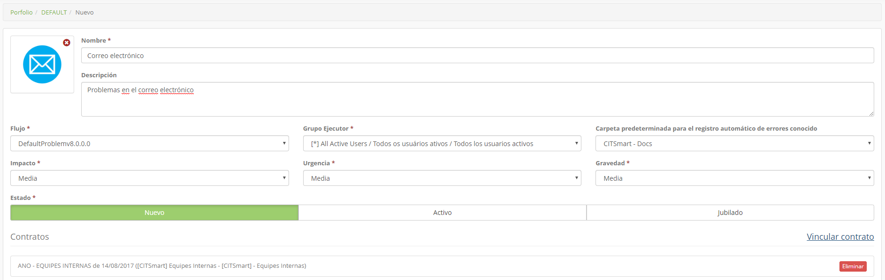

Al Vincular un Servicio al Problema, es posible visualizar el Mapa del Servicio y la Lista de sus EC.**(a.)**, basta hacer doble clic en el EC para ver los detalles **(b.)** y de la lista de EC, es posible vincular a los que están relacionados con el problema **(c.)**.

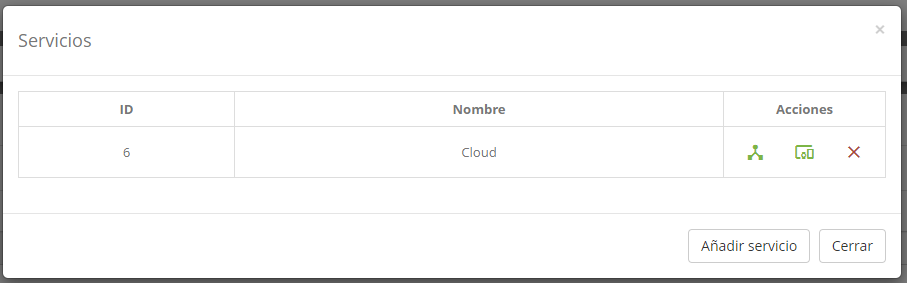

Una nueva área de diagnóstico fue creada y permite que, a través del Simple, más personas o equipos trabajen colaborativamente en el análisis del problema, trayendo agilidad y eficiencia **(a.)**. El registro de error conocido, causa raíz y soluciones de contorno también están más fáciles. Una nueva notificación se envía al responsable del incidente tan pronto como se registra cada solución de contorno **(b.)**.

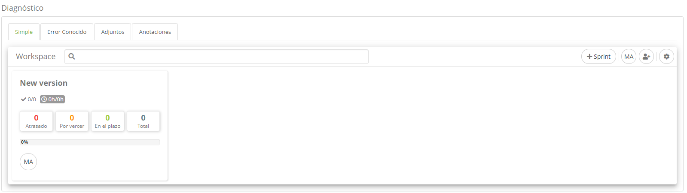

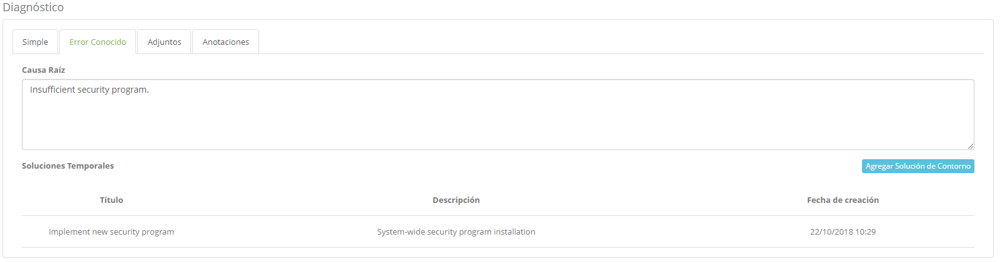

También hay una nueva área de Solución con vínculo directo al Simple y a los registros de cambio, permitiendo que el diseño, desarrollo e implantación de la solución sea más ágil y colaborativo, alcanzando mejores resultados **(a.)**. La guía de Revisión y Cierre permite informar si el problema se ha resuelto con éxito o no. También es posible registrar lecciones aprendidas, abrir sprints para problemas cuya revisión involucra a más personas o equipos **(b.)**.

Para más información acceder la documentación de [Gestión de Problema][3]

Gestión de Configuración y Activos
--------------------------------------

Con el objetivo de hacer la búsqueda y visualización de EC más rápida y práctica, el panel de Gestión de Configuración y Activos fue reformulado, considerando la mejor experiencia para el usuario. La nueva búsqueda permite filtrar por grupos, tipos, alertas e identificación. 

El panel dispone de un nuevo Widget de Grupos que permite el acceso y la navegación entre las estructuras del CMDB **(a.)**. El Widget de Alertas muestra la lista de EC con el cuantitativo de Incidentes, Problemas, Cambios y Liberación abiertos **(b.)**. Los tipos de EC también están dispuestos en un nuevo Widget con el cuantitativo de EC que poseen **(c.)** y al acceder al tipo, la lista de EC se muestra de forma agrupada y con el cuantitativo de EC de acuerdo con la identificación **(d.)**.

La visualización del EC también fue optimizada. Ahora las principales informaciones y características del EC se muestran en el área General **(a.)** y la información de garantía también se muestra en un nuevo Widget **(b.)**.

Para más información acceder la documentación de [Gestión de Configuración][4]

Gestión de Cambio
-------------------------

CITSmart evolucionó la Gestión de Cambios para dar más agilidad, seguridad y practicidad a los cambios en ambientes que van más allá de la TI. Con un nuevo panel de lista, puede cambiar las columnas de visualización, activar la actualización automática, ver el progreso del flujo, buscar registro, acceder a la lista de informes dinámicos, entre otros.

Para facilitar la atención, la siguiente secuencia de pasos fue estructurada en el menú lateral:

*   Informaciones del solicitante
*   Informaciones de la solicitud de cambio
*   Planificación del cambio
*   Plan de reversión
*   Revisión y cierre
*   EC relacionado

Para facilitar la organización y la clasificación de los registros de cambio, CITSmart pasó a utilizar el concepto de Portafolio de Cambios, permitiendo pre-configurar plantillas con flujo de atención, calendario, grupos responsables y otros **(a.)**. Además, la clasificación del cambio se ha vuelto mucho más simple y ágil **(b.)**.

También es posible vincular a las plantillas los formularios de análisis ágil de riesgo. Cada plantilla de cambio puede utilizar un formulario con preguntas y pesos. De acuerdo con el análisis, un gráfico de riesgo se presenta **(a.)**. OLa Planificación, Reversión, Revisión y Cierre del cambio ahora cuentan con un panel de gestión ágil (concepto "Simple"), así que varios equipos pueden realizar tareas de forma rápida, transparente y colaborativa **(b.)**.

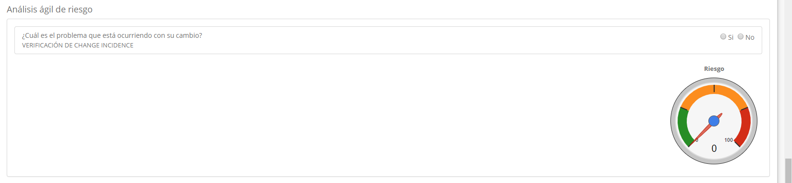

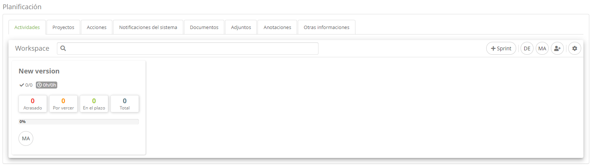

En la Revisión y cierre del cambio, además de informar si el cambio fue hecho con éxito o no, también es posible vincular un formulario para analizar la calidad del cambio, además del vínculo con Incidentes, Problemas, Lecciones aprendidas y otros.

Para más información acceder la documentación de [Gestión de Cambio][5]

## Gestión de Liberación e Implementación

El proceso de Gestión de Liberación e Implementación también pasó por evoluciones. El panel de lista sigue el mismo patrón que se muestra en los procesos de Gestión de Problema y Cambio.

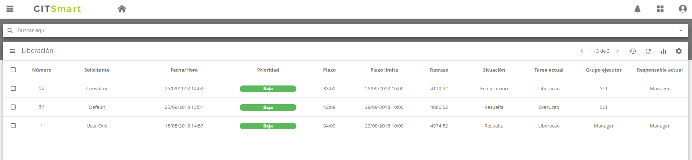

En el menú lateral se ha estructurado una secuencia de pasos para facilitar el seguimiento de la liberación **(a.)**,  y los cambios empaquetados para la liberación se presentan en la misma pantalla, facilitando el seguimiento **(b.)**. La Planificación e Implementación ahora cuentan con un panel de Gestión Ágil (Concepto "Simple"), facilitando la participación y la colaboración de varios equipos **(c.)**.

## Business Intelligence

Uno de los módulos opcionales en esta nueva versión es el Smart Analytics, que permite el uso de la estructura de BI de Saiku Community para análisis de datos de Tickets, Cambios, Liberaciones y otros **(a.)**. Además, se ofrecen varias vistas de gráficos y tablas, con la posibilidad de filtros y exportación para csv y pdf **(b.)**.

## Camino de Auditoría

Los caminos de auditoría fueron creadas para dar más transparencia del uso de datos y seguridad de nuestro sistema, hay tres opciones de Auditoría: de **datos**, de **acceso** y de **clave**. 

Para más información acceder la documentación de [Auditoría del Sistema][6]

**Auditoría de datos.**

En esta opción de auditoría se muestra el historial de todos los datos de cambio, inclusión y exclusión hechos en el sistema.

**Auditoría de Acceso**

En esta opción se muestra el historial de los accesos al sistema (entradas y salidas).

**Auditoría de Clave**

En esta opción de auditoría se indican las licencias utilizadas para la validación del sistema.

## App Mobile CITSmart GO

El App CITSmart GO fue creado para dar más flexibilidad y agilidad en atendimientos hechos en campo. Las características de la aplicación se pueden ejecutar sin conexión y después sincronizadas de forma fácil.

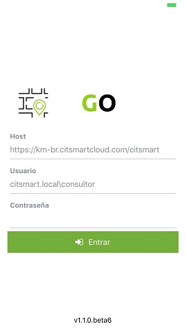

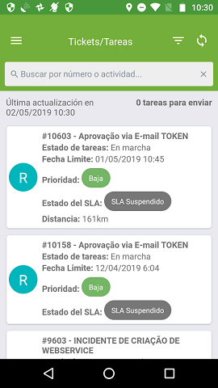

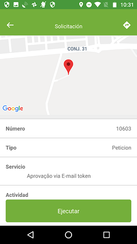

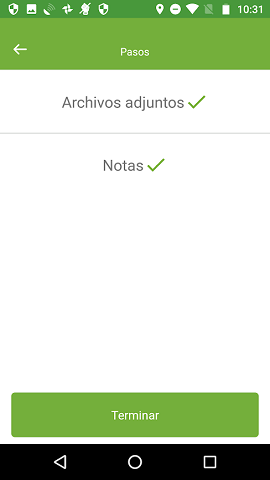

Para más información acceder la documentación de [CITSmart GO][7]

## App CITSmart Experience

App Mobile CITSmart Experience ha sido creado para que las facilidades y beneficios de la solución CITSmart puedan ser accedidos también a través de dispositivos móviles. Esta nueva versión incluye notificaciones para el sistema operativo Android y la posibilidad de confirmación de atención vía subscripción.

Para más información acceder la documentación de [Mobile CITSmart Experience][8]

[1]:/es-es/citsmart-platform-8/processes/knowledge/use/create-experience-center.html
[2]:/es-es/citsmart-platform-8/additional-features/project-management/simple-agile-management/simple-agile-management.html
[3]:/es-es/citsmart-platform-8/processes/problem/overview.html
[4]:/es-es/citsmart-platform-8/processes/configuration/overview.html
[5]:/es-es/citsmart-platform-8/processes/change/overview.html
[6]:/es-es/citsmart-platform-8/platform-administration/logs-and-auditing/system-audit.html
[7]:/es-es/citsmart-platform-8/additional-features/mobile-and-field-service/apps/citsmart-field-service-manual.html
[8]:/es-es/citsmart-platform-8/additional-features/mobile-and-field-service/apps/citsmart-app.html

!!! tip "About"

    <b>Product/Version:</b> CITSmart | 8.00 &nbsp;&nbsp;
    <b>Created:</b>03/14/2019 - André Fernandes

