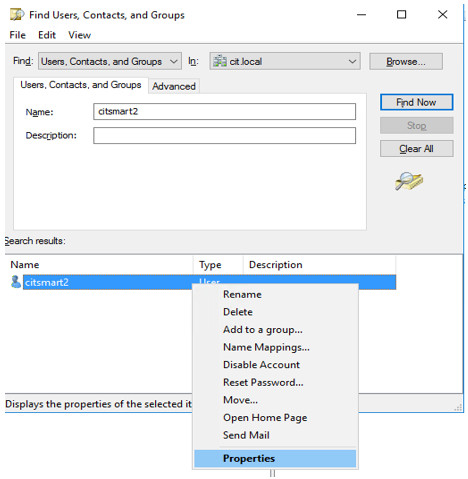

title: CITSmart auto-login - SSO
Description: CITSmart auto-login
# CITSmart auto-login - SSO


**Branchs**:

   Sso (itsm)

   Spnego 1.0 (artifactory)


Crear usuario AD
----------------

1.  Acceder a crear usuarios en Usuarios y Ordenadores del Active Directory,
    según la figura siguiente:

    

     Figura 1 - Crear usuario

2. Crear una contraseña: 

    

     Figura 2 - Contraseña

3. Hacer clic en el lado derecho del ratón, en el botón de usuario/propiedades:

    

     Figura 3 - Botón usuario/propriedades

4. Seleccionar la opción "Esta cuenta ofrece soporte para criptografia de 256 bits", aplicar y marcar "OK", como se muestra a 
   continuación:

    

     Figura 4 - Configurar cuenta


5.  Abrir el ADSI Editar. Después, conectar en el AD, hacer clic en usuarios y
    localizar el usuario recién creado, conforme la figura abajo:
      
    

     Figura 5 - Verificando usuario

6.  Hacer clic con el botón derecho del ratón y seleccionar la opción Propiedades.
    Después, buscar por **servicePrincipalName** (acrónimo de SPN);

7.  Agregar HTTP/hom-itsm.centralit.com.br, hacer clic en OK, conforme la figura
    siguiente:

    

     Figura 6 - Agregar valor

8.  Abrir el **CMD** como administrador y colocar los siguientes comandos.
    Recuerde que la primera configura el **SPN** y el segundo genera el Keytab       (lo que se utilizará en el Wildfly):

    -   setspn -s HTTP/hom-itsm.centralit.com.br citsmart2

    -   ktpass / princ HTTP/hom-itsm.centralit.com.br /mapuser citsmart2  /pass
        central\@123 /ptype KRB5_NT_Principal/outcitsmart2.keytab /crypto ALL

9.  Realizado los pasos anteriores, el **AD** estará configurado. 


Configurar el servidor Wildfly
-----------------------------

1.  Copiar el **war** generado de la branch **sso**;

2.  Copiar el archivo krb5.conf (validar las informaciones de acuerdo con el AD) para
    la carpeta standalone/configuration (wildfly):
    
    ```sh
    [libdefaults]
    default_tkt_enctypes = aes256-cts-hmac-sha1-96 aes128-cts-hmac-sha1-96 rc4-hmac
    default_tgs_enctypes = aes256-cts-hmac-sha1-96 aes128-cts-hmac-sha1-96 rc4-hmac
    permitted_enctypes = aes256-cts-hmac-sha1-96 aes128-cts-hmac-sha1-96 rc4-hmac
    [realms]
    ```
    
    ```sh
    citgosrv004.cit.local  = {
    kdc = citsmartsrv.citsmartsrv.bigdata-team.com
    default_domain = citsmartsrv.citsmartsrv.bigdata-team.com }     
    ```
    
    ```sh
    [domain_realm]
    .citsmartsrv.citsmartsrv.bigdata-team.com = citsmartsrv.citsmartsrv.bigdata-team.com
    ```

1.  Copiar el archivo login.conf (validar las informaciones de acuerdo con el AD) para la 
    carpeta standalone/configuration (wildfly):

    ```sh
    custom-client {
    com.sun.security.auth.module.Krb5LoginModule required
    storeKey=true
    useKeyTab=true
    keyTab="file:///opt/wildfly-12.0.0.Final/standalone/configuration/lightkeytab.keytab"
    principal=HTTP/light-desenvolvimento.citsmartcloud.com\@CITSMARTSRV.BIGDATA-TEAM.COM;
    };
    ```

1.  Copiar el archivo lightkeytab.keytab (generado por el comando en el AD) para la carpeta
    standalone/configuration (wildfly)

2.  Arreglar el standalone.xlm al agregar las siguientes informaciones:

    En **\<system-properties\>**
    
    ```java
    \<property name="sun.security.krb5.debug" value="true"/\>
    \<property name="java.security.krb5.kdc" value="CITSMARTSRV.BIGDATA-TEAM.COM"/\>
    \<property name="java.security.krb5.realm"value="CITSMARTSRV.BIGDATA-TEAM.COM"/\>
    \<property name="java.security.krb5.conf"value="/opt/wildfly-12.0.0.Final/standalone/configuration/krb5.conf"/\>
    \<property name="java.security.auth.login.config"value="/opt/wildfly-12.0.0.Final/standalone/configuration/login.conf"/\>
    \<property name="krb.keyTab"value="/opt/wildfly-12.0.0.Final/standalone/configuration/lightkeytab.keytab"/\>
    \<property name="krb.principal"value="HTTP/light-desenvolvimento.citsmartcloud.com\@CITSMARTSRV.BIGDATA-TEAM.COM"/\>
    ```
    
    En **\<security-domains\>**

    ```java
    \<security-domain name="spnego-server"\>
    \<authentication\>
    \<login-module code="com.sun.security.auth.module.Krb5LoginModule"flag="required"\>
    \<module-option name="storeKey" value="true"/\>
    \<module-option name="useKeyTab" value="true"/\>
    \<module-option name="keyTab" value="\${krb.keyTab}"/\>
    \<module-option name="principal" value="\${krb.principal}"/\>
    \<module-option name="isInitiator" value="false"/\>
    \</login-module\>
    \</authentication\>
    \</security-domain\>
    \<security-domain name="SPNEGO" cache-type="default"\>
    \<authentication\>
    \<login-module code="Kerberos" flag="required"\>
    \<module-option name="storeKey" value="true"/\>
    \<module-option name="refreshKrb5Config" value="true"/\>
    \<module-option name="useKeyTab" value="true"/\>
    \<module-option name="doNotPrompt" value="true"/\>
    \</login-module\>
    \</authentication\>
    \</security-domain\>
    ```

1.  Si no ha cambiado el jar de la política de JAVA (JCE - Java Cryptography
    Extension), descargar los archivos y colocar en
    jdk/jre/lib/security/policy/limited e jdk/jre/lib/security/policy/unlimited;

2.  Importar (sincronizar) usuarios del LDAP en el ITSM.

!!! Abstract "ATENCIÓN"

    El DN Alias debe ser igual al dominio de la red (por ejemplo: CIT\\usuario), luego
    el DN Alias = CIT, conforme la figura siguiente:


   Figura 7 - Definir el DN

!!! Abstract "ATENCIÓN"

    Se recomienda la lectura de los siguientes materiales de apoyo:
    <https://ss64.com/nt/setspn.html> y <http://spnego.sourceforge.net/>.
    
    
!!! tip "About"

    <b>Product/Version:</b> CITSmart | 8.00 &nbsp;&nbsp;
    <b>Updated:</b>03/15/2019 – Anna Martins

   
