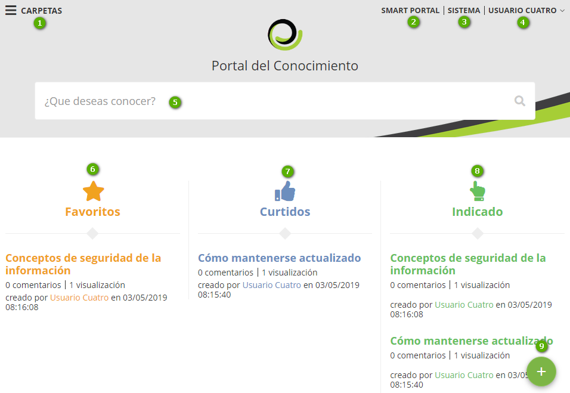

title: Portal del Conocimiento
Description: proporcionar informaciones relevantes que permitan al operador (usuario o administrador) el entendimiento y aplicación de un determinado conocimiento.
# Portal del Conocimiento

El Portal del Conocimiento es una de las pantallas principales de la solución, que pretende proporcionar informaciones relevantes que permitan al operador (usuario o administrador) el entendimiento y aplicación de un determinado conocimiento. 

También permite que el mismo registre un nuevo conocimiento para tonar el portal dinámico y actualizado.

   Figura 1 - Portal del Conocimiento
   
- **1**: Carpetas - muestra las carpetas que el usuario conectado tiene acceso para ver sus conocimientos

- **2**: Portal de Servicios - al hacer clic en esta opción, aparecerá una de las pantallas principales del producto, el Portal de Servicios (Smart Portal)

- **3**: Sistema - al hacer clic en esta opción, permite entrar en el sistema

- **4**: Identificación del usuario registrado - al hacer clic en esta opción, se muestran las funciones para cambiar la contraseña de acceso y salir del portal

- **5**: Campo de búsqueda - permite la búsqueda de conocimientos

- **6**: Favoritos - conocimientos que fueron marcados como favoritos por el usuario registrado

- **7**: Me gusta - conocimientos que fueron de interés para el usuario conectado

- **8**: Indicados - conocimientos indicados al usuario, referentes a las funcionalidades del sistema más accedidas. Ejemplo: el usuario registrado accede siempre a la funcionalidad de "Solicitud de Servicio", cuando el mismo entrar en el Portal del Conocimiento, el sistema indicará los conocimientos referentes a la funcionalidad

- **9**: Agregar Conocimiento - permite al usuario conectado registrar un nuevo conocimiento en la Base de Conocimientos

-------------------------------------------------------------------------------------------------

   Figura 2 - Resultado de búsqueda

 - **1**: campo de búsqueda
 Muestra la cantidad de conocimientos encontrados
 
 - **2**: muestra la cantidad de conocimientos encontrados
 
 - **3**: muestra filtros para encontrar el conocimiento, refinando la búsqueda inicial seleccionando una de las opciones
  
 - **4**: relación de conocimientos encontrados
 
 
!!! Abstract "REGLA"

    La lista resultante se monta de acuerdo con determinadas prioridades de comparaciones (configurables). 
    Por default, toda lista resultante será montada comparando el texto buscado con (en este orden): 
    
    a)contenido del conocimiento
    
    b) título
    
    c) anexos 
    
    d) palabras claves (Tags)
    
  
1.  Después de encontrar el conocimiento deseado, haga clic en el título para ver el contenido:

 

   Figura 3 - Visualización del conocimiento 
   

- **1**:Título del conocimiento

- **2**:Icono para favorecer el conocimiento para que sea relacionado en la página principal del Portal del Conocimiento

- **3**:Icono para ver qué módulos ITIL el conocimiento está vinculado

- **4**:Icono para dejar un comentario sobre el conocimiento

- **5**:Icono para imprimir el conocimiento

- **6**:Ruta de carpetas y subcarpetas para llegar a este conocimiento (migaja de pan)

- **7**:Lista para acceder a las versiones del conocimiento

- **8**:Lista de archivos adjuntos al conocimiento

- **9**:Contenido del conocimiento

- **10**:Iconos para registrar un "like" o "unlike" sobre el conocimiento

- **11**:Cantidad de comentarios, visualizaciones, nombre de quien creó el conocimiento, fecha y hora de su última modificación

- **12**:Estrategia de evaluación cuantitativa del conocimiento (una nota), que va a variar de 1 a 5, dependiendo de la estrella marcada

- **13**:Lugar donde el usuario puede registrar sus comentarios

- **14**:Lugar donde se enumerarán todos los conocimientos que se hayan relacionado con el conocimiento visualizado

- **15**:Icono para contribuir con la gestión de conocimiento de la organización, es decir, la manera que el usuario tiene para crear (proponer) un nuevo conocimiento

!!! tip "About"

    <b>Product/Version:</b> CITSmart | 8.00 &nbsp;&nbsp;
    <b>Updated:</b>02/27/2019 – Anna Martins
