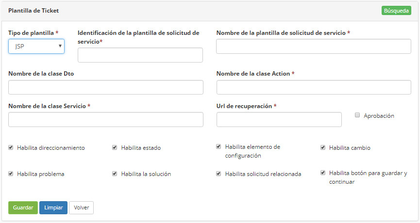
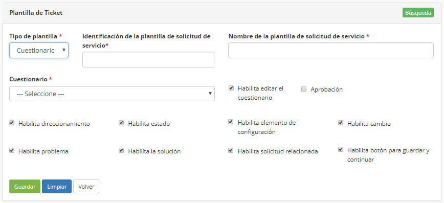

title: Registrar plantilla de servicio
Description: Ofrece diversas acciones, tales cuales, incluir, cambiar y borrar una platilla de servicio, que se utilizará para personalizar la pantalla de servicio.

# Registrar plantilla de servicio

Esta funcionalidad ofrece diversas acciones, tales cuales, incluir, cambiar y
borrar una platilla de servicio, que se utilizará para personalizar la pantalla
de servicio.

Antes de empezar
--------------------

Para registrar una plantilla de servicio, es necesario tener registrado el
cuestionario.

Procedimento
----------------

1.  Acceder a la funcionalidad por el menú principal Procesos \> Gestión de
    Portafolio y Catálogo \> Plantilla de Servicio;

2.  Completar los campos disponibles;

3.  En el campo **Tipo de plantilla**, a cada opción elegida (JSP, Cuestionario o Neuro) los campos para relleno se cambiarán

    

    Figura 1 - JSP plantilla

    

    Figura 2 - Cuestionario plantilla

    

    Figura 3 - Neuro plantilla

4. Hacer clic en "Guardar".

Relacionado
-----------

[Cadastrar cuestionario](/es-es/citsmart-platform-8/platform-administration/questionnaires/questionaires-management/register-questionnaire.html)

<i class='fa fa-youtube-play  fa-2x' style='color:#97ce17;vertical-align: middle;'> </i> [Video Library](https://www.youtube.com/playlist?list=PLB5qK2uzf2ROUXdrTeH-_n6tXmG4oPtoz)'

!!! tip "About"

    <b>Product/Version:</b> CITSmart | 8.00 &nbsp;&nbsp;
    <b>Updated:</b>01/24/2019 - Anna Martins
