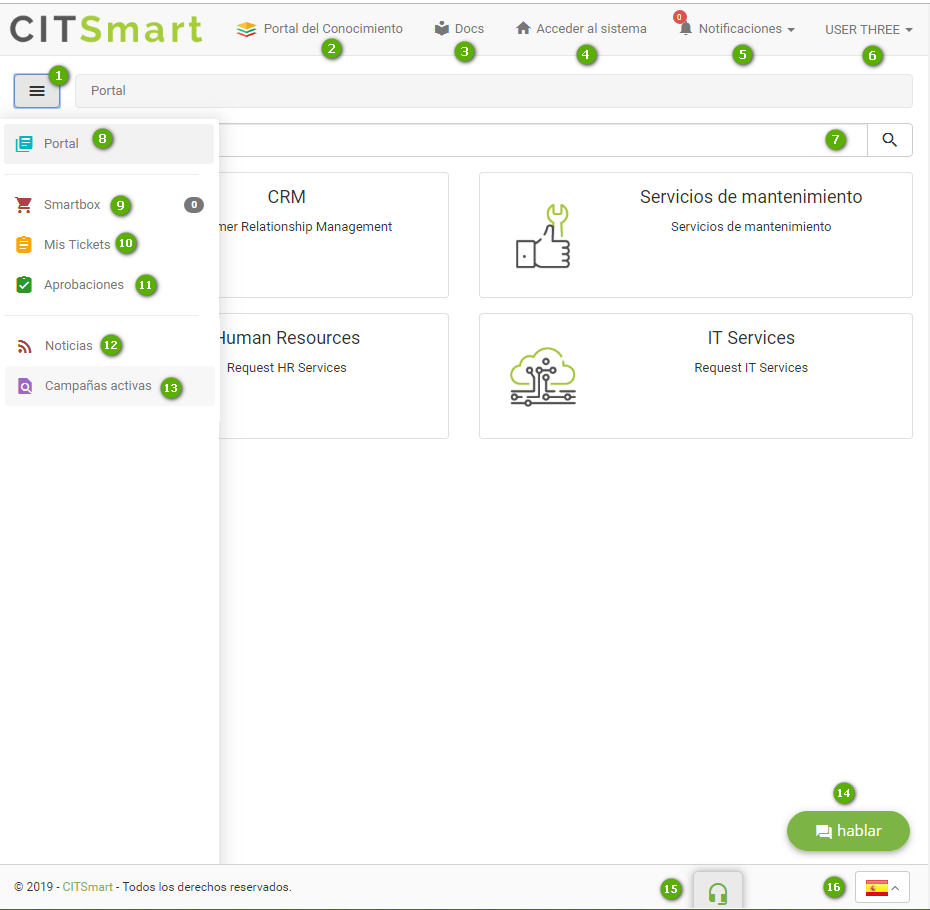

title:  Smart Portal
Description: Smart Portal es un recurso de la solución que ofrece el Catálogo de Servicios
# Smart Portal

Smart Portal es un recurso de la solución que ofrece el Catálogo de Servicios (Negocio y Apoyo) a los usuarios del sistema y permite realizar acciones diversas, tales como:  

•	Abrir un ticket (solicitud de servicio);  
•	Recibir noticias referentes al Sistema;  
•	Evaluar la solicitud de servicio;  
•	Acceso a los conocimientos referentes al ticket para aclaración de dudas.  

Figura 1 - Smart Portal

- **1**: Botón de menú - al hacer clic en este botón, permite ocultar/mostrar el menú del Smart Portal

- **2**: Portal de Conocimiento - acceso directo a Portal del Conocimiento, permite al usuario realizar la búsqueda de informaciones generadas en su organización

- **3**: Docs: direcciona al usuario para la documentación del producto CITSmart

- **4**: Acceder al sistema - permite entrar en el sistema

- **5**: Notificaciones - local donde muestra los mensajes de alerta del sistema

- **6**: Identificación del usuario - se muestran las funciones para cambiar el perfil y salir del sistema

- **7**: Búsqueda - permite buscar los servicios disponibles en el portal

- **8**: Portal - permite volver a la pantalla de inicio de Smart Portal

- **9**: Smartbox  - muestra la cantidad de solicitudes que están en la cesta de la compra del usuario (opción activa sólo cuando el parámetro 292 se establece en "SIM")

- **10**: Mis solicitudes - permite al usuario registrado ver sus solicitudes de servicios y realizar algunas acciones en las mismas

- **11**: Aprobaciones - permite al usuario registrado ver sólo las solicitudes de servicios que requiere aprobación

- **12**: Noticias - local donde están disponibles las noticias, como por ejemplo, referentes a la organización, al sistema, etc

- **13**: Investigaciones actividades - permite al usuario registrado ver las búsquedas de satisfacción activas

- **14**: Chat - permite crear una solicitud de servicio e interactuar con el operador sobre la misma

- **15**: VoIP - permite hacer llamadas directamente desde el Smart Portal, pero es necesario la integración con herramientas VoIP

- **16**: Idioma - le permite elegir el idioma que desee para el sistema (Portugués, Inglés o Español)

Antes de empezar 
-----------------

Es necesario el registro previo del contrato, la definición del tiempo de atención de las actividades de solicitud/incidente. Es imprescindible también tener el portafolio con los servicios y las actividades de solicitud/incidente registrados y disponibles en el Smart Portal.

Procedimiento 
-------------

1.  Acceder al menú principal Procesos \> Gestión de
    Portafolio y Catálogo \> Smart Portal;

2.  Elegir un portafolio y hacer clic. Se presentará varias acciones que se 
    pueden ejecutar en cada una de las pestañas de esta pantalla. Ellas son:

    -   **Servicios**: en esta pestaña se presentarán las actividades registradas en este portafolio. Al seleccionar y hacer clic en una actividad, será posible registrar la solicitud de servicio (ticket) referente al escenario encontrado, también es viable observar los conocimientos referentes al ticket al hacer clic en la pestaña del mismo nombre, analizar las evaluaciones de los usuarios referentes a las solicitudes disponibles al hacer clic en la pestaña "Evaluaciones" y tener acceso a las noticias referentes a la solicitud en cuestión al apretar la pestaña "Campañas activa";  

    !!! Abstract "NOTAS"  

        Los conocimientos diponibles en la pestaña "Conocimientos", del elemento "Servicio", pueden ser definidos en dos niveles:  

        -   Los conocimientos que se han vinculado al portafolio que estarán dispuestos en el elemento "Relacionados al Servicio";  

        -   Los conocimientos que se asociaron al ticket (añadidos cuando responsable de la atención de éste vinculó un artículo para difundir el conocimiento de la solución del mismo) ordenados en el elemento "Relacionados a la Solicitud/Incidente".  

    -   **Conocimientos**: al hacer clic sobre la pestaña, se presentarán los conocimientos vinculados al portafolio;

    -   **Campañas activas**: esta pestaña expone los cuestionarios (recolección de información) sobre el portafolio en cuestión.

3.  Al hacer clic en el icono "Menú", se muestran accesos directos a algunas acciones. Se permite visualizar las solicitudes abiertas por el usuario al apretar el icono "Mis solicitudes", ver las aprobaciones del ticket efectuadas por el usuario, observar las noticias y campañas activas (cuestionarios) referentes a la organización como un todo.  
    
!!! tip "About"  
    <b>Product/Version:</b> CITSmart | 8.00 &nbsp;&nbsp;
    <b>Updated:</b>02/13/2019 – Larissa Lourenço  
   
