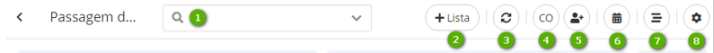

Title: List

# Criar listas

1.  Dentro de cada Sprint são disponibilizadas listas default do sistema: “To do, In progress e Finished”;

2.  Para criar nova lista, clicar no botão “+Lista”, nomear e “Salvar”.

    
    
    Figura 2 - Tela lista

    -   **1**: pesquisar tarefas com filtros de membros, tags e status da lista
    (concluída e não concluída)

    -   **2**: criar nova lista

    -   **3**: atualizar a tela

    -   **4**: abreviação do nome do membro adicionado. Ao clicar é possível excluir e
    definir se o membro será administrador ou não

    -   **6**: definir data, hora e estimativa de horas para entrega

    -   **7**: visualizar o histórico de ações

    -   **8**: arquivar lista de tarefas