title: Configurar o Okta no 4biz
Description: O Okta conecta qualquer usuário com qualquer aplicativo em qualquer dispoitivo. Este documento explica a forma ideial de conectar esta solução ao 4biz.
# Configurar o Okta no 4biz

Este método de autenticação permite que se utilize os recursos do Okta para autenticar usuários da organização em uma instância 4biz. Este documento explica os passos da configuração deste método. Para saber mais sobre o Okta acesse [okta.com][1].

Antes de começar
--------------------

A configuração desta solução é um processo de diversas fases. A primeira fase é a criação de uma conta Okta.

Procedimento
----------------

*1º Passo: Criar uma conta Okta:*

1. Acessar o site:  https://www.okta.com;

2. Clicar em "Try Okta" e em seguida "Sign up today";

3. Informar os dados essenciais (e-mail, nome e sobrenome);

    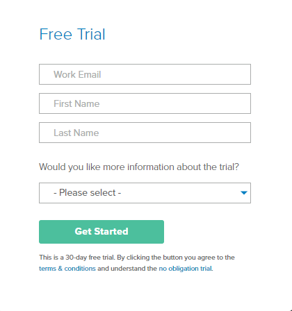

4. Apertar o botão "Get Started" para concluir a operação. Em seguida, verificar o e-mail cadastrado (que enviará um link de acesso), acessar a conta com a senha temporária enviada e alterar a mesma para maior segurança dos dados;

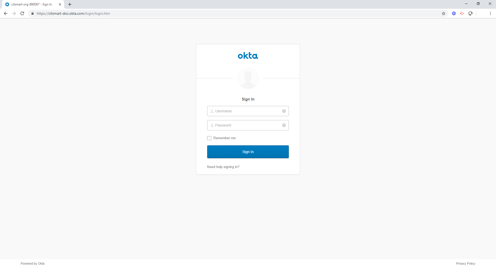

*2º Passo: Criar a aplicação 4biz dentro do Okta:*

1. Após concluído a etapa anterior, conectar-se ao Okta com a conta recém criada;

2. Clicar na aba "Applications e em seguida no botão "Add Application";

    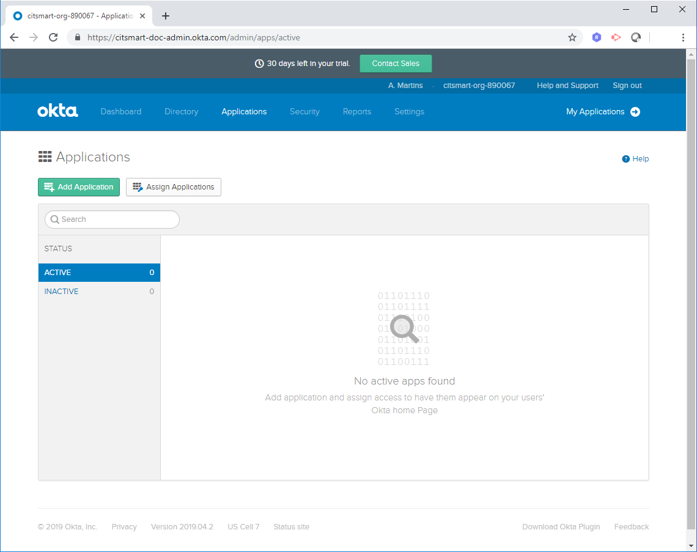

3. Apertar em "Create New App";

    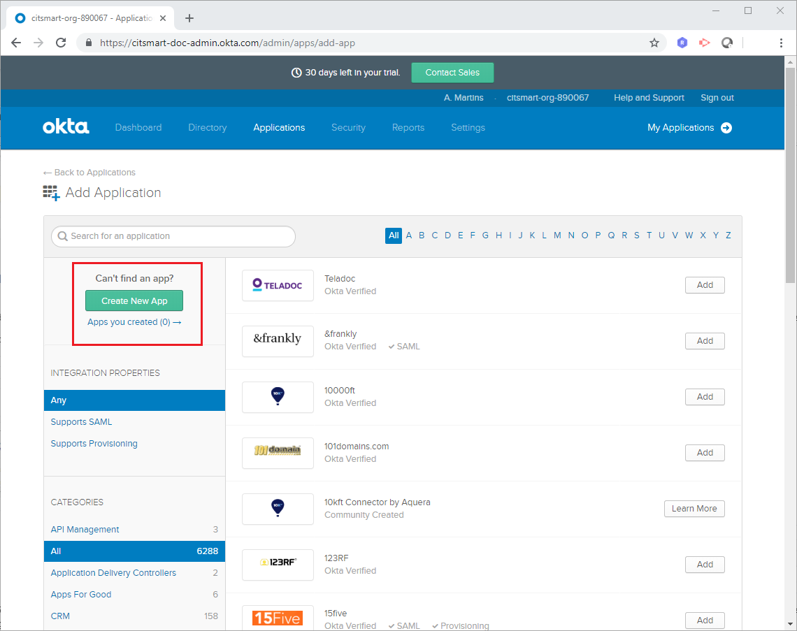

4. Marcar a opção "SAML 2.0" e depois clicar no botão "Create";

    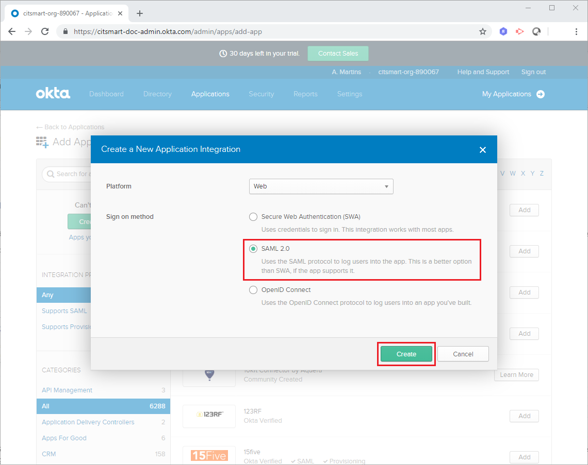

5. No campo "App name", adcionar o nome da aplicação e logo após, é necessário clicar no botão "Next";

    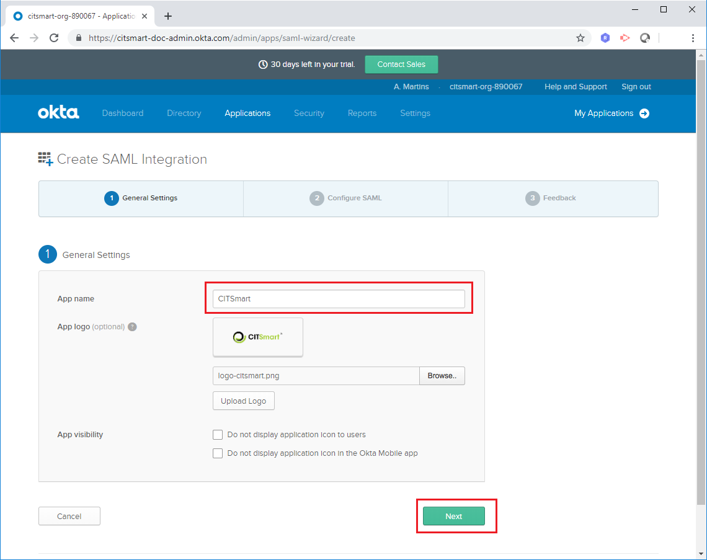

6. Configurar o caminho da aplicação e depois clicar no botão Next;

    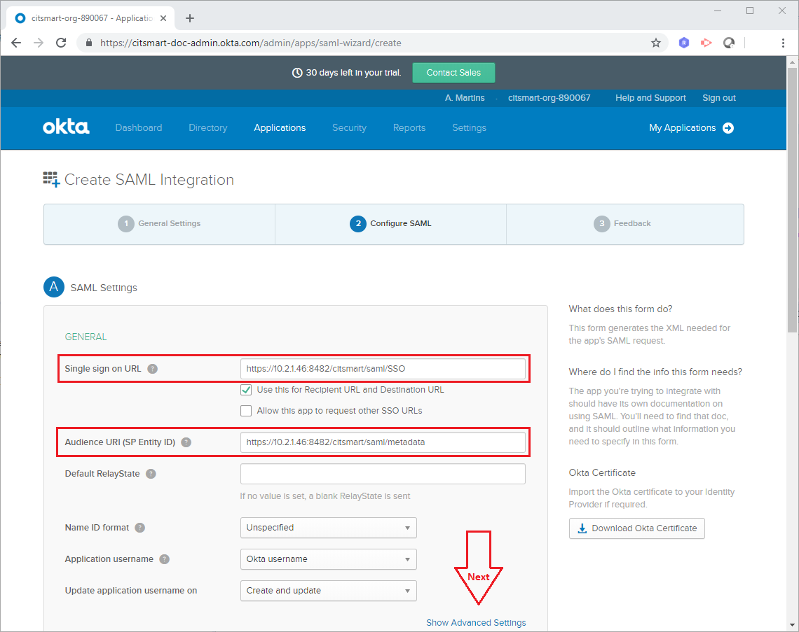

    !!! Abstract "ATENÇÃO"
    
        No campo "Single sign on URL" e "Audience URI (SP Entity ID)" deverá ser incluído os endereços de URL no qual a                 aplicação 4biz será executada.

7. Marcar as opções "I'm an Okta customer adding an internal app" e "This is an internal app that we have created". Logo em seguida, clicar no botão "Finish".

    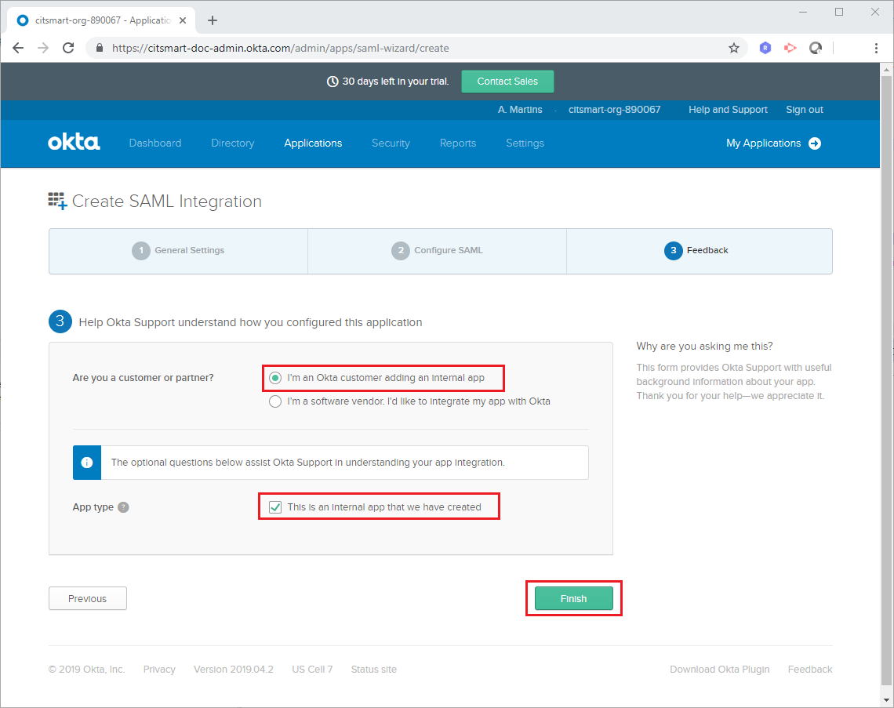

*3º Passo: Atribuir usuários a aplicação 4biz do Okta:*

1. Concluído o passo anterior, é necessário clicar na aba "Applications > Applications" e em seguida em "Assign Applications" e optar pelo filtro chamado "People";

    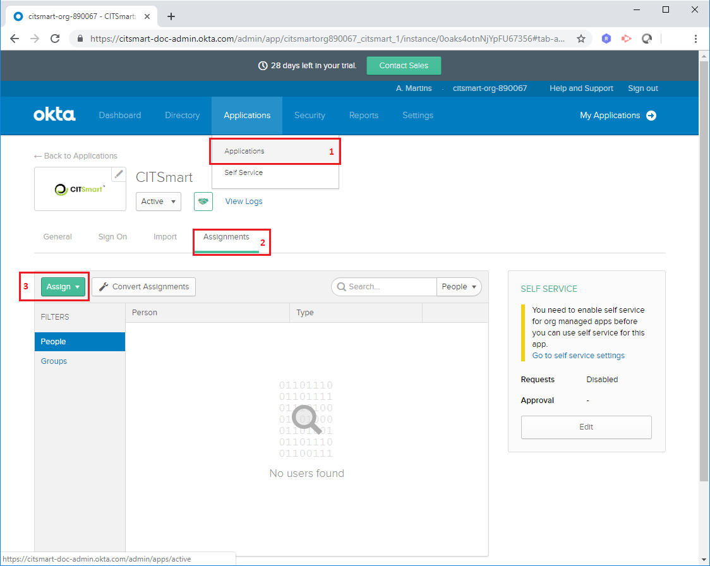

2. Em seguida, é possível escolher o usuário que terá a permissão de acessar a aplicação que está sendo criada. Clicar então no botão "Assign" e posteriormente para finalizar, clicar em  "Done";

    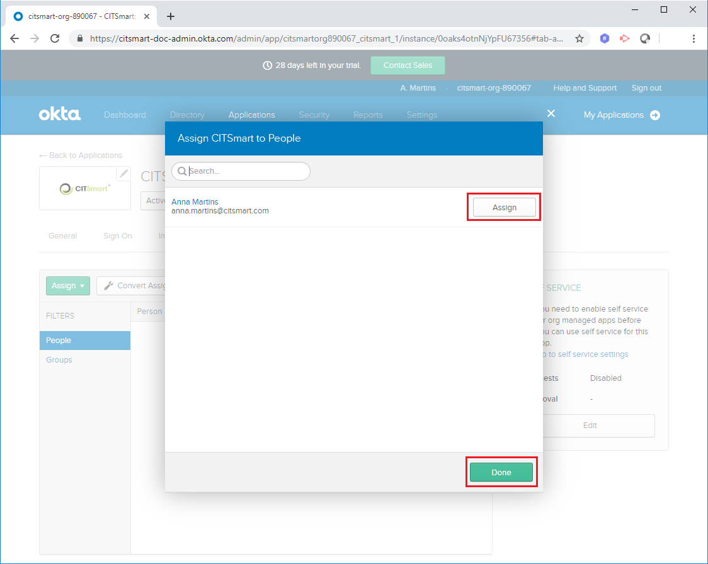

*4º Passo: Incluir informações necessárias no 4biz configurado no Okta:*

1. Será necessário configurar alguns dados no diretório do WildFly. Acessar o diretório, abrir a pasta "/standalone/configuration" e alterar o arquivo "4biz .cfg".

    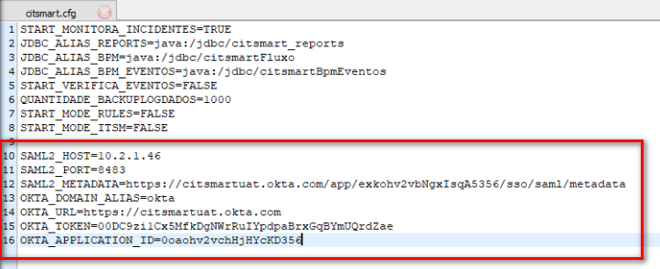

2. Acessado o arquivo, é preciso incluir estas informações no arquivo "4biz .cfg":
       
      a) Na linha *SAML2_HOST* e *SAML2_PORT* incluir o endereço e porta da aplicação 4biz;
       
      b)  Na linha *SAML2_METADATA* incluir os metadados SAML do Okta. Este dado pode ser obtido seguindo as seguintes instruções:
 
      * Acessar a aplicação 4biz no Okta, clicar na aba "Applications > Applications" e em seguida na opção "Sign On". Ao apertar a opção "Identity Provider metadata", será disponibilizado uma nova aba os metadados, copiar a URL do browser e inserir na propriedade *SAML2_METADATA* ;
        
    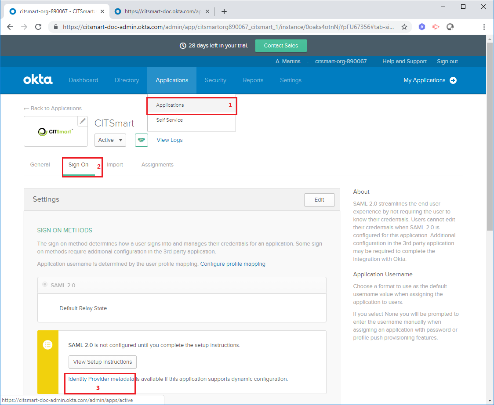

     c) Na linha *OKTA_URL*, incluir a URL principal da conta Okta.
   
     d) Na linha *OKTA_TOKEN*, incluir o token para acesso via API. Para obter este token, atenda estes passos:
   
   - Acessar a aplicação 4biz no Okta, selecionar no menu a opção "Security > API" e em seguida clicar no botão "Create Token". Nomear o token e apertar o botão "Create Token". Será então apresentado o valor do token que deverá ser copiado na linha citado acima.
   
    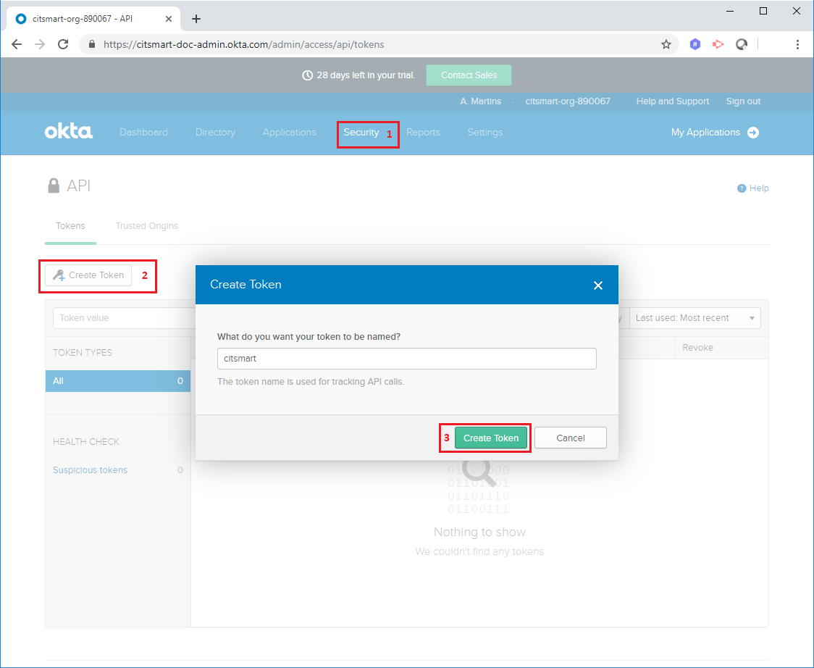

     e) Na linha *OKTA_DOMAIN_ALIAS*, incluir o domínio dos usuários provinientes do Okta.
  
*5º Passo: Sincronizar usuário do Okta no 4biz:*

1. Dentro do 4biz, acessar o menu "Okta Config" e cadastrar uma nova configuração ao clicar no botão "Novo";

    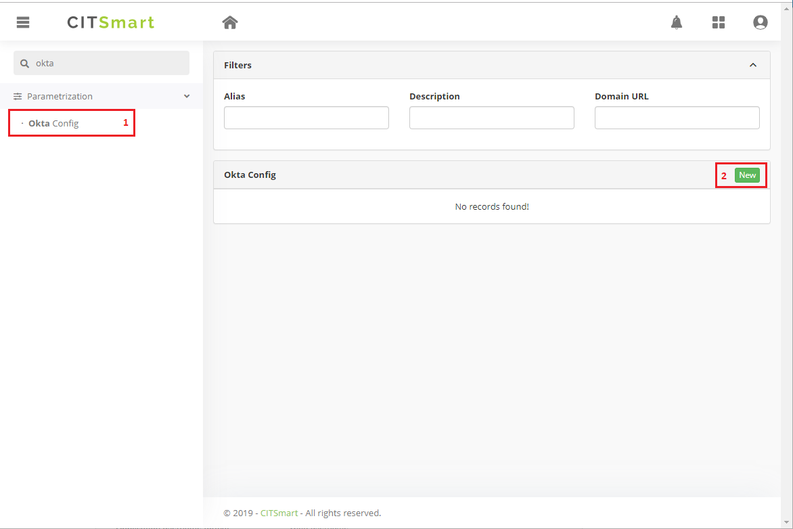

2. Preencher os campos com as informações necessárias:

    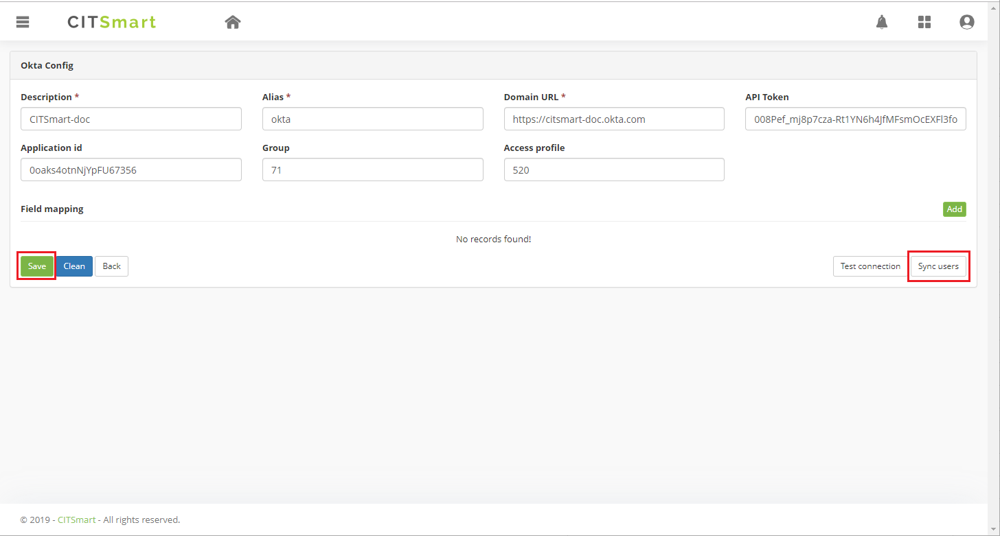

    * **Descrição:** introduzir uma definição desta nova configuração Okta;
     
    * **Alias:** incluir o domínio do usuário que será gravado na base. Exemplo: okta\administrador@run2biz.com;
     
    * **URL de domínio:** deverá incluir o mesmo valor (URL) que foi inserida na linha *OKTA_URL* no arquivo "4biz .cfg"; 
     
    * **Token API:** incluir o mesmo valor do token inserido na linha *OKTA_TOKEN* no arquivo "4biz .cfg";
      
    * **Grupo:** inserir o ID do grupo no qual o usuário sincronizado e gravado pertencerá no 4biz;
     
    * **Perfil de Acesso:** inserir o ID do perfil no qual o usuário sincronizado e gravado pertencerá no 4biz;
     
    * **ID da aplicação:** incluir o ID da aplicação. Esta informação pode ser recuperada na URL do Okta, conforme a figura abaixo:
     
      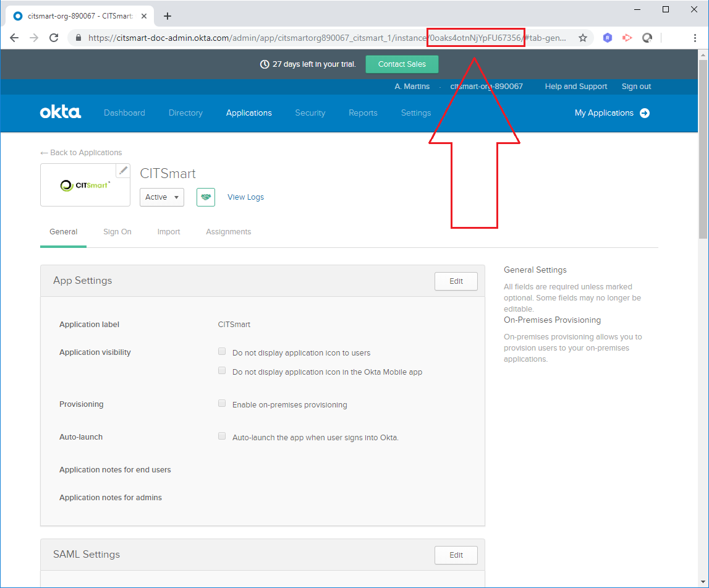

3. Clicar no botão "Salvar" e em seguida "Sicronizar usuários" para efetuar a operação.

*6º Passo: Configurar o Logout:*

 1. Como o Okta não possui tela de logout, no parâmetro 377 do 4biz podemos inserir algum endereço de página para redirecionar o usuário ao final da sessão;
 
 2. Configurar o link para logout também no endereço (**Admin > Settings > Customization > Sign-Out-Page)** , em seguida marcar a opção "Usar a custom sign-out page". Então, deve-se inserir a URL (https://localhost:8443/4biz/saml/logout) com as devidas adaptações (host e porta), conforme a imagem abaixo:
 
 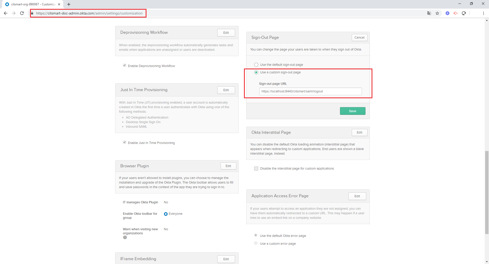

!!!Abstract "NOTA"   
  
    Ao fazer o *logout* do 4biz não deve ser realizado o *logout* do Okta, pois o usuário pode ter outras aplicações na sessão do Okta. Em contrapartida, se fizer o *logout* do Okta, a sessão do usuário no 4biz será removida.
       
O que fazer a seguir
----------------------

Concluída a integração do Okta com o 4biz, alguns parâmetros do 4biz podem ser configurados para melhor personalizar esta integração:

 -  O parâmetro 445 (Nome do grupo Administrador no Okta) permite escolher o grupo administrador na solução Okta. Se o usuário pertencer a este grupo escolhido, terá o perfil de acesso definido como administrador. Caso o mesmo não tenha um perfil definido, o sistema atribuirá o parâmetro 39 e caso este usuário já tenha um perfil definido no 4biz, este se manterá.
 
!!! tip "About"

    <b>Product/Version:</b> 4biz | Helium &nbsp;&nbsp;
    <b>Updated:</b>05/30/2019 – Larissa Lourenço

[1]: https://www.okta.com/
