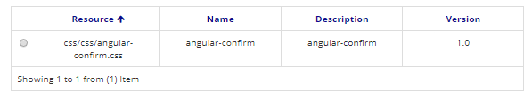

title: CSS  
Description: O Neuro permite que a manutenção de arquivos CSS dentro da ferramenta. Esses arquivos poderão ser usados em Formulário como dependência.   
# CSS

O Neuro permite que a manutenção de arquivos CSS dentro da ferramenta. Esses arquivos poderão ser usados em Formulário como dependência.     

!!! Abstract "ATENÇÃO"  

    A pasta é um agrupador físico dos arquivos no servidor, para fins de organização. A pasta configurada não interfere no funcionamento     do sistema.  

##Como acessar    

1.  Acesse a funcionalidade através da navegação no menu Neuro > Recursos > CSS.    

##Pré-condições    

1.  Não se aplica.  

##Filtros  

1.  O seguinte filtro possibilita ao usuário restringir a participação de itens na listagem padrão da funcionalidade, facilitando a localização dos itens desejados:   

    * Palavra chave    

  

Figura 1 - Tela de pesquisa de CSS  

##Listagem de itens

1. Os seguintes campos cadastrais estão disponíveis ao usuário para facilitar a identificação dos itens desejados na listagem padrão da funcionalidade: Recurso, Nome, Descrição e Versão.      

Figura 2 - Tela de listagem de CSS  

##Preenchimento dos campos cadastrais 

1. Para cadastrar um novo arquivo CSS, clique em "Cadastrar", conforme ilustrado na figura abaixo:   

    
    
    Figura 3 - Tela inicial do CSS    

2. Nesta tela também é permitido ao usuário outras ações. São elas:

   - Para editar um item criado, selecione o item desejado, clique em "Editar" (a versão atual ou a versão anterior), faças as alterações e clique em "Salvar";
   
   - Para visualizar um item, selecione o mesmo e clique em "Visualizar";
   
   - Para remover um item criado, selecione o item desejado, clique em "Remover" e confirme a exclusão.  

3. Ao clicar em "Cadastrar", será apresentada a seguinte tela:    
 
       
    Figura 4 - Tela de cadastro de CSS    

4. Informe uma descrição, o caminho da pasta do CSS e faça o upload do arquivo. Os campos de nome e versão são auto incrementados pelo sistema.   
5. Clique em "Salvar" para armazenar o arquivo. Clique em "Pesquisar" para voltar para a tela anterior.    

!!! tip "About"
    <b>Updated:</b>17/01/2019 - João Pelles Junior
