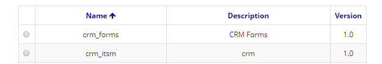

Title: Pacote
Description: Quando se produz um conjunto de itens de aplicação através do Neuro, é possível que esse conjunto seja aglomerado em um pacote que pode ser importado/exportado entre ambientes do Neuro.    
# Pacote  

Quando se produz um conjunto de itens de aplicação através do Neuro, é possível que esse conjunto seja aglomerado em um pacote que pode ser importado/exportado entre ambientes do Neuro.    

## Como acessar 

1. Acesse a funcionalidade através da navegação no menu Neuro > Gerenciamento > Pacote.    

## Pré-condições 

1. Não se aplica.    

## Filtros

1. O seguinte filtro possibilita ao usuário restringir a participação de itens na listagem padrão da funcionalidade, facilitando a localização dos itens desejados:    
 
     * Palavra chave ou enter.      

Figura 1 - Tela de pesquisa de pacotes    

## Listagem de itens

1. Os seguintes campos cadastrais estão disponíveis ao usuário para facilitar a identificação dos itens desejados na listagem padrão da funcionalidade: Nome, Descrição e Versão.    

 

Figura 2 - Tela de listagem de pacotes   

## Preenchimento dos campos cadastrais 

1. Para alterar um pacote já cadastrado, clique em "Editar", faça as modificações e depois clique em "Salvar";   
2. Para criar um pacote, clique em "Cadastrar". Informe o Nome e a Descrição do pacote. Em seguida, selecione os elementos que farão parte do pacote. Todos estes elementos foram cadastrados previamente no Neuro;    

    
    
    Figura 3 - Tela de cadastro/edição de pacotes   

3. Poderão ser selecionadas Aplicações, Parâmetros, Labels, Imagens, CSS, Java Scripts, Páginas HTML, Relatórios, Regras de negócio, Fluxos, Objetos de negócio, Componentes, Páginas de formulário, Formulários, Processos de negócio, Notificações e Grupos de usuário para compor o pacote;    
4. Clique em "Salvar" para criar o pacote. Clique em "Pesquisar" para voltar para a tela anterior;   
5. Para exportar um pacote salvo, selecione o pacote, e clique em "Exportar". Os pacotes são exportados em formato .json;    
6. Para importar um pacote para um Neuro, clique em "Importar", selecione se esta versão do pacote deverá substituir os elementos que possuírem o mesmo identificador, se a DDL deverá ser executada, e selecione o arquivo de importação .json.    

    !!! Abstract "ATENÇÃO"  

        Para garantir a compatibilidade, é altamente recomendável que a versão do Neuro que realizou a exportação de um pacote seja a           mesma do Neuro que realizará a importação do mesmo pacote.   

7. Para visualizar um item, selecione o mesmo e clique em "Visualizar".    

!!! tip "About"
    <b>Updated:</b>17/01/2019 - João Pelles Junior
