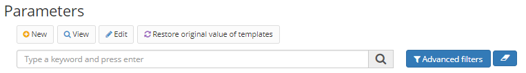
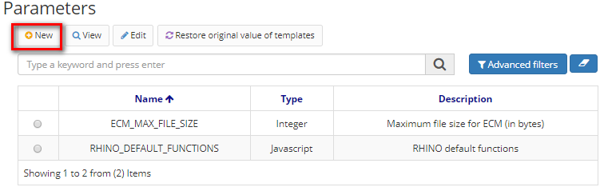

Title: Parâmetros   
Description: Nesta tela, os parâmetros a serem usados em aplicativos criados através do Neuro são configurados.    

# Parâmetros  

Nesta tela, os parâmetros a serem usados em aplicativos criados através do Neuro são configurados.   

## Como acessar 

1. Acesse a funcionalidade através da navegação no menu Neuro > Configuração > Parâmetros.   

## Pré-condições  

1. Não se aplica.    

## Fitros 

1. O seguinte filtro possibilita ao usuário restringir a participação de itens na listagem padrão da funcionalidade, facilitando a localização dos itens desejados:    
 
     * Palavra chave    

Figura 1 - Tela de pesquisa de parâmetros    

## Listagem de itens  

1. Os seguintes campos cadastrais estão disponíveis ao usuário para facilitar a identificação dos itens desejados na listagem padrão da funcionalidade: Nome, Tipo e Descrição.    

 

Figura 2 - Tela de listagem de parâmetros    

## Preenchimento dos campos cadastrais  

1. Para cadastrar um novo parâmetro, clique em "Cadastrar", conforme ilustrado na figura abaixo:  

    
    
    Figura 3 - Tela inicial de parâmetros  

2. Nesta tela também é permitido ao usuário outras ações. São elas:    
    
    - Editar: muda um parâmetro existente. Para editar, selecione um item na tabela e clique em "Editar".   
    - Visualização: exibe um parâmetro registrado. Não permite edição. Para visualizar, selecione um item na tabela e clique em "Exibir". 

3. Ao clicar em "Cadastrar", será apresentada a seguinte tela:   

     
    
    Figura 4 - Tela de cadastro de parâmetro    

4. Para registrar um parâmetro, insira o nome, o tipo e a descrição. O sistema exibirá um campo "Valor" de acordo com o tipo selecionado.    
5. Clique em "Salvar" para salvar suas alterações.    

!!! tip "About"
    <b>Updated:</b>17/01/2019 - João Pelles Junior
