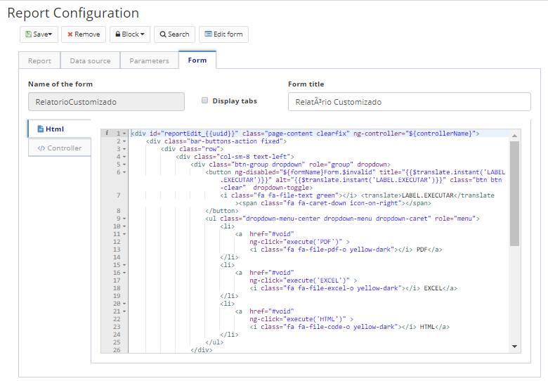

Title: Configuração de relatório    
Description:Essas informações são preenchidas automaticamente a partir do cadastro do arquivo de relatório. Podem ser editados o nome, a descrição, e a pasta agrupadora do projeto no servidor.   

# Configuração de relatório   

Essas informações são preenchidas automaticamente a partir do cadastro do arquivo de relatório. Podem ser editados o nome, a descrição, e a pasta agrupadora do projeto no servidor.   

## Como acessar 

1. Acesse a funcionalidade através do menu Neuro > Gerenciamento > Relatório.

## Pré-condições

1. O formulário deve ser previamente cadastrado no Formulário. 

## Filtros 

1. O seguinte filtro possibilita ao usuário restringir a participação de itens na listagem padrão da funcionalidade, facilitando a localização dos itens desejados:   

    * Palavra chave ou enter.    

Figura 1 -Tela de pesquisa de relatórios     

## Listagens de itens

1. Os seguintes campos cadastrais estão disponíveis ao usuário para facilitar a identificação dos itens desejados na listagem padrão da funcionalidade: Aplicação, Recurso, Nome, Descrição e Versão.  

Figura 2 -Tela de listagem de relatórios    

## Preenchimento dos campos cadastrais  

### Dados do relatório

1. Essas informações são preenchidas automaticamente a partir do cadastro do arquivo de relatório. Podem ser editados o nome, a descrição, e a pasta agrupadora do projeto no servidor.    

Figura 3 - Cadastro/edição de configuração de relatório, aba Dados do Relatório    

## Data source

1. Refere-se à fonte de dados do relatório. Informe o tipo da fonte de dados, que pode ser:   

    - Nenhum: caso o arquivo não realize uma busca no banco de dados.    
    - Conexão de dados: caso a fonte de informações seja uma conexão com banco de dados, informe também a conexão de banco respectiva       (cadastrável no menu Conexão de banco).   
    - Objeto de dados: caso a fonte de informações seja um objeto de banco de dados cadastrado na aplicação. Informe o objeto de negócio      que será a fonte de dados (cadastrável no menu Objeto de negócio).    
    - Fluxo ESI: caso a fonte de informações seja um fluxo ESI cadastrado na aplicação. Informe o fluxo que será a fonte de dados           (cadastrável no menu Design Workflow/ESI).    
    - Script: caso a fonte de dados seja um script, codifique o script utilizando a linguagem Rhino.    

Figura 4 - Cadastro/edição de configuração de relatório, aba Data source    

## Parâmetros   

1. Esta aba refere-se ao cadastro de parâmetros fixos para compor o relatório. Você poderá inserir uma imagem como parâmetro para definir a logotipo do relatório, por exemplo.   

    - Clique em "Adicionar" para incluir um novo parâmetro;    
    - Informe o nome do parâmetro, o tipo, e o objeto do parâmetro;   
    - Clique em "Salvar" para incluir o parâmetro na lista;  
    - Para editar um parâmetro da lista, clique em "Editar";   
    - Para remover um parâmetro da lista, clique em "Remover".  

Figura 5 - Cadastro/edição de configuração de relatório, aba Parâmetros    

## Formulário

Esta aba representa o formulário a ser exibido quando o usuário for gerar o relatório.    

1. Informe o nome do formulário cadastrado, informe se deverão ser exibidas abas, o título do formulário, e o menu associado ao mesmo;    
2. No formulário selecionado, por padrão, serão acrescentadas opções para gerar o relatório em PDF, Excel e HTML;    
3. Para alterar o padrão, edite o código fonte apresentado na tela;  
4. Clique em "Salvar" para executar as alterações. Clique em "Pesquisar" para voltar para a tela anterior;   
5. Para editar um item criado, selecione o item desejado, clique em "Editar" (a versão atual ou a versão anterior), faças as alterações, e clique em Salvar;   
6. Para visualizar um item, selecione o mesmo e clique em "Visualizar;.   
7. Para remover um item criado, selecione o item desejado, clique em "Remover" e confirme a exclusão.    

Figura 6 - Cadastro/edição de configuração de relatório, aba Formulário  

!!! tip "About"
    <b>Updated:</b>17/01/2019 - João Pelles Junior
