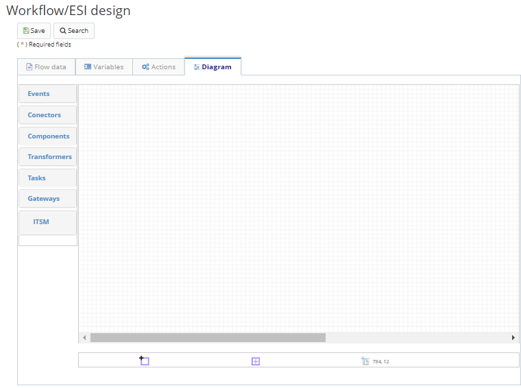

Title: Fluxo de integração de serviços  
Description:Os fluxos de integração de serviços, como o próprio nome diz, envolvem workflows executados com base em serviços de sistema, como integrações e conversões, por exemplo.   

# Fluxo de integração de serviços 

Os fluxos de integração de serviços, como o próprio nome diz, envolvem workflows executados com base em serviços de sistema, como integrações e conversões, por exemplo.   

## Como acessar    

1. Acesse a funcionalidade através do menu Neuro > Gerenciamento > Fluxo de Integração.     

## Pré-condições    

1. Não se aplica.   

## Filtros  

1. O seguinte filtro possibilita ao usuário restringir a participação de itens na listagem padrão da funcionalidade, facilitando a localização dos itens desejados:   

    * Palavra chave  

Figura 1 - Tela de pesquisa    

## Listagem de itens    

1. Os seguintes campos cadastrais estão disponíveis ao usuário para facilitar a identificação dos itens desejados na listagem padrão da funcionalidade: Nome, Descrição, Aplicação do fluxo, Versão e Data de bloqueio.   

Figura 2 - Tela de listagem     

## Preenchimento dos campos cadastrais - dados do fluxo   

Através dessa aba, são definidas informações básicas do fluxo que será desenhado.   

1. Para adicionar um novo fluxo, clique em Cadastrar > Fluxo de serviços de integração, conforme ilustrado na figura abaixo:   

       
    Figura 3 - Tela de registro   

2. Para cadastrar um novo dados do fluxo, clique em "Adicionar".   
3. Será apresentada a seguinte tela:    

    
    
    Figura 4 - Tela de cadastro/edição do workflow, aba de Dados do fluxo    

4. Informe um nome para o fluxo, uma descrição, qual formulário dará início ao fluxo (caso se aplique), e se persiste ou não a execução do fluxo. Caso o campo “Persiste a execução do fluxo” for marcado, o Neuro persistirá no banco de dados de toda instância da execução deste fluxo.    

5. O campo versão é incrementado automaticamente pelo sistema sempre que uma nova versão do workflow for criada.    

## Variáveis  

Nesta aba são configuradas as variáveis que serão utilizadas no fluxo desenhado. As variáveis são objetos capazes de reter e representar um valor ou expressão. As variáveis são associadas a "nomes", chamados identificadores, durante o tempo de execução do fluxo.  

1. Para adicionar uma variável, selecione a sua aba referente e clique em "Adicionar".  
2. Será apresentada a seguinte tela:    

    
    
    Figura 5 - Tela de cadastro/edição do workflow, aba de Variáveis     

3. Preencha os campos:

    * Nome da variável;  
    * Descrição;  
    * Se será armazenada no banco de dados;  

	  * Esta opção irá armazenar o valor da variável internamente, dentro do modelo de dados do Neuro, assim ela irá reter o valor               durante a execução das tarefas.  

    * Se é uma variável de retorno;  

	  * Esta opção irá fazer que o Neuro retorne a variável no final da execução do fluxo.  

    * Se é uma lista de valores;  
    * Se é uma variável de entrada na interface do fluxo;  

	  * Esta opção permite que a variável seja “injetada” no processo de negócio vinculado a este fluxo.  

    * Se é uma variável de saída na interface do fluxo;  

	  * Esta opção faz que a variável tenha o valor preenchida quando o processo de negócio vinculado à estre fluxo for executado.  

    * O tipo da variável;  

	  * Se for um objeto Java, informe a classe Java correspondente;  
	  * Se for um objeto de negócio, informe qual sua aplicação respectiva e qual o nome cadastrado do objeto de negócio.  

    * O valor inicial da variável, se constante ou script.  

	  * Se o valor for uma constante, este nunca será alterado durante a execução do fluxo, independente das operações realizadas             pelo usuário.  

4. Para editar uma variável, selecione a variável desejada, clique em "Editar", faça as alterações necessárias e clique em "Atualizar" para concluir a edição.  

5. Para remover uma variável do fluxo, selecione a variável desejada, clique em "Remover" e confirme a exclusão.    

!!! Abstract "ATENÇÃO"  

    Para salvar efetivamente as alterações, clique em Salvar na barra superior.  

## Ações  

Por meio deste menu, é possível cadastrar as ações que serão executadas no workflow.   

As ações são baseadas em scripts programados na linguagem Rhino.   

1. Para adicionar uma ação, selecione sua aba referente e clique em "Adicionar".   
2. Será apresentada a seguinte tela:  

     
    
    Figura 6 - Tela de cadastro/edição do workflow, aba de Ações   

3. Preencha os campos:   

    - Um identificador para a ação;    
    - O nome literal para a mesma;   
    - O script que será executado quando a ação for acionada.    

4. Para editar uma ação, selecione a ação desejada, clique em "Editar", faça as alterações necessárias e clique em "Atualizar" para concluir a edição.  

5. Para remover uma ação, selecione a mesma, clique em "Remover" e confirme a exclusão.   

!!! Abstract "ATENÇÃO"  

    Para salvar efetivamente as alterações, clique em "Salvar" na barra superior.  

## Diagrama  

O diagrama de um fluxo de serviços não possui os mesmos componentes de “Tarefa” de um fluxo de processo. Não é possível utilizar aqui os componentes de “Tarefa humana” e “Sub processo workflow”.  

Para um processo de negócio, possuímos a mais as seções de componentes:   

- Conectores: componentes utilizados para a execução de operações relacionadas à banco de dados.  
- Componentes: componentes variados para a execução de diversas tarefas.  
- Transformadores: componentes para a conversão de tipos de variáveis.  
- CITSmart ITSM: componentes utilizados para integração com um sistema CITSmart ITSM externo.   

Os demais componentes presentes na paleta se assemelham aos componentes de um “Fluxo de Processo”. Mais informações a respeito da funcionalidade e utilização de cada um dos componentes podem ser encontradas no Desenvolvendo Aplicações.    

1. Para desenhar o diagrama, escolha a aba refente ao mesmo.  
2. A seguinte tela será exibida:  

Figura 7 - Tela de cadastro/edição do workflow, aba de Diagrama  

!!! tip "About"
    <b>Updated:</b>17/01/2019 - João Pelles Junior
