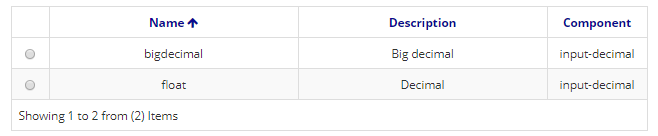

Title: Tipo de dado  
Description:O cadastro de tipo de dado tem a funcionalidade de vincular um tipo abstrato de dado à um componente de formulário.   

# Tipo de dado  

O cadastro de tipo de dado tem a funcionalidade de vincular um tipo abstrato de dado à um componente de formulário.    
Este campo é selecionado quando se cria um novo atributo de um objeto de negócio. Mais informações podem ser encontradas no documento de Desenvolvendo Aplicações.   

## Como acessar   

1. Acesse a funcionalidade através da navegação no menu Neuro > Configuração > Tipo de dado.    

## Pré-condições  

1. Não se aplica.    
 
## Filtros   

1. O seguinte filtro possibilita ao usuário restringir a participação de itens na listagem padrão da funcionalidade, facilitando a localização dos itens desejados:   

    * Palavra chave   

 

Figura 1 - Tela de pesquisa de tipo de dado    

## Listagem de itens  

1. Os seguintes campos cadastrais estão disponíveis ao usuário para facilitar a identificação dos itens desejados na listagem padrão da funcionalidade: Nome, Descrição e Componente.

Figura 2 - Tela de listagem de tipo de dado    

## Preenchimento dos campos cadastrais  

1. Para cadastrar uma propriedade de componente, clique em Cadastrar, conforme ilustrado na figura abaixo:   

     
    
    Figura 3 - Tela inicial de tipo de dado   

2. Nesta tela também é permitido ao usuário outras ações. São elas:   

    - Para editar um item criado, selecione o item desejado, clique em "Editar", faças as alterações, e clique em "Salvar".  
    - Para visualizar um item, selecione o mesmo e clique em "Visualizar".  
    - Para remover um item criado, selecione o item desejado, clique em "Remover" e confirme a exclusão.   

3. Ao clicar em "Cadastrar", será apresentada a seguinte tela:    

    
    
    Figura 4 - Tela de cadastro de tipo de dado  

4. Preencha os campos;    
5. Clique em "Salvar" para armazenar o arquivo. Clique em "Pesquisar" para voltar para a tela anterior.  

!!! tip "About"
    <b>Updated:</b>17/01/2019 - João Pelles Junior
