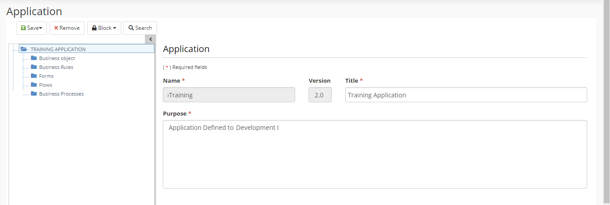

title: Aplicação Builder
Description:Aplicação Builder
# Aplicação Builder

A Aplicação Builder é uma composição de elementos que interagem entre si para
compor um conjunto de funcionalidades integradas ao 4biz e sistemas legados.

Os principais elementos do 4biz Builder são Objetos de Negócio, Regras de
Negócio, Formulários, Fluxos e Processos de Negócio.

Antes de começar
--------------

É necessário ter criado a Conexão DB.

Procedimento
-----------

1.  Acessar a funcionalidade pelo menu de navegação Builder \> Gerenciamento \> Aplicação;

2.  Clicar em “Cadastrar”;

3.  Preencher os campos disponíveis para “Aplicação”;

4.  Clicar em “Salvar” (a Treeview esquerda será preenchida);

5.  Criar Objeto de Negócio, Regras de Negócio, Formulários, Fluxos e Processos
    de Negócio (a área direita abrirá o registro para cada elemento em seu
    contexto);

6.  Salvar cada uma separadamente;

7.  Clicar em “Salvar” na Aplicação.

!!! Abstract "ATENÇÃO"

    Todos os campos na lista de Itens serão usados como filtro para restringir
    os itens listado.
    
   

Figura 1 - Aplicação Builder

!!! tip "About"

    <b>Product/Version:</b> 4biz | Helium &nbsp;&nbsp;
    <b>Updated:</b>03/13/2019 – Anna Martins

