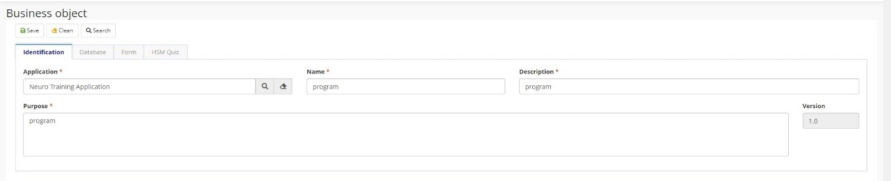
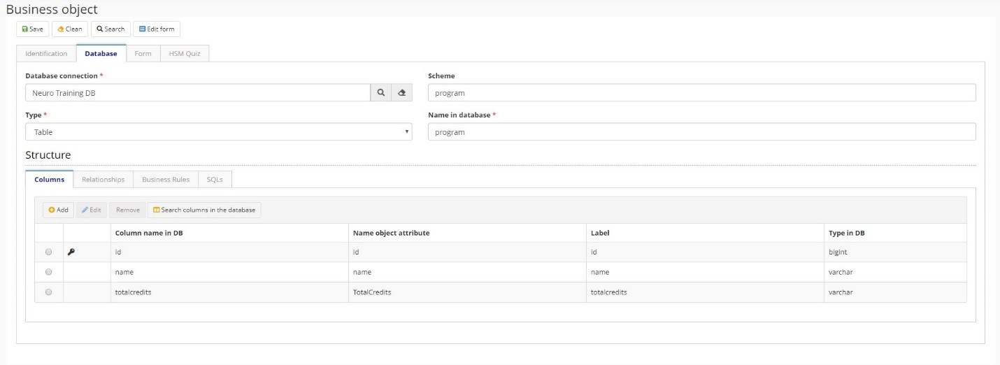

title: Objeto de Negócio
Description:Objeto de Negócio
# Objeto de Negócio

Objetos de Negócios são os vínculos entre o Neuro e uma Entidade de Dados das aplicações. Desta forma, o Objeto de Negócio representará o modelo de dados e poderá atingir um ou mais formulários.

Cada objeto de negócio criado representa uma tabela no banco de dados.

Antes de começar
----------------

É necessário ter criado Conexão DB e Aplicação Neuro.

## Dados gerais

1.  Acessar a funcionalidade pelo menu de navegação Neuro \> Gerenciamento \>
    Objeto de Negócio;

2.  Clicar em “Cadastrar”;

3.  Preencher os campos disponíveis na guia “Identificação”;

4.  Selecione a **Aplicação** para a qual o objeto de negócio é criado, atribua
    ao Objeto de Negócio um Nome e uma Descrição, também informe a finalidade do
    Objeto de Negócio.
    
    

Figura 1 - Identificacão

## Informação do Banco de Dados

1.  Preencher os campos disponíveis para a guia "Banco de dados". Essa guia faz
    referência à estrutura do banco de dados da aplicação. Como cada objeto de
    negócio representa uma tabela de banco de dados, essa guia define as colunas
    do banco, bem como seus relacionamentos, regras de negócio e comandos SQL
    (se necessário).

2.  Preencher as informações com:

    1.  A **Conexão de Banco** criada,

    2.  O nome do **Esquema** de banco de dados,

    3.  O **Tipo**, se é tabela ou view, e

    4.  O **Nome no Banco de Dados** do objeto de negócio.

Figura 2 - Banco de dados

## Colunas

1.  Adicionar as colunas da tabela, indicando

    1.  Informar o **nome da coluna na BD**;

    2.  Selecionar o **Tipo** da Coluna. O sistema fará a correlação
        automaticamente para o **Tipo no BD**;

    3.  Dê o **Nome para atributo de objeto**, se você não mudar, terá o mesmo
        nome que o nome da coluna;

    4.  Configurar a **Label** para o formulário e a grid;

    5.  Selecionar a **Chave primária** se a coluna é a Chave primária para a
        tabela;

    6.  Selecione **Obrigatório** se a coluna for obrigatória;

    7.  Clicar em “Salvar”.
    
!!! Abstract "NOTA"

    Após o "Salvar", você poderá informar a chave do domínio e digitar e atribuir o relacionamento, se necessário.
    

Figura 3 - Lista de colunas

Figura 4 - Adicionar novas colunas

!!! Abstract "ATENÇÃO"

    Em cada mudança de banco de dados ou no momento da criação do objeto de negócio, você deve executar o DDL correspondente para           executar a criação/mudança no Banco de Dados.
    
## Relação

1.  Se necessário, você pode adicionar Relações nessa guia;

2.  Definir:

    1.  **Tipo** (1 x N, N x 1);

    2.  Informar o **nome da Relação** e da **Label** (para o formulário);

    3.  O **objeto Referenciado** que será vinculado;

    4.  A **Coluna para preenchimento automático**;

    5.  Configurar se é um campo **Obrigatório**;

    6.  Uso de **Delegação** quando você quiser usar conceitos de
        Generalização/Especialização para o Relacionamento;

    7.  Configurar se a Coluna de objeto de negócio fará parte do relacionamento;
    
    

Figura 5 - Relação 

## Regras de Negócio

1.	Selecionar a Regra de Negócio atribuída para inserir, alterar ou excluir a ação no Objeto de Negócio 

Figura 6 - Regras de negócio
    
## SQLs 

1.  Você pode criar SQL's relacionados ao objeto de negócio a ser usado no
    fluxo, por exemplo:

    1.  Em uma tarefa para solicitação de inscrição em cursos, você pode criar
        um SQL (será considerado como uma função) para obter o número de alunos
        matriculados em um curso;

    2.  O SQL será executado sob um fluxo ESI e será chamado pelo Fluxo SM
        (usando o componente para integração com o fluxo ESI).
  
    

Figura 7 - SQL

## Formulário (CRUD & Personalizável)

1.	Você pode alterar as labels de atributos por meio da guia Labels e editar os campos da grid usando a guia Grid.

    

    Figura 8 - Labels

    

    Figura 9 - Grid

2.	Ao clicar em Editar formulário no cabeçalho da tela, gerará um formulário para esse objeto de negócio. Se não houver um formulário para esse objeto de negócio, a barra lateral Campos será exibida. Se já houver um formulário registrado anteriormente vinculado a este formulário, a guia Desenhar Tela para este formulário será aberta.

!!! tip "About"

    <b>Product/Version:</b> CITSmart | 8.00 &nbsp;&nbsp;
    <b>Updated:</b>03/13/2019 - Anna Martins  
