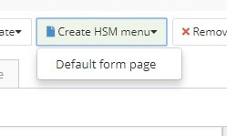

title: Criar item de menu via Builder
Description: Criar item de menu via Builder
# Criar item de menu via Builder

1.  Criar um formulário para o objeto de negócio;

2.  Criar o Menu SM informando:

    1.  A **Descrição** do Item de Menu;

    2.  Qual será o **menu Pai** e a **Ordem** (posição no menu) que o nosso formulário será colocado;

    3.  O sistema irá gerar um Link automaticamente para o nosso formulário.

Figura 1 - Criar menu SM

Figura 2 - Criar menu SM (continuação)

!!! tip "About"

    <b>Product/Version:</b> 4biz | Helium &nbsp;&nbsp;
    <b>Updated:</b>03/13/2019 – Anna Martins
