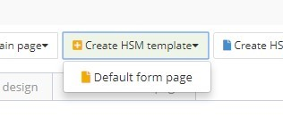
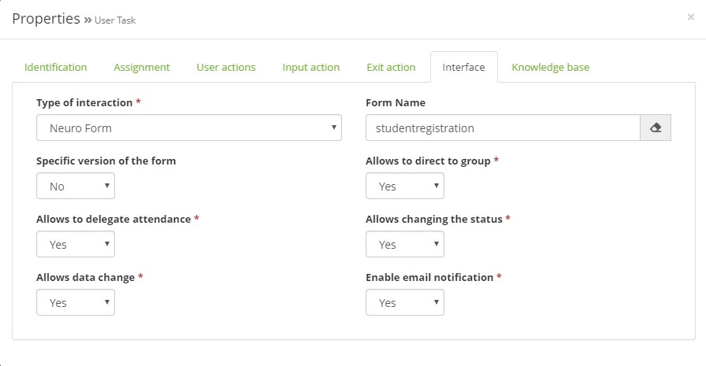

title: Usando aplicativos Builder em Tickets
Description: Usando aplicativos Builder em Tickets
# Usando aplicativos Builder em Tickets

Existem duas formas de interface Builder com um Ticket:

1.  Você pode criar um **formulário que será uma fonte de informação para o processo de uma solicitação**, assim você poderá:

  a)  Criar um formulário para o objeto de negócio;

  b)  Criar um template SM;
    
   

   Figura 1 - Criar template SM
    
  c)  Vincular o template para a requisição/incidente;
    
   

   Figura 2 - Vincular template
    
  d)  Usar o template na requisição/incidente.
    
   

   Figura 3 - Template use
    

2.  Você pode **usar um formulário durante a resolução (etapas) do fluxo de processo** na requisição/incidente;

  a)  Selecionar usuário de tarefa
    
   

   Figura 4 - Vincular template
    

  b)  Vincular o formulário a uma etapa do Fluxo SM na guia "Interface" de uma tarefa de usuário
    
   

   Figura 5 - Interface
    

!!! tip "About"

    <b>Product/Version:</b> 4biz | Helium &nbsp;&nbsp;
    <b>Updated:</b>03/20/2019 – Anna Martins

