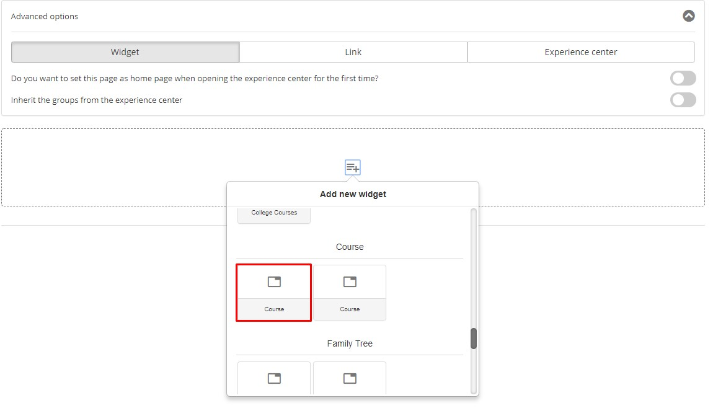
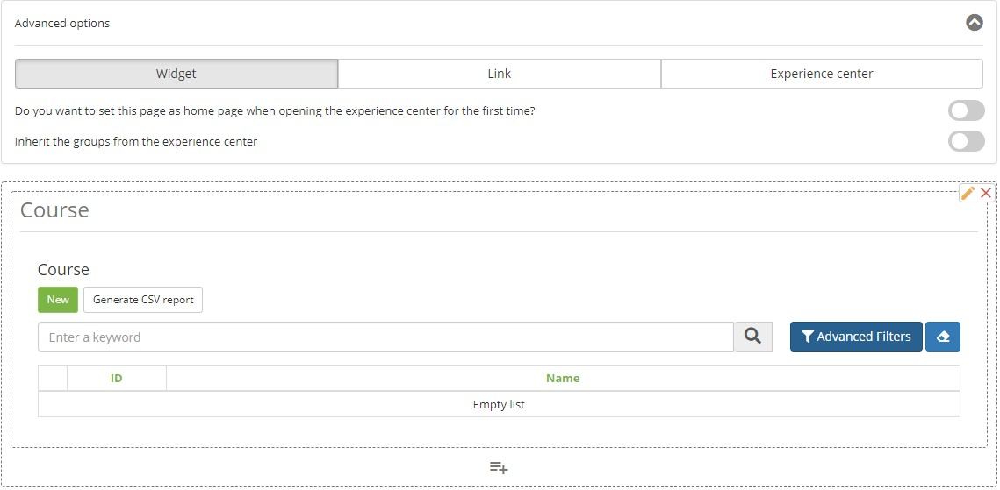
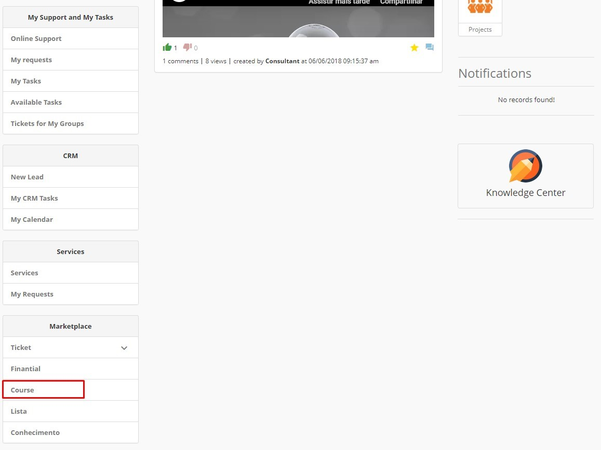
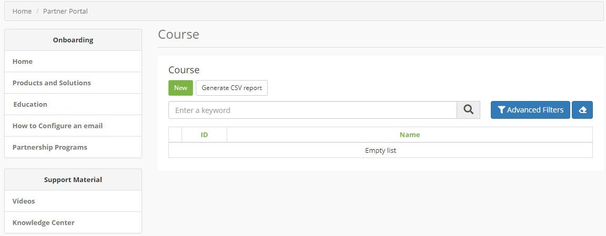

title: Usar aplicativos Neuro no Centro de Experiência
Description: Usar aplicativos Neuro no Centro de Experiência
# Usar aplicativos Neuro no Centro de Experiência

Centro de Experiência

1.  Criar um formulário para o objeto de negócio;

2.  Marcar seu formulário para **Exibir Como Widget SM**;

    

    Figura 1 - Dados básicos

3.  Vincular o formulário a um Centro de Experiência;

4.  Selecionar formulário

    

    Figura 2 - Formulário

    

    Figura 3 - Formulário (continuação)

5.  Usando o Centro de Experiência para Inserir Dados:

Figura 4 - Centro de Experiência

Figura 5 - Centro de Experiência (continuação)

!!! tip "About"

    <b>Product/Version:</b> CITSmart | 8.00 &nbsp;&nbsp;
    <b>Updated:</b>03/13/2019 – Anna Martins
