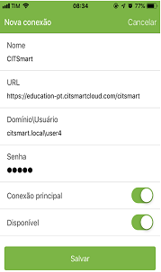

Title: Manual de utilização do aplicativo mobile CITSmart Experience - IOS
# Manual de utilização do aplicativo mobile CITSmart Experience - IOS

Este documento tem o propósito de fornecer orientações necessárias para instalar, configurar e utilizar o aplicativo mobile CITSmart Experience, disponível nas plataformas Android e iOS.
O aplicativo Experience oferece a facilidade no atendimento, direcionamento de onde a solicitação está localizada, filtragem das solicitações pessoais e por grupo de trabalho, visualização dos detalhes de uma solicitação de serviço, entre diversas outras funcionalidades possíveis devido a renderização das páginas e leiaute responsivo

Antes de começar
---------------

Para utilizar o aplicativo Experience é preciso criar o menu com as opções que poderão ser acessadas.

Procedimento
------------

1.	Instalar o aplicativo Experience a partir da loja online (App Store ou Play Store);
2.	Para criar uma conexão, clicar no botão “Add” ou “Adicionar conexão”;
3.	Será apresentada tela “Nova Conexão” para registrar conexão:
4.	Informar os dados:

    

     Figura 1 - Conexão

    *	Nome da conexão: informar o nome da instância;

    *	URL do servidor: informar o endereço do servidor para conexão com o uso do protocolo (https) na URL;

    *	Domínio\Usuário:  informar o domínio (local/ldap) e seu usuário;

    Ex.: citsmart.local\nome.sobrenome
    
    *	Senha: credencial de acesso ao sistema;

    *	Conexão principal: informar se a instância escolhida será a principal;

    *	Disponível:

           a.	Habilitado: o sistema permitirá conexão ao servidor e o posicionamento físico do usuário será obtida e                           registrada;

           b.	Desabilitado: o sistema não permitirá conexão ao servidor nem registrará a posição física do atendente.

5.	Após informar os dados da conexão desejada, clicar no botão "Salvar";

6.	Depois de adicionada a conexão, aparecerá a listagem das conexões criadas. Para alterar uma conexão, basta selecionar e manter pressionada a conexão e fazer a alteração;

7.	Logar com o usuário e senha utilizados no CITSmart web;

8.	Após realizar a conexão, será apresentada a tela com menus de funcionalidades disponíveis.

!!! Abstract "ATENÇÃO"

    Caso o aparelho seja trocado, esta conexão deve ser deletado.

   
Relacionado
----------

[Configurar opções de menu no mobile](/pt-br/citsmart-platform-8/additional-features/mobile-and-field-service/configuration/configure-mobile-options.html)

!!! tip "About"

    <b>Product/Version:</b> CITSmart | 8.00 &nbsp;&nbsp;
    <b>Updated:</b>04/26/2019 - Anna Martins
