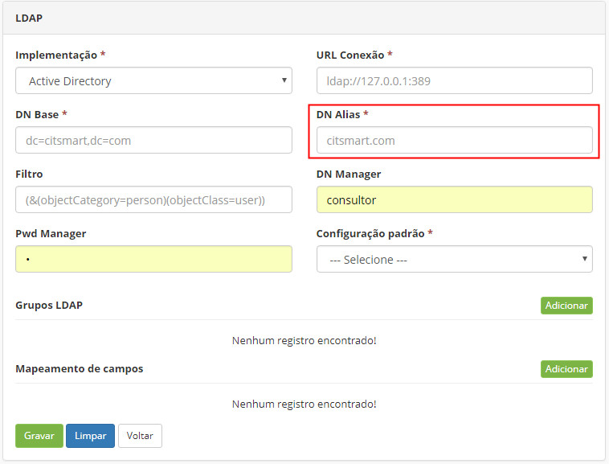

title: CITSmart auto-login - SSO
Description: CITSmart auto-login
# CITSmart auto-login - SSO


**Branchs**:

   Sso (itsm)

   Spnego 1.0 (artifactory)


Criar usuário AD
----------------

1.  Acessar criar usuário em Usuários e Computadores do Active Directory,
    conforme a figura abaixo:

    

     Figura 1 - Criar usuário

2. Criar uma senha: 

    

     Figura 2 - Senha

3. Clicar no lado direito do mouse, no botão usuário/propriedades:

    

     Figura 3 - Botão usuário/propriedades

4. Selecionar a opção "Esta conta oferece suporte para criptografia de 256 bits", aplicar e marcar "OK", conforme a figura abaixo:

    

     Figura 4 - Configurar conta


5.  Abrir o ADSI Editar. Logo após, conectar no AD, clicar em usuários e
    localizar o usuário recém criado, conforme a figura abaixo:
      
    

     Figura 5 - Verificando usuário

6.  Clicar no botão direito do mouse e selecionar a opção Propriedades.
    Logo após, procurar o **servicePrincipalName** (sigla de SPN);

7.  Adicionar HTTP/hom-itsm.centralit.com.br, clicar em "OK" para efetuar a
    operação, conforme a figura abaixo:

    

     Figura 6 - Adicionar o valor

8.  Abrir o **CMD** como Administrador e colocar os seguintes comandos.
    Lembrar que o primeiro seta o **SPN** e o segundo gera o Keytab (o que
    será utilizado no Wildfly):

    -   setspn -s HTTP/hom-itsm.centralit.com.br citsmart2

    -   ktpass / princ HTTP/hom-itsm.centralit.com.br /mapuser citsmart2  /pass
        central\@123 /ptype KRB5_NT_Principal/outcitsmart2.keytab /crypto ALL

9.  Realizado os passos acima, o **AD** estará configurado. 


Configurar o servidor Wildfly
-----------------------------

1.  Copiar o **war** gerado da branch **sso**;

2.  Copiar o arquivo krb5.conf (validar as informações de acordo com o AD) para
    a pasta standalone/configuration (wildfly):
    
    ```sh
    [libdefaults]
    default_tkt_enctypes = aes256-cts-hmac-sha1-96 aes128-cts-hmac-sha1-96 rc4-hmac
    default_tgs_enctypes = aes256-cts-hmac-sha1-96 aes128-cts-hmac-sha1-96 rc4-hmac
    permitted_enctypes = aes256-cts-hmac-sha1-96 aes128-cts-hmac-sha1-96 rc4-hmac
    [realms]
    ```
    
    ```sh
    citgosrv004.cit.local  = {
    kdc = citsmartsrv.citsmartsrv.bigdata-team.com
    default_domain = citsmartsrv.citsmartsrv.bigdata-team.com }     
    ```
    
    ```sh
    [domain_realm]
    .citsmartsrv.citsmartsrv.bigdata-team.com = citsmartsrv.citsmartsrv.bigdata-team.com
    ```

1.  Copiar o arquivo login.conf (validar as informações de acordo com o AD) para a pasta standalone/configuration (wildfly):

    ```sh
    custom-client {
    com.sun.security.auth.module.Krb5LoginModule required
    storeKey=true
    useKeyTab=true
    keyTab="file:///opt/wildfly-12.0.0.Final/standalone/configuration/lightkeytab.keytab"
    principal=HTTP/light-desenvolvimento.citsmartcloud.com\@CITSMARTSRV.BIGDATA-TEAM.COM;
    };
    ```

1.  Copiar o arquivo lightkeytab.keytab (gerado pelo comando no AD) para a pasta
    standalone/configuration (wildfly)

2.  Arrumar o standalone.xlm ao adicionar as seguintes informações:

    Em **\<system-properties\>**
    
    ```java
    \<property name="sun.security.krb5.debug" value="true"/\>
    \<property name="java.security.krb5.kdc" value="CITSMARTSRV.BIGDATA-TEAM.COM"/\>
    \<property name="java.security.krb5.realm"value="CITSMARTSRV.BIGDATA-TEAM.COM"/\>
    \<property name="java.security.krb5.conf"value="/opt/wildfly-12.0.0.Final/standalone/configuration/krb5.conf"/\>
    \<property name="java.security.auth.login.config"value="/opt/wildfly-12.0.0.Final/standalone/configuration/login.conf"/\>
    \<property name="krb.keyTab"value="/opt/wildfly-12.0.0.Final/standalone/configuration/lightkeytab.keytab"/\>
    \<property name="krb.principal"value="HTTP/light-desenvolvimento.citsmartcloud.com\@CITSMARTSRV.BIGDATA-TEAM.COM"/\>
    ```
    
    Em **\<security-domains\>**

    ```java
    \<security-domain name="spnego-server"\>
    \<authentication\>
    \<login-module code="com.sun.security.auth.module.Krb5LoginModule"flag="required"\>
    \<module-option name="storeKey" value="true"/\>
    \<module-option name="useKeyTab" value="true"/\>
    \<module-option name="keyTab" value="\${krb.keyTab}"/\>
    \<module-option name="principal" value="\${krb.principal}"/\>
    \<module-option name="isInitiator" value="false"/\>
    \</login-module\>
    \</authentication\>
    \</security-domain\>
    \<security-domain name="SPNEGO" cache-type="default"\>
    \<authentication\>
    \<login-module code="Kerberos" flag="required"\>
    \<module-option name="storeKey" value="true"/\>
    \<module-option name="refreshKrb5Config" value="true"/\>
    \<module-option name="useKeyTab" value="true"/\>
    \<module-option name="doNotPrompt" value="true"/\>
    \</login-module\>
    \</authentication\>
    \</security-domain\>
    ```

1.  Caso não tenha alterado o jar do policy do JAVA (JCE - Java Cryptography
    Extension), baixar os arquivos e colocar em
    jdk/jre/lib/security/policy/limited e jdk/jre/lib/security/policy/unlimited;

2.  Importar (sincronizar) usuários do LDAP no ITSM.

!!! Abstract "ATENÇÃO"

    O DN Alias deve ser igual ao domínio da rede (exemplo: CIT\\usuario), logo
    o DN Alias = CIT, conforme a figura abaixo:



   Figura 7 - Definir o DN

!!! Abstract "ATENÇÃO"

    É recomendável a leitura dos seguintes materiais de
    apoio: <https://ss64.com/nt/setspn.html> e <http://spnego.sourceforge.net/>.
    
    
!!! tip "About"

    <b>Product/Version:</b> CITSmart | 8.00 &nbsp;&nbsp;
    <b>Updated:</b>03/15/2019 – Anna Martins
   
