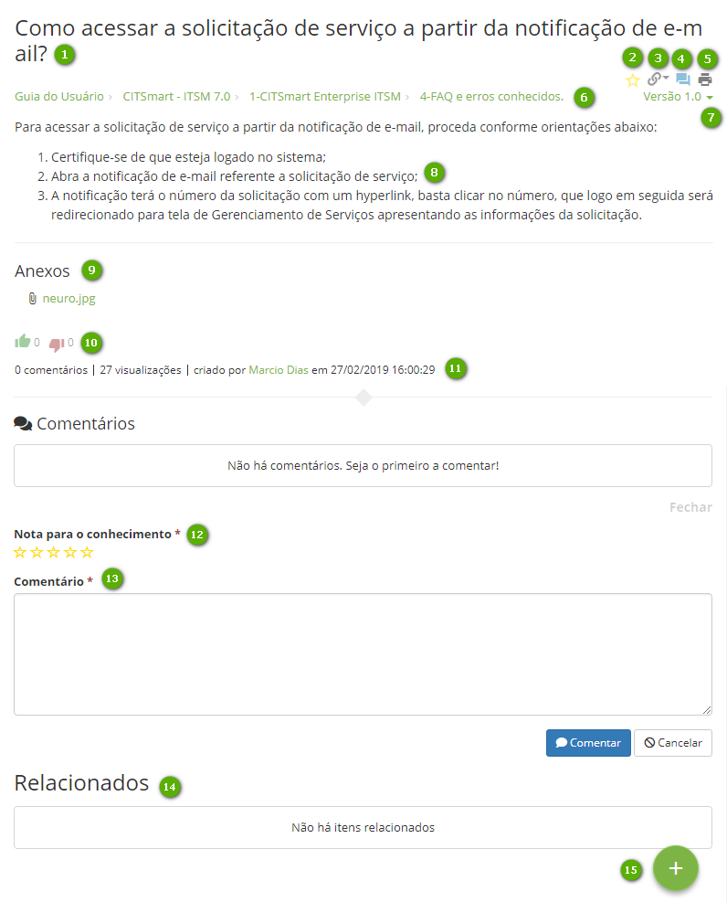

title: Portal do Conhecimento
Description: Visa fornecer informações relevantes que permitam ao operador (usuário ou administrador) o entendimento e aplicação de um determinado conhecimento.
# Portal do Conhecimento

O Portal do Conhecimento é uma das telas principais da solução, que visa
fornecer informações relevantes que permitem ao operador (usuário ou
administrador) o entendimento e aplicação de um determinado conhecimento.

Também possibilita que o mesmo registre um novo conhecimento, de modo a tornar o
portal dinâmico e atualizado.

   Figura 1 - Portal do Conhecimento
   
- **1**: Pastas - exibe as pastas que o usuário logado tem acesso para
visualização dos conhecimentos das mesmas

- **2**: Portal de Serviços - ao clicar nesta opção, será apresentada uma das
telas principais do produto, o Portal de Serviços (Smart Portal)

- **3**: Sistema - ao clicar nesta opção, permite entrar no sistema

- **4**: Identificação do usuário logado - ao clicar nesta opção, são exibidas
as funções para alterar a senha de acesso e sair do portal

- **5**: Campo de pesquisa - permite a busca por conhecimentos

- **6**: Favoritos - conhecimentos que foram marcados como favorito pelo o
usuário logado

- **7**: Curtidos - conhecimentos que foram curtidos pelo usuário logado

- **8**: Indicados - conhecimentos indicados ao usuário, referentes às
funcionalidades do sistema mais acessadas. Exemplo: o usuário logado acessa
sempre a funcionalidade de "Solicitação de Serviço", quando o mesmo entrar no
Portal do Conhecimento, o sistema irá indicar os conhecimentos referentes à
funcionalidade

- **9**: Adicionar Conhecimento - permite ao usuário logado registrar um novo
conhecimento na Base de Conhecimento

------------------------------------------------------------------------------------

   Figura 2 - Resultado de pesquisa

 - **1**: campo de pesquisa
 
 - **2**: relação de conhecimentos encontrados
  
 - **3**: mostra os filtros para encontrar conhecimentos, sendo possível refinar ainda mais a busca inicial ao selecionar uma das opções
 
 - **4**: relação de conhecimentos encontrados
 
!!! Abstract "REGRA"

    A lista resultante é montada de acordo com determinadas prioridades de comparações (configuráveis). Por default, toda lista             resultante será montada comparando o texto procurado com (nesta ordem): 
    
    a) conteúdo do conhecimento
    
    b) título
    
    c) anexos
    
    d) palavras-chaves (Tags)
    
    
1.  Após encontrar o conhecimento desejado, clicar no título para visualizar o
    conteúdo:

 

   Figura 3 - Visualizar conhecimento 

- **1**:Título do documento

- **2**:Ícone para favoritar o conhecimento para que ele seja relacionado na página principal do Portal do Conhecimento

- **3**:Ícone para visualizar a quais módulos ITIL o conhecimento está vinculado

- **4**:Ícone para deixar um comentário sobre o conhecimento

- **5**:Ícone para imprimir o conhecimento

- **6**:Caminho de pastas e sub-pastas para chegar a este conhecimento (migalha de pão)

- **7**:Lista para acesso às versões do conhecimento

- **8**:Lista de arquivos anexados ao conhecimento

- **9**:Conteúdo do conhecimento

- **10**:Ícones para registrar um "like" ou "unlike" sobre o conhecimento

- **11**:Quantidade de comentários, visualizações, nome de quem criou o conhecimento, data e horário de sua última modificação

- **12**:Estratégia de avaliação quantitativa do conhecimento (uma nota), que varia de 1 a 5, dependendo da estrela marcada

- **13**:Local onde o usuário pode registrar seus comentários

- **14**:Local onde serão listados todos os conhecimentos que tiverem sido relacionados com o conhecimento visualizado

- **15**:Ícone para contribuir com a gestão de conhecimento da organização, ou seja, a maneira que o usuário tem para criar (propor) um novo conhecimento

!!! tip "About"

    <b>Product/Version:</b> CITSmart | 8.00 &nbsp;&nbsp;
    <b>Updated:</b>02/27/2019 – Anna Martins

 
