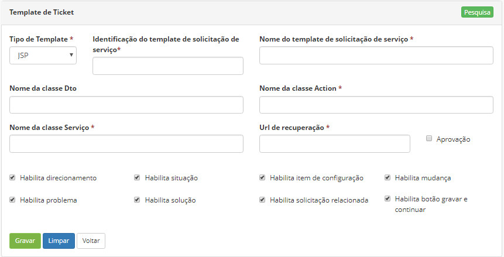
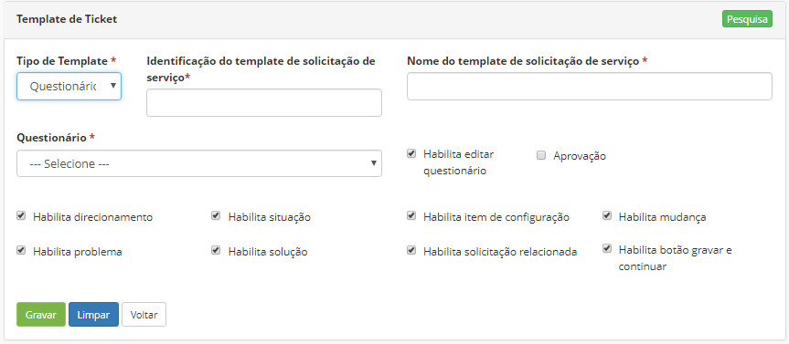
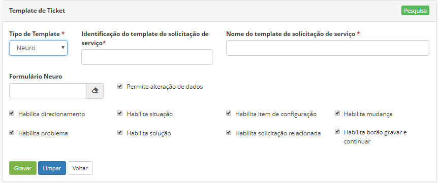

title: Cadastrar template de serviço
Description: Disponibiliza ações diversas, tais como, incluir, alterar e excluir um template de serviço, o qual será utilizado para personalizar a tela de serviço.
# Cadastrar template de serviço

Esta funcionalidade disponibiliza ações diversas, tais como, incluir, alterar e
excluir um template de serviço, o qual será utilizado para personalizar a tela
de serviço.

Antes de começar
-------------

Para cadastrar um template de serviço é preciso cadastrar um questionário
previamente.

Procedimento
-----------

1.  Acessar a funcionalidade de Template de Serviço através da navegação no
    menu principal Processos \> Gerência de Portfólio e Catálogo \> Template de
    Serviço;

2.  Preencher os campos disponibilizados;

3.  No campo  **Tipo de Template**, a cada opção escolhida (JSP, Questionário ou Neuro) os campos para preenchimento serão alterados:

    

    Figura 1 - Template JPS

    

    Figura 2 - Template Questionário

    

    Figura 3 - Template Neuro

4.  Clicar em "Gravar".

Relacionado
-----------

[Cadastrar questionário](/pt-br/citsmart-platform-8/platform-administration/questionnaires/questionaires-management/register-questionnaire.html)

<i class='fa fa-youtube-play  fa-2x' style='color:#97ce17;vertical-align: middle;'> </i> [Video Library](https://www.youtube.com/playlist?list=PLB5qK2uzf2RPUBXWp7r7A0YUQY07qkSrO)'

!!! tip "About"

    <b>Product/Version:</b> CITSmart | 8.00 &nbsp;&nbsp;
    <b>Updated:</b>01/16/2019 - Anna Martins
