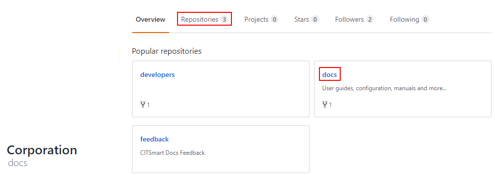
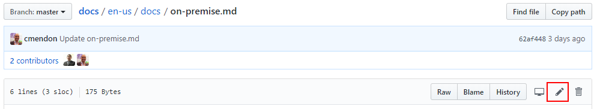

Title: Guia de contribuição do CITSmart Docs

# Guia de contribuição do CITSmart Docs

O CITSmart Docs é um trabalho incessante de documentação de nossos produtos. Entendemos que a experiência de nossa comunidade no uso da plataforma é a parte mais enriquecedora. Por isso, aqui explicamos como você poderá contribuir com nossas documentações de forma transparente e aberta.

As documentações do CITSmart estão disponíveis publicamente no [GitHub](https://github.com/citsmartdocs/). É através dele que você conseguirá editar os documentos existentes, criar novos documentos ou mesmo sugerir melhorias para nosso portal.

Obrigado por acessar a página de contribuição do CITSmart Docs.

## Editar documentos existentes

 

Uma das formas de contribuir, é editando documentos existentes em nosso repositório. Sugestão de pequenos erros técnicos ou gramaticais são bastante comuns utilizando esse método simples e rápido.

Para começar:

 

1) Acesse o repositório de documentos da CITSmart no GitHub: https://gitbub.com/citsmartdocs.

2) Clique em "Sign In" no topo da página e entre com um usuário e senha.

 

 

 

Caso não tenha um usuário e senha e queira contribuir, Clique em "Sign Up" para criar uma nova conta.

A criação de um usuário na plataforma do Github é gratuita.

 

!!! Warning "ATENÇÃO"

 

    O usuário e senha do GitHub é de responsabilidade do site. Não temos controle sobre a criação de usuários na plataforma.

 

3) Após realizar o login, cliquem em "Repositories" ou em "docs" conforme imagem abaixo:

 

 

4) Após acessar o repositório de docs, você encontrará nossas documentações separadas por pastas em linguagens. Escolha a pasta e documentação que deseja contribuir, e clique em "Edit":

 

 

5) A partir desse momento, você conseguirá editar o documento se estiver logado. Nossos documentos são elaborados utilizando uma linguagem sintática chamada Markdown.

O markdown permite que usuários sem conhecimento em linguagem de programação possa escrever documentos em formato HTML. É uma linguagem simples feita para usuários finais.

Siga nosso [guia de escrita em Markdown](https://docs.citsmart.com/pt-br/markdown.html) para descobrir como escrever nossos documentos.

 

Clique na tab "Preview changes" caso queira ir acompanhando o progresso da escrita do documento e como ele ficará após a conversão do formato Markdown.

 

!!! Warning "ATENÇÃO"

 

    Nem todas formatações de markdown são possíveis de visualização no "preview" do Github, embora diversos elementos visuais sejam perfeitamente aplicáveis.

               

6) Quando concluir a edição do documento desejado, coloque seus comentários nos campos do "Propose file change" e clique no botão "Propose file change".

Na próxima etapa irá aparecer o botão "Create pull request". Clique nele para submeter sua sugestão.

 

A equipe irá avaliar sua proposta de mudança, e após a aprovação do conteúdo este estará disponível em nossa documentação.

## Propor novos documentos

Caso você não encontre a documentação de uma funcionalidade, utilize nossa [área de feedback][1] para propor a criação.

[1]:https://github.com/citsmartdocs/feedback
 
