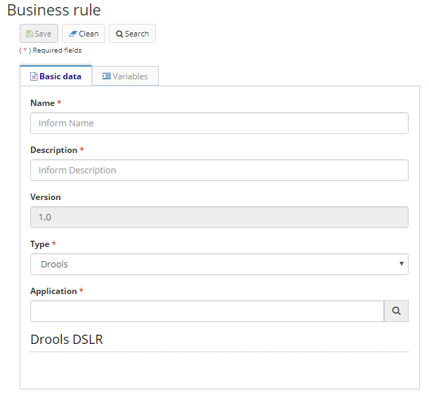
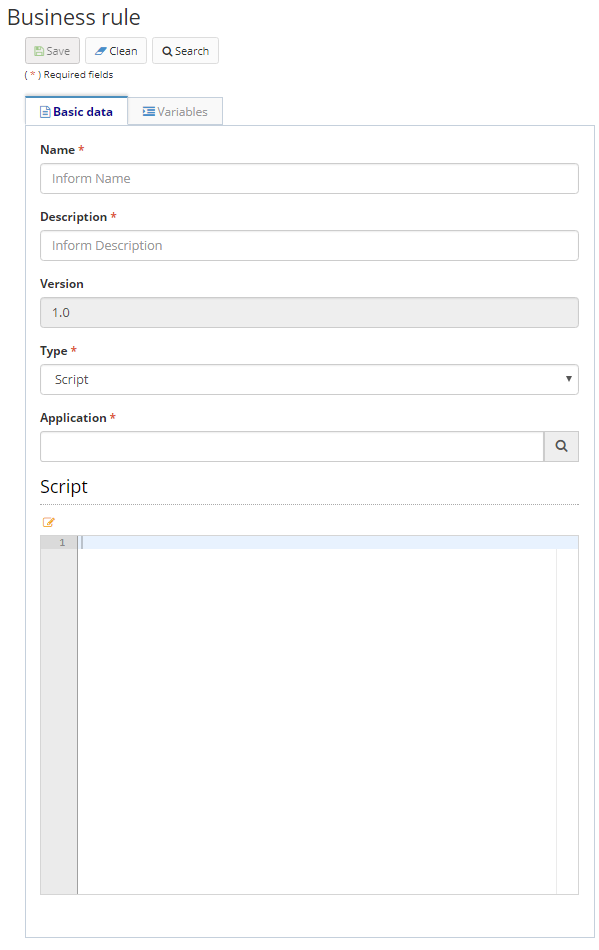

title: Regras de negócio    
Description: As regras de negócio definem como o seu negócio funciona, e podem abranger diversos assuntos como suas políticas, interesses, objetivos, compromissos éticos e sociais, obrigações contratuais, decisões estratégicas, leis e regulamentações entre outros.   

# Regras de negócio  

As regras de negócio definem como o seu negócio funciona, e podem abranger diversos assuntos como suas políticas, interesses, objetivos, compromissos éticos e sociais, obrigações contratuais, decisões estratégicas, leis e regulamentações entre outros.    
No Neuro, as regras de negócio podem ser construídas através do desenho de um fluxo, ou através de Script.      

##Como acessar  

1.	Acesse a funcionalidade através da navegação no menu principal Neuro > Gerenciamento > Regra de Negócio.      

##Pré-condições

1.	Não se aplica.    

##Filtros

1.	O seguinte filtro possibilita ao usuário restringir a participação de itens na listagem padrão da funcionalidade, facilitando a localização dos itens desejados:

    *  Palavra chave ou enter    

Figura 1 - Tela de pesquisa de regras de negócio    

##Listagem de itens    
Os seguintes campos cadastrais estão disponíveis ao usuário para facilitar a identificação dos itens desejados na listagem padrão da funcionalidade: Nome, Descrição, Aplicação, Versão e Data de bloqueio.    

 

Figura 2 - Tela de listagem de regras de negócio  

##Preenchimento dos campos cadastrais

  1. Para editar um item criado, selecione o item desejado, clique em "Editar", faças as alterações, e clique em "Salvar";    
  2. Para criar nova regra de negócio, clique no botão "Cadastrar";    
  3. Para remover um item criado, selecione o item desejado, clique em "Editar" > "Remover" e confirme a exclusão;    
  4. As regras de negócio inseridas, por padrão são criadas bloqueadas. Isso significa que a regra não será utilizada a menos que você a Desbloqueie. Para que o desbloqueio da regra ocorra, selecione o item desejado, e clique na opção Desbloquear, localizada no menu superior.; de negócio, em um processo de negócio ou em um fluxo;    
  5. Mais informações sobre o uso de uma regra de negócio podem ser encontradas no Desenvolvendo aplicações.    

##Criar regras de negócio usando tipo Drools

  1. O Drools é um conjunto de ferramentas que permite separar e raciocinar sobre a lógica e os dados encontrados nos processos de negócios. As duas palavras-chave importantes que tem que executar são lógica e dados. Vá para https://www.drools.org/ para mais informações.    
  2. Para criar uma regra de negócios usando o Drools, deve-se primeiro criar o DSL e DSLR através do menu Neuro > Configuração > Domínio;    
  3. Após o cadastro de domínio, acesse a o menu Neuro > Gerenciamento > Regra de Negócio, clique em "Cadastrar".  Preencha os campos inserindo o Nome, Descrição, Tipo (preencha com Drools), e a respectiva Aplicação que foi cadastrada (Neuro > Gerenciamento > Aplicação), informe finalmente ao Drools DSLR que foi registrado na etapa anterior;    
  4. Além disso, as variáveis que complementam as regras de negócios podem ser inseridas.    

   
   
   Figura 3 - Tela de cadastro/edição de regras de negócio do tipo Drools - aba Dados básicos    

  5. Na aba Variáveis clique em "Adicionar" e preencha os seguintes campos conforme figura abaixo:  

Figura 4 - Tela de cadastro/edição de regras de negócio do tipo Drools - aba Dados básicos (continuação)  

##Criar regras de negócio usando tipo Fluxo

  1. Para criar uma regra de negócio utilizando tipo Fluxo, um diagrama deverá ser desenhado utilizando os componentes previstos na ferramenta. Para conhecer mais sobre os componentes, acesse a documentação dos componentes comportados pelo Neuro;    
  2. Na aba Dados básicos, preencha todos os campos (conforme mostrado na figura abaixo), ao selecionar o Tipo Fluxo, duas novas abas aparecerão (Ações e Diagrama);  

     
    
   Figura 5 - Tela de cadastro/edição de regra de negócio - Tipo Fluxo  

  3. Na aba Variáveis clique em "Adicionar" e preencha os seguintes campos conforme figura abaixo:    

   
   
   Figura 6 - Tela de cadastro/edição de regra de negócio - Tipo Fluxo (continuação)   

  4. Na aba Ações clique em "Adicionar" e preencha os seguintes campos conforme figura abaixo:    

   
    
   Figura 7 - Tela de cadastro/edição de regra de negócio - Tipo Fluxo (continuação)    

  5. Na aba Diagrama desenhe o fluxo e clique em Salvar, conforme figura abaixo:  

Figura 8 - Tela de cadastro/edição de regra de negócio - Tipo Fluxo (continuação)  

##Criar regras de negócio usando tipo Script    

  1. Para criar uma regra de negócio utilizando Script, acesse a opção Cadastrar, informe o Nome, Descrição, Tipo (preencha com Script), e a Aplicação respectiva que foi cadastrada:    

   
    
   Figura 9 - Tela de cadastro/edição de regra de negócio - Tipo Script    

  2. Codifique o script de regra de negócio no campo Script, e adicione variáveis na aba de variáveis, caso necessário. São aceitos scripts na linguagem de programação Rhino:  

   
    
   Figura 10 - Tela de cadastro/edição de regra de negócio - Tipo Script (continuação)    

  3. Clique em Salvar para executar as alterações.    

!!! tip "About"
    <b>Updated:</b>17/01/2019 - João Pelles Junior
